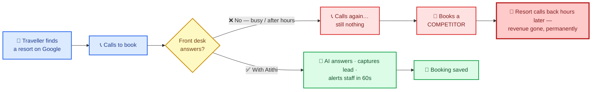
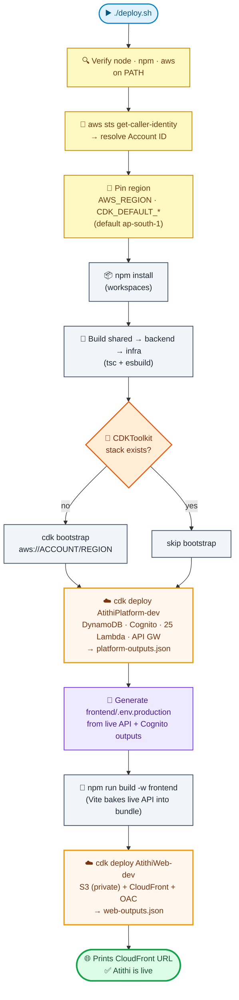
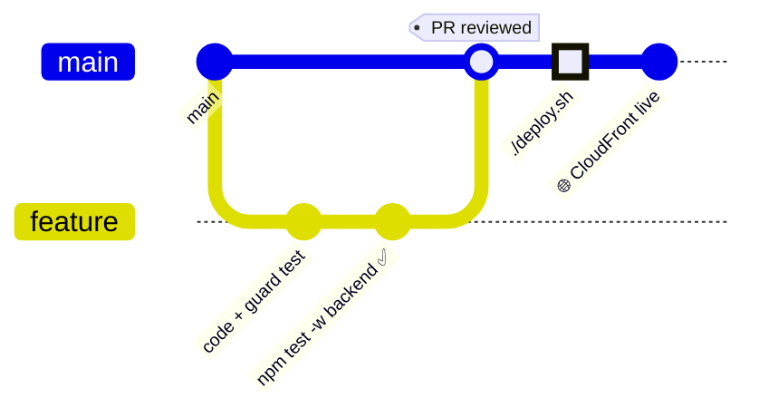
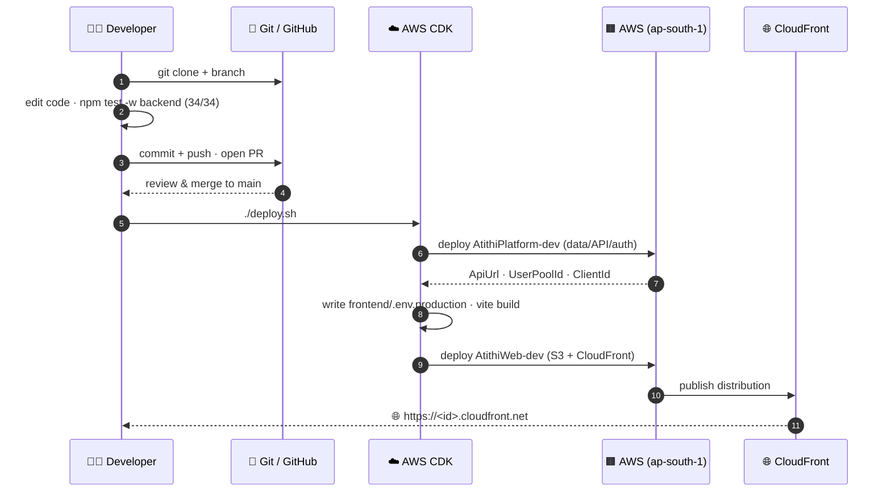
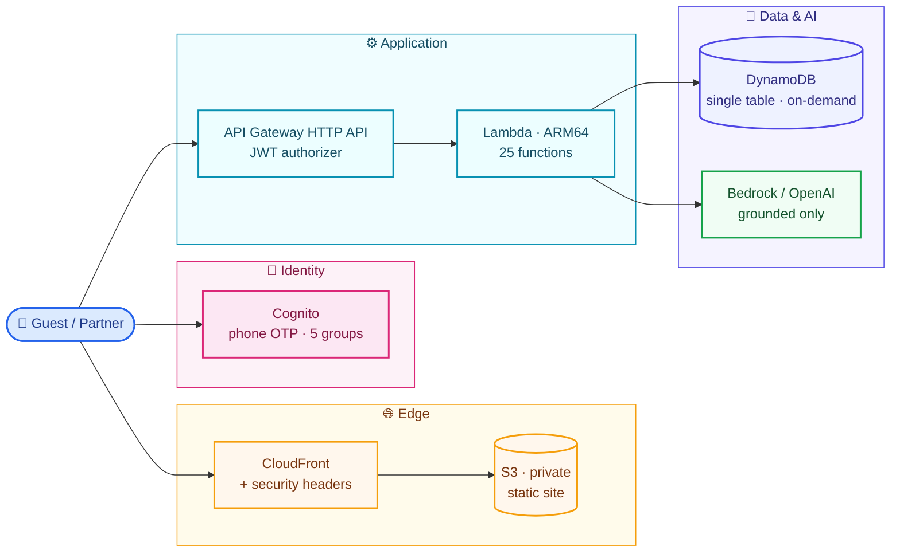
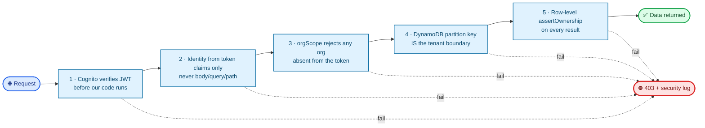
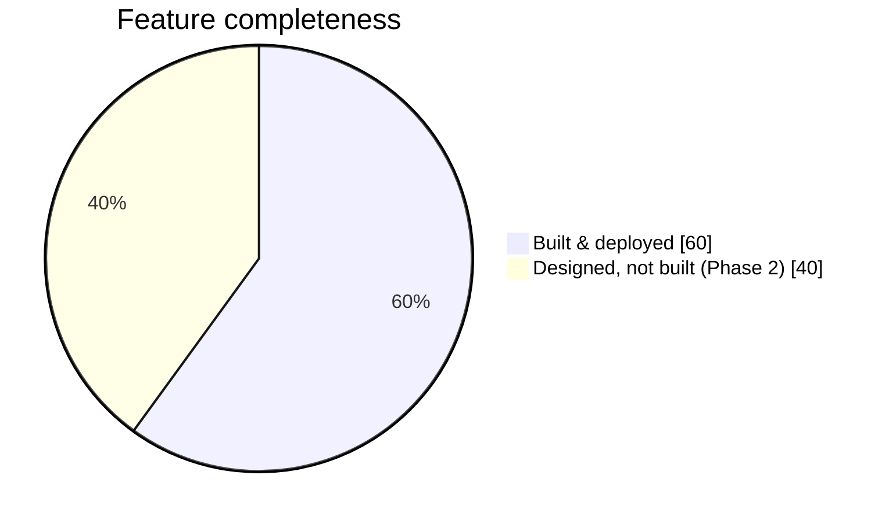

<div align="center">

# 🏨 Atithi

### *One-stop verified stays for India*

**Verified stays · Honest prices · Someone always answers**

<br/>


<br/>

*A full-stack, AWS-serverless hospitality platform. Guests book verified properties with the*
*total price shown upfront — and properties never lose a booking to an unanswered phone call.*

</div>

---

## 📖 Table of contents

- [Why this exists](#-why-this-exists)
- [The two products](#-the-two-products)
- [One-click deploy](#-one-click-deploy)
- [Deployment workflow (detailed)](#-deployment-workflow-detailed)
- [Contributor git workflow](#-contributor-git-workflow)
- [Architecture](#-architecture)
- [The two guarantees, enforced in code](#-the-two-guarantees-enforced-in-code)
- [What we do differently](#-what-we-do-that-the-big-otas-dont)
- [Repository layout](#-repository-layout)
- [Honest status](#-honest-status)
- [Documentation index](#-documentation-index)

---

## 💡 Why this exists

> A real incident. The reason the whole company exists.



That single incident produced **two products**, both in this repo.

---

## 🎯 The two products

```mermaid
flowchart TB
    subgraph P1["🏨 Direct Booking Platform — ✅ BUILT & DEPLOYED"]
        direction LR
        S["🔍 Verified search<br/>10 languages"]:::built
        PR["💰 Upfront total price<br/>zero drip fees"]:::built
        BK["📅 Atomic booking<br/>no overbooking"]:::built
        RV["⭐ Verified-stay<br/>reviews only"]:::built
        S --> PR --> BK --> RV
    end
    subgraph P2["📞 AI Receptionist — 📄 DESIGNED, PHASE 2"]
        direction LR
        CALL["☎️ Answers missed calls"]:::planned
        LEAD["📝 Captures lead"]:::planned
        SLA["⏱️ SLA + escalation"]:::planned
        CALL --> LEAD --> SLA
    end

    classDef built fill:#dcfce7,stroke:#16a34a,stroke-width:2px,color:#14532d;
    classDef planned fill:#ede9fe,stroke:#7c3aed,stroke-width:2px,color:#4c1d95;
    style P1 fill:#f0fdf4,stroke:#16a34a,stroke-width:2px,color:#14532d
    style P2 fill:#faf5ff,stroke:#7c3aed,stroke-width:2px,color:#4c1d95
```



---

## 🚀 One-click deploy

Deploy the **entire stack** — infra, backend, frontend, S3 + CloudFront — to a fresh AWS
account in three steps. No manual console clicking.

```bash
# 1️⃣  Authenticate (once per machine)
aws configure

# 2️⃣  Clone
git clone https://github.com/yadakrishna245/Atithi-Resort.git
cd Atithi-Resort

# 3️⃣  Deploy — the script does everything else
./deploy.sh          # Linux · macOS · Git-Bash · WSL
```

<details>
<summary><b>🪟 Windows PowerShell</b></summary>

```powershell
aws configure
git clone https://github.com/yadakrishna245/Atithi-Resort.git
cd Atithi-Resort
./deploy.ps1
```
</details>

<details>
<summary><b>⚙️ Region &amp; stage overrides</b></summary>

Defaults to `ap-south-1` (India data residency). Override per run:

```bash
AWS_REGION=us-east-1 STAGE=prod ./deploy.sh
```
```powershell
./deploy.ps1 -Region us-east-1 -Stage prod
```
</details>

At the end the script prints your **live CloudFront URL**. That's it.

---

## 🔄 Deployment workflow (detailed)

Exactly what `deploy.sh` / `deploy.ps1` do, in order. Each box is a real step in the script.



> **Why the script pins the region itself:** the AWS CDK CLI resolves the deploy region from
> `AWS_REGION` / `AWS_DEFAULT_REGION`, *not* from `CDK_DEFAULT_REGION`. The script sets all of
> them so a deploy lands in the same place on every machine, regardless of local CLI config.

---

## 🌿 Contributor git workflow

How changes flow from a local edit to the deployed CloudFront distribution.





---

## 🏗️ Architecture



> **No VPC, no NAT Gateway, no always-on compute, no search cluster.**
> Roughly **₹1,250/month at launch**, and under **₹1 per booking** in infrastructure at scale.

---

## 🛡️ The two guarantees, enforced in code

### 1. One customer never sees another's data — 5 independent layers



Proven by 20 tests in [`tenantIsolation.test.ts`](backend/src/__tests__/tenantIsolation.test.ts).
Cross-tenant attempts return **403, not 404**, and raise a security log event.

| Layer | Where |
|---|---|
| Cognito verifies the JWT before our code runs | [platform-stack.ts](infrastructure/lib/platform-stack.ts) |
| Identity comes from token claims only | [auth.ts](backend/src/lib/auth.ts) |
| `orgScope` rejects any org absent from the token | [auth.ts](backend/src/lib/auth.ts) |
| The DynamoDB partition key **is** the tenant boundary | [dynamo.ts](backend/src/lib/dynamo.ts) |
| Row-level `assertOwnership` re-check on every result | [auth.ts](backend/src/lib/auth.ts) |

### 2. No fake or hallucinated data

| Mechanism | Where |
|---|---|
| Zero seed data — only ops-verified listings are searchable | [propertyRepository.ts](backend/src/repositories/propertyRepository.ts) |
| Availability read from real inventory rows; a missing date is never assumed available | [inventoryRepository.ts](backend/src/repositories/inventoryRepository.ts) |
| The AI gets a closed fact sheet built only from verified stored fields | [groundedAssistant.ts](backend/src/ai/groundedAssistant.ts) |
| A **deterministic scanner** rejects any answer with a price/availability claim absent from the facts — plain code, survives prompt injection | [groundedAssistant.ts](backend/src/ai/groundedAssistant.ts) |
| The search parser can only resolve cities that exist in our inventory | [searchParser.ts](backend/src/ai/searchParser.ts) |
| Reviews require a completed booking owned by the reviewer | [reviewRepository.ts](backend/src/repositories/reviewRepository.ts) |

Proven by 15 tests in [`grounding.test.ts`](backend/src/__tests__/grounding.test.ts).

---

## 🆚 What we do that the big OTAs don't

Full analysis with code references: **[docs/19 — What We Do Differently](docs/19-what-we-do-differently.md)**

| # | Gap in MakeMyTrip / Agoda / OYO / Goibibo / Cleartrip / Booking.com | Our answer |
|---|---|---|
| 1 | Price grows between search and payment | One shared pricing function; **zero** convenience fee; server rejects the booking if the total drifted |
| 2 | "Confirmed" online, no room on arrival | Real per-date inventory; booking + decrement in one atomic transaction |
| 3 | Turned away over "couples / local ID not allowed" | Both are **mandatory** policy fields and first-class filters |
| 4 | Fake reviews | A review is impossible without a completed booking you own |
| 5 | Misleading photos | Per-photo verification flag; minimum verified count before publishing |
| 6 | Can't reach the property | Phone shown prominently — plus the AI receptionist behind it |
| 7 | English-only | 10 Indian languages end to end, including natural-language search |
| 8 | Pay-to-win ranking | Readable ranking with **no** paid-placement term; every card shows why it matched |
| 9 | Guest details demanded at reception | Captured at checkout (we store ID *type* only, never the number) |
| 10 | Forced prepayment, vague refunds | Pay-at-property supported; exact refund and deadline shown |
| 11 | Your data is the product | Per-purpose consent, DPDP export/erasure, PII masked in logs, data stays in India |

**Deliberately not copied:** fake urgency counters, "23 people viewing", countdown timers, pre-ticked add-ons, disguised sponsored results, hidden phone numbers, padded ratings for new listings.

---

## 📂 Repository layout

```
Atithi-Resort/
├── 🚀 deploy.sh / deploy.ps1   # one-click deploy (this is the magic button)
├── 📁 docs/                    # 20 product & engineering documents
├── 📦 packages/shared/         # Domain types, Zod schemas, pricing engine (FE ↔ BE)
├── ⚙️  backend/                 # Lambda handlers, repositories, services, AI grounding
├── 🎨 frontend/                # React 18 + Vite SPA, 10 Indian languages
├── ☁️  infrastructure/          # AWS CDK — DynamoDB, Cognito, Lambda, API GW, S3, CloudFront
└── 🧠 project-memory/          # AI-assistant context (not part of the app)
```

### Quick start (local dev)

```bash
npm install
npm test -w backend      # prove tenant isolation + AI grounding first (34/34)
npm run dev:web          # run the app locally at http://localhost:5173
```

---

## 📊 Honest status



**✅ Built and working:** verified-property search (structured + natural language in 10 languages),
real availability, transparent pricing, atomic booking with overbooking protection, cancellation
with exact refund calculation, verified-stay reviews, grounded AI Q&A, guest profile with DPDP
export/erasure, partner dashboard, full CDK infrastructure, **34 passing guard tests**.

**🚧 Not yet built:** Razorpay payments, photo upload + ops verification console, WhatsApp
notifications, telephony for the AI receptionist, partner onboarding wizard, map/radius search.
Tracked in [docs/18 §6](docs/18-aws-serverless-architecture-and-cost.md).

**⚠️ Before going live:** close the five critical questions in
[docs/16 §3.1](docs/16-open-questions-and-decisions.md), and have a lawyer review the telephony
architecture and DPDP position. Two values are flagged for professional verification: the **GST
slabs** in [constants.ts](packages/shared/src/constants.ts) and the **carrier USSD forwarding
codes** in [docs/10](docs/10-telephony-and-india-compliance.md).

---

## 📚 Documentation index

| # | Document | What's inside |
|---|----------|---------------|
| 01 | [Product Vision & Problem](docs/01-product-vision-and-problem.md) | Problem, market, vision, principles |
| 02 | [PRD](docs/02-prd.md) | Goals, scope, requirements, user stories, metrics |
| 03 | [Personas & User Journeys](docs/03-personas-and-user-journeys.md) | Who we serve, end-to-end journeys |
| 04 | [Workflows](docs/04-workflows.md) | Call flows, lead lifecycle, escalation |
| 05 | [System Architecture](docs/05-system-architecture.md) | Components, voice pipeline, deployment |
| 06 | [Tech Stack](docs/06-tech-stack.md) | Technology choices + rationale |
| 07 | [Data Model](docs/07-data-model.md) | Entities, ERD, multi-tenancy, retention |
| 08 | [API Specification](docs/08-api-spec.md) | REST endpoints, webhooks, auth model |
| 09 | [AI Agent Design](docs/09-ai-agent-design.md) | Prompts, RAG, guardrails, evaluation |
| 10 | [Telephony & India Compliance](docs/10-telephony-and-india-compliance.md) | Forwarding, TRAI/DoT/DLT |
| 11 | [Security, Privacy & DPDP](docs/11-security-privacy-dpdp.md) | Threat model, DPDP Act 2023 |
| 12 | [NFRs & SLAs](docs/12-nfrs-and-slas.md) | Latency, availability, scale, cost |
| 13 | [Roadmap & MVP Scope](docs/13-roadmap-and-mvp-scope.md) | Phased plan, MVP cut line |
| 14 | [Pricing & GTM](docs/14-pricing-and-gtm.md) | Packaging, unit economics |
| 15 | [Testing & QA](docs/15-testing-and-qa.md) | Test strategy for a voice AI product |
| 16 | [Open Questions & Decisions](docs/16-open-questions-and-decisions.md) | Decision log |
| 17 | [Glossary](docs/17-glossary.md) | Domain and technical terms |
| 18 | [AWS Architecture & Cost](docs/18-aws-serverless-architecture-and-cost.md) | Serverless design, cost, deploy steps |
| 19 | [What We Do Differently](docs/19-what-we-do-differently.md) | OTA gap analysis mapped to code |

**Suggested reading order** — New here: `01 → 02 → 19 → 05 → 18` · Running it: `18 → 08 → 07` ·
Building the receptionist: `13 → 10 → 09` · Selling it: `01 → 19 → 14 → 03`.

---

<div align="center">

**Atithi** — because a guest who can't reach you books someone else.

*All documents are v0.1 drafts (2026-09-13). The booking platform is implemented; the AI
receptionist is documented but not yet wired to telephony.*

</div>
