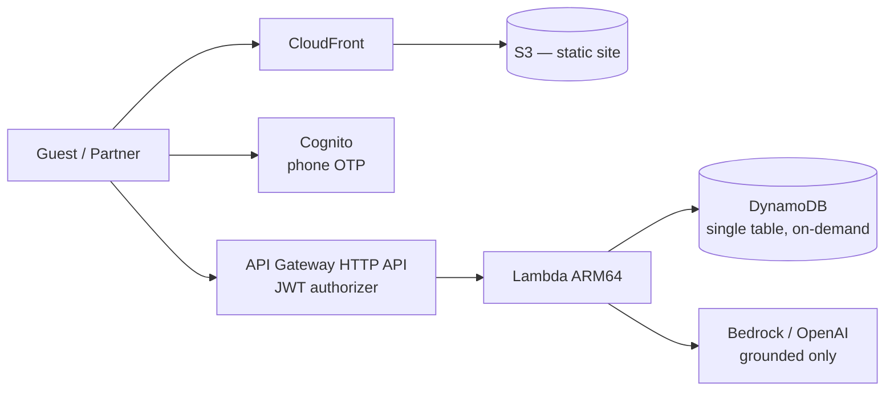

# Atithi — One-stop verified stays for India

> **Verified stays. Honest prices. Someone always answers.**

A full-stack, AWS-serverless hospitality platform. Guests book verified properties with the total price shown upfront; properties never lose a booking to an unanswered phone call.

## Why this exists

A real incident (the founding story):

1. A traveller finds a resort in India on Google, likes the property, and wants to book.
2. He calls the number listed on Google. Nobody answers. He calls again. And again.
3. He books a **competing** resort instead.
4. The resort calls back **hours later** — the revenue is already gone, permanently.

That single incident produced two products, and this repository contains both:

1. **An AI receptionist** that answers calls the front desk cannot, captures the enquiry, and hands a hot lead to staff. *Fully documented; telephony integration is Phase 2.*
2. **A direct booking platform** that fixes the reasons guests distrust existing OTAs in the first place. *Built — see below.*

---

## Repository layout

```
.
├── docs/                    # 20 product & engineering documents
├── packages/shared/         # Domain types, Zod schemas, pricing engine (shared FE ↔ BE)
├── backend/                 # Lambda handlers, repositories, services, AI grounding
├── frontend/                # React + Vite SPA, 10 Indian languages
└── infrastructure/          # AWS CDK — DynamoDB, Cognito, Lambda, API Gateway, S3, CloudFront
```

## Quick start

```bash
npm install

# Prove the two things that matter before anything else
npm test -w backend            # tenant isolation + AI grounding guards

npm run dev:web                # run the app locally
```

## One-click deploy to a fresh AWS account

Everything — infra, backend, frontend, S3 + CloudFront — deploys with a single script.
On a brand-new AWS account you only need three steps:

```bash
aws configure          # 1. paste access key + secret (region is optional)
git clone <this-repo> && cd Atithi-resort-project
./deploy.sh            # 3. Linux / macOS / Git-Bash / WSL
```

On Windows PowerShell use the `.ps1` instead:

```powershell
aws configure
git clone <this-repo>; cd Atithi-resort-project
./deploy.ps1
```

The script installs dependencies, builds every workspace, bootstraps CDK if the
account has never been bootstrapped, deploys the platform stack (DynamoDB, Cognito,
Lambda, API Gateway), auto-wires `frontend/.env.production` from the live stack
outputs, builds the SPA, deploys the web stack (S3 + CloudFront), and prints the
**CloudFront URL** at the end.

Defaults to region `ap-south-1` (India data residency). Override with a flag or env var:

```bash
AWS_REGION=us-east-1 STAGE=prod ./deploy.sh
./deploy.ps1 -Region us-east-1 -Stage prod
```

Deployment, cost model and AWS setup: **[docs/18 — AWS Serverless Architecture & Cost](docs/18-aws-serverless-architecture-and-cost.md)**

---

## Architecture at a glance



**No VPC, no NAT Gateway, no always-on compute, no search cluster.** Roughly **₹1,250/month at launch**, and under ₹1 per booking in infrastructure at scale.

---

## The two guarantees, enforced in code

### 1. One customer never sees another's data

Five independent layers — a bug in any one is not enough to leak anything.

| Layer | Where |
|---|---|
| Cognito verifies the JWT before our code runs | [infrastructure/lib/platform-stack.ts](infrastructure/lib/platform-stack.ts) |
| Identity comes from token claims only — never from body, query or path | [backend/src/lib/auth.ts](backend/src/lib/auth.ts) |
| Access scopes; `orgScope` rejects any org absent from the token | [backend/src/lib/auth.ts](backend/src/lib/auth.ts) |
| The DynamoDB partition key **is** the tenant boundary | [backend/src/lib/dynamo.ts](backend/src/lib/dynamo.ts) |
| Row-level `assertOwnership` re-check on every result | [backend/src/lib/auth.ts](backend/src/lib/auth.ts) |

Proven by 20 tests in [backend/src/\_\_tests\_\_/tenantIsolation.test.ts](backend/src/__tests__/tenantIsolation.test.ts). Cross-tenant attempts return **403, not 404**, and raise a security log event.

### 2. No fake or hallucinated data

| Mechanism | Where |
|---|---|
| Zero seed data. Only ops-verified listings are searchable | [backend/src/repositories/propertyRepository.ts](backend/src/repositories/propertyRepository.ts) |
| Availability read from real inventory rows; a missing date is never assumed available | [backend/src/repositories/inventoryRepository.ts](backend/src/repositories/inventoryRepository.ts) |
| The AI gets a closed fact sheet built only from verified stored fields | [backend/src/ai/groundedAssistant.ts](backend/src/ai/groundedAssistant.ts) |
| A **deterministic scanner** rejects any answer containing a price, availability claim or confirmation absent from the facts — plain code, so it survives prompt injection | [backend/src/ai/groundedAssistant.ts](backend/src/ai/groundedAssistant.ts) |
| The search parser can only resolve cities that exist in our inventory | [backend/src/ai/searchParser.ts](backend/src/ai/searchParser.ts) |
| Reviews require a completed booking owned by the reviewer | [backend/src/repositories/reviewRepository.ts](backend/src/repositories/reviewRepository.ts) |

Proven by 15 tests in [backend/src/\_\_tests\_\_/grounding.test.ts](backend/src/__tests__/grounding.test.ts).

---

## What we do that MakeMyTrip, Agoda, OYO, Goibibo, Cleartrip and Booking.com don't

Full analysis with code references: **[docs/19 — What We Do Differently](docs/19-what-we-do-differently.md)**

| # | Gap | Our answer |
|---|---|---|
| 1 | Price grows between search and payment | One shared pricing function; **zero** convenience fee; server rejects the booking if the total drifted |
| 2 | "Confirmed" online, no room on arrival | Real per-date inventory; booking + decrement in one atomic transaction |
| 3 | Turned away over "couples not allowed" / "local ID not allowed" | Both are **mandatory** policy fields and first-class filters; silence never counts as permission |
| 4 | Fake reviews | A review is impossible without a completed booking you own |
| 5 | Misleading photos | Per-photo verification flag; minimum verified count before publishing |
| 6 | Can't reach the property | Phone number shown prominently — plus the AI receptionist behind it |
| 7 | English-only | 10 Indian languages end to end, including natural-language search |
| 8 | Pay-to-win ranking | Readable ranking function with **no** paid-placement term; every card shows why it matched |
| 9 | Guest details demanded at reception | Every member captured at checkout (we store ID *type* only, never the number) |
| 10 | Forced prepayment, vague refunds | Pay-at-property supported; exact refund and deadline computed and shown |
| 11 | Your data is the product | Per-purpose consent, DPDP export/erasure built in, PII masked in logs, data stays in India |

**Deliberately not copied:** fake urgency counters, "23 people viewing", countdown timers, pre-ticked add-ons, disguised sponsored results, hidden phone numbers, padded ratings for new listings.

---

## Honest status

**Built and working:** verified-property search (structured + natural language in 10 languages), real availability, transparent pricing, atomic booking with overbooking protection, cancellation with exact refund calculation, verified-stay reviews, grounded AI Q&A, guest profile with DPDP export/erasure, partner dashboard, full CDK infrastructure, 35 passing guard tests.

**Not yet built:** Razorpay payments, photo upload and ops verification console, WhatsApp notifications, telephony for the AI receptionist, partner onboarding wizard, map/radius search. Tracked in [docs/18 §6](docs/18-aws-serverless-architecture-and-cost.md#6-what-still-needs-building).

**Before going live:** close the five critical questions in [docs/16 §3.1](docs/16-open-questions-and-decisions.md#31-critical--blocking-the-build), and have a lawyer review the telephony architecture and DPDP position. Two values in the code are flagged as needing professional verification: the **GST slabs** in [packages/shared/src/constants.ts](packages/shared/src/constants.ts) and the **carrier USSD forwarding codes** in [docs/10](docs/10-telephony-and-india-compliance.md).

---

## Documentation index

| # | Document | What's inside |
|---|----------|---------------|
| 01 | [Product Vision & Problem](docs/01-product-vision-and-problem.md) | Problem, market, opportunity sizing, vision, principles |
| 02 | [PRD](docs/02-prd.md) | Goals, scope, functional requirements, user stories, acceptance criteria, success metrics |
| 03 | [Personas & User Journeys](docs/03-personas-and-user-journeys.md) | Who we serve, end-to-end journeys |
| 04 | [Workflows](docs/04-workflows.md) | Call flows, lead lifecycle, onboarding, escalation (with diagrams) |
| 05 | [System Architecture](docs/05-system-architecture.md) | Components, realtime voice pipeline, sequence diagrams, deployment topology |
| 06 | [Tech Stack](docs/06-tech-stack.md) | Chosen technologies with rationale and alternatives |
| 07 | [Data Model](docs/07-data-model.md) | Entities, ERD, multi-tenancy, retention |
| 08 | [API Specification](docs/08-api-spec.md) | REST endpoints, webhooks, auth model |
| 09 | [AI Agent Design](docs/09-ai-agent-design.md) | Conversation design, prompts, RAG knowledge base, guardrails, evaluation |
| 10 | [Telephony & India Compliance](docs/10-telephony-and-india-compliance.md) | Number strategy, call forwarding, TRAI/DoT/DLT rules |
| 11 | [Security, Privacy & DPDP](docs/11-security-privacy-dpdp.md) | Threat model, controls, DPDP Act 2023 obligations |
| 12 | [NFRs & SLAs](docs/12-nfrs-and-slas.md) | Latency, availability, scale, cost budgets |
| 13 | [Roadmap & MVP Scope](docs/13-roadmap-and-mvp-scope.md) | Phased plan, MVP cut line, milestones |
| 14 | [Pricing & GTM](docs/14-pricing-and-gtm.md) | Packaging, unit economics, go-to-market |
| 15 | [Testing & QA](docs/15-testing-and-qa.md) | Test strategy for a voice AI product |
| 16 | [Open Questions & Decisions](docs/16-open-questions-and-decisions.md) | Decision log + what still needs answering |
| 17 | [Glossary](docs/17-glossary.md) | Domain and technical terms |
| 18 | [AWS Architecture & Cost](docs/18-aws-serverless-architecture-and-cost.md) | Serverless design, cost model, deployment steps |
| 19 | [What We Do Differently](docs/19-what-we-do-differently.md) | OTA gap analysis mapped to code |

## What you said you wanted — and what I added

You asked for: AI answers when the property is busy → gives property details → collects customer details → front office calls back.

That is the correct core. Documented as-is. Here is **what was missing** that these docs now cover, because without them the product either doesn't sell, doesn't work in India, or doesn't scale:

| Gap you didn't mention | Why it matters | Where it's covered |
|---|---|---|
| **How the call reaches your AI at all** | You cannot answer a call to *their* number without conditional call forwarding or number porting. This is the single biggest technical/ops dependency. | [Doc 10](docs/10-telephony-and-india-compliance.md) |
| **Multilingual + accent handling** | Callers in India speak Hindi, Telugu, Tamil, Kannada, Marathi, Bengali, Hinglish. English-only kills adoption outside metros. | [Doc 09](docs/09-ai-agent-design.md) |
| **Latency budget** | If the AI pauses 3 seconds before replying, callers hang up. Sub-second response is a product requirement, not a nice-to-have. | [Doc 12](docs/12-nfrs-and-slas.md) |
| **Human escalation / barge-in** | Some callers must reach a human (angry guest, in-house guest emergency). AI must transfer, not trap. | [Doc 04](docs/04-workflows.md) |
| **Closing the loop after the call** | Capturing a lead is worthless if nobody calls back. Needs instant WhatsApp/SMS to guest, push alert to staff, SLA timers, and escalation if untouched. | [Doc 04](docs/04-workflows.md) |
| **Follow-up channel = WhatsApp, not email** | In India the guest expects a WhatsApp message with photos, tariff and a payment link within 60 seconds. | [Doc 04](docs/04-workflows.md), [Doc 06](docs/06-tech-stack.md) |
| **Hallucination control on price/availability** | An AI that invents a ₹4,000 tariff or confirms a room that isn't free creates legal and reputational liability. Must be grounded and bounded. | [Doc 09](docs/09-ai-agent-design.md) |
| **Call recording consent & data protection** | India's DPDP Act 2023 + TRAI rules apply. Recording voice without notice is a real risk. | [Doc 11](docs/11-security-privacy-dpdp.md) |
| **PMS / Channel Manager integration** | Real availability and rates live in eZee, Hotelogix, Djubo, Cloudbeds, STAAH. Integration is the moat. | [Doc 05](docs/05-system-architecture.md), [Doc 13](docs/13-roadmap-and-mvp-scope.md) |
| **Proof of ROI for the owner** | Owners buy "you recovered ₹2.4L of bookings last month", not "AI receptionist". Attribution reporting is a core feature. | [Doc 02](docs/02-prd.md) |
| **Multi-tenancy, billing, roles** | It's a SaaS — org/property hierarchy, per-minute metering, Razorpay subscriptions, RBAC. | [Doc 07](docs/07-data-model.md), [Doc 14](docs/14-pricing-and-gtm.md) |
| **Outbound calling (later)** | The same engine can chase unconverted leads and do post-stay feedback — big expansion revenue. | [Doc 13](docs/13-roadmap-and-mvp-scope.md) |

## Suggested reading order

New to the project → `01` → `02` → `19` → `05` → `18`.
Running the code → `18` → `08` → `07`.
Building the AI receptionist → `13` → `10` → `09`.
Selling it → `01` → `19` → `14` → `03`.

## Document status

All documents are **v0.1 drafts** dated 2026-09-13. The booking platform described in `18` and `19` is implemented in this repository; the AI receptionist (`09`, `10`) is documented but not yet wired to telephony. Decisions marked 🔓 in [Doc 16](docs/16-open-questions-and-decisions.md) remain open.
