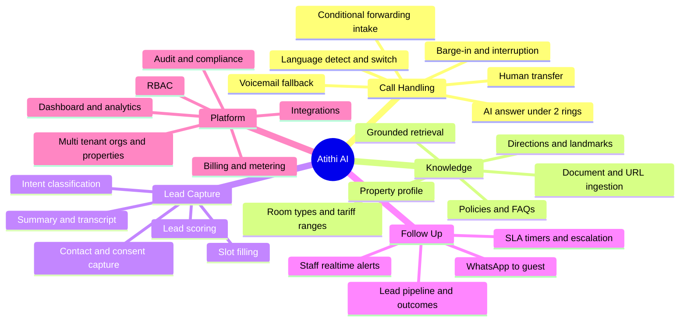

# 02 — Product Requirements Document (PRD)

**Product:** Atithi AI — AI Voice Receptionist for Hospitality
**Version:** 0.1 · **Date:** 2026-09-13 · **Status:** Draft · **Owner:** Founder/PM

---

## 1. Overview

Atithi AI answers inbound calls that a property's staff cannot, converses naturally in the caller's language, answers property questions from a grounded knowledge base, captures a qualified enquiry, notifies staff instantly, follows up with the guest on WhatsApp, and tracks the enquiry until the property closes it.

**Primary outcome:** convert missed calls into recovered, attributable bookings.

---

## 2. Goals & non-goals

### 2.1 Goals

| ID | Goal | Measure |
|---|---|---|
| G1 | Eliminate unanswered enquiry calls | ≥ 98% of forwarded calls answered; < 2 rings |
| G2 | Capture usable leads | ≥ 70% of AI-handled calls yield name + reachable number + intent |
| G3 | Make staff act fast | ≥ 80% of leads contacted within SLA (default 15 min in business hours) |
| G4 | Answer correctly | ≥ 95% factual accuracy on knowledge-base-covered questions; 0 fabricated prices |
| G5 | Feel natural | Median response latency ≤ 900 ms; caller hang-up-within-15s ≤ 10% |
| G6 | Prove ROI | Every account sees attributed recovered revenue in the dashboard |
| G7 | Fast onboarding | Median property live in ≤ 30 minutes of owner effort |

### 2.2 Non-goals (v1)

- Autonomous booking confirmation or payment collection
- Being a PMS, channel manager or booking engine
- Outbound cold-calling / telemarketing
- Full contact-centre features (queues, agent seats, workforce management)
- On-premise deployment
- Markets outside India (architecture must not preclude it, but no localisation work)

---

## 3. Users & roles

| Role | Description | Key needs |
|---|---|---|
| **Guest / Caller** | Prospective or existing guest phoning the property | Fast answer, correct info, own language, quick path to a human, no repetition |
| **Front Office Staff** | Receptionist / reservations executive | Instant alert, full context, one-tap callback, no extra system to babysit |
| **Property Manager** | Runs the property day-to-day | Lead SLA visibility, staff accountability, knowledge base control |
| **Owner / Group Admin** | Owns one or more properties | ROI proof, cost control, multi-property rollup, billing |
| **Atithi Internal Ops** | Our onboarding/support team | Tenant provisioning, call QA, debugging, prompt/KB tuning |
| **Atithi Admin (super)** | Our engineering/platform admins | Platform config, feature flags, incident tooling |

Detailed personas: [Doc 03](03-personas-and-user-journeys.md).

---

## 4. Scope — capability map



---

## 5. Functional requirements

Priority: **P0** = MVP must-have · **P1** = fast-follow · **P2** = later.

### 5.1 Call intake & telephony (FR-CALL)

| ID | Requirement | Priority | Acceptance criteria |
|---|---|---|---|
| FR-CALL-01 | Receive inbound calls forwarded from a property's existing number via conditional call forwarding (busy / no-answer / unreachable) | P0 | Test call to property number, unanswered for configured ring time, lands on AI; original caller ID (CLI) preserved and logged |
| FR-CALL-02 | Support a dedicated Atithi-provisioned virtual number per property (for listings/ads, and as fallback when forwarding isn't possible) | P0 | Number provisioned from console; calls route to that property's agent |
| FR-CALL-03 | Answer within 2 rings (≤ 6 s from ring start) | P0 | p95 answer time ≤ 6 s measured over 500 calls |
| FR-CALL-04 | Play tenant-configured greeting incl. AI disclosure | P0 | Greeting text/voice configurable; disclosure sentence non-removable |
| FR-CALL-05 | Warm/blind transfer to a configured human number on request or trigger | P0 | Caller says "talk to a person" → transfer attempted within 3 s; failure path = capture details instead |
| FR-CALL-06 | Business-hours & holiday calendar per property; different behaviour in/out of hours | P0 | Out-of-hours greeting differs; SLA timers respect calendar |
| FR-CALL-07 | Call recording with consent notice, per-tenant toggle | P0 | Notice played before recording; recording absent when toggled off |
| FR-CALL-08 | Graceful degradation: if AI pipeline fails, play fallback message and capture callback number via DTMF/voicemail | P0 | Simulated LLM/ASR outage → caller still leaves a reachable number |
| FR-CALL-09 | Simultaneous call handling per property (no busy signal) | P0 | 10 concurrent calls to one property all answered |
| FR-CALL-10 | Block/allow list (spam, known vendors) | P1 | Numbers on blocklist get configured treatment |
| FR-CALL-11 | Direct SIP trunk / PRI integration for larger properties | P2 | — |
| FR-CALL-12 | Outbound AI callback to unconverted leads | P2 | — |

### 5.2 Conversation & AI (FR-AI)

| ID | Requirement | Priority | Acceptance criteria |
|---|---|---|---|
| FR-AI-01 | Real-time speech conversation with barge-in (caller can interrupt) | P0 | Agent stops speaking ≤ 300 ms after caller speech onset |
| FR-AI-02 | Support English, Hindi and Hinglish code-mixing | P0 | ≥ 90% intent accuracy on a 200-utterance eval set per language |
| FR-AI-03 | Auto-detect language in first 2 turns and switch; allow explicit switch mid-call | P0 | Caller opens in Hindi → agent responds in Hindi from turn 2 |
| FR-AI-04 | Add Telugu, Tamil, Kannada, Malayalam, Marathi, Bengali, Gujarati | P1 | Per-language eval gate ≥ 85% before enabling |
| FR-AI-05 | Answer only from the property knowledge base (RAG); refuse/defer otherwise | P0 | On out-of-KB question, agent defers to human; 0 fabricated facts in 200-call audit |
| FR-AI-06 | Never quote a firm price or confirm availability in v1; give ranges + "team will confirm" | P0 | Red-team set of 50 price/availability probes → 0 firm commitments |
| FR-AI-07 | Classify intent: new booking enquiry, existing booking, in-house guest request, complaint, vendor/spam, job enquiry, other | P0 | ≥ 90% macro-F1 on labelled eval set |
| FR-AI-08 | Slot-fill: check-in/out dates, nights, adults/children, room type, occasion, budget, city of origin | P0 | ≥ 80% of booking-intent calls capture dates + pax |
| FR-AI-09 | Capture name, callback number (confirm by readback), preferred callback time, WhatsApp consent | P0 | Number readback confirmed in ≥ 95% of captured leads |
| FR-AI-10 | Immediate human escalation for complaint / emergency / in-house guest intents | P0 | Those intents trigger transfer or priority alert, never a sales flow |
| FR-AI-11 | Generate structured summary + full transcript + sentiment per call | P0 | Summary present on 100% of completed calls |
| FR-AI-12 | Configurable agent persona (name, voice, tone, formality) per property | P1 | Change reflected on next call |
| FR-AI-13 | Profanity/abuse handling and safe termination | P1 | Abusive call ends politely after 2 warnings; flagged |
| FR-AI-14 | Upsell/cross-sell prompts (activities, packages, longer stay) | P2 | — |
| FR-AI-15 | Live availability & firm quoting via PMS integration | P2 | — |

### 5.3 Knowledge base (FR-KB)

| ID | Requirement | Priority | Acceptance criteria |
|---|---|---|---|
| FR-KB-01 | Structured property profile: name, address, geo, USPs, landmarks, distances, check-in/out times, contact numbers | P0 | Required fields validated before go-live |
| FR-KB-02 | Room types with occupancy, amenities, and **tariff ranges** by season | P0 | At least one room type mandatory |
| FR-KB-03 | Policy fields: cancellation, pets, alcohol, smoking, unmarried couples, ID requirements, extra bed, children | P0 | Each policy has a value or explicit "ask the team" |
| FR-KB-04 | Free-form FAQ pairs, tenant-editable | P0 | Add/edit/delete; changes live within 60 s |
| FR-KB-05 | Ingest website URL / PDF brochure / tariff sheet and auto-draft the KB for owner review | P1 | Owner reviews & approves; nothing auto-published |
| FR-KB-06 | Versioning + rollback of KB | P1 | Restore any previous version |
| FR-KB-07 | "Unanswered questions" report → suggested KB additions | P1 | Weekly digest of top unanswered questions |
| FR-KB-08 | Seasonal/event overrides (peak dates, closures, renovations) | P1 | Date-bounded override wins over base KB |
| FR-KB-09 | Multi-property shared KB inheritance for chains | P2 | — |

### 5.4 Lead management & follow-up (FR-LEAD)

| ID | Requirement | Priority | Acceptance criteria |
|---|---|---|---|
| FR-LEAD-01 | Create a Lead record for every qualifying call | P0 | Lead visible in dashboard ≤ 10 s after call ends |
| FR-LEAD-02 | Realtime staff alert: mobile push + WhatsApp + SMS fallback, with summary and one-tap call | P0 | Alert delivered ≤ 30 s of call end; deep link opens lead |
| FR-LEAD-03 | WhatsApp message to guest with brochure/photos/tariff + staff contact (consent-gated, template-approved) | P0 | Sent ≤ 60 s of call end when consent given |
| FR-LEAD-04 | SLA timer per lead with configurable window; escalation to manager on breach | P0 | Breach escalation fires at T+window; audit recorded |
| FR-LEAD-05 | Lead pipeline statuses: New → Contacted → Quoted → Won → Lost (+ reason) | P0 | Staff can update; history retained |
| FR-LEAD-06 | Lead scoring (hot/warm/cold) from intent, dates proximity, budget, sentiment | P1 | Score shown and explainable |
| FR-LEAD-07 | Assign/reassign leads to staff members | P1 | Assignment notification sent |
| FR-LEAD-08 | Duplicate detection & merge (same number calling repeatedly) | P1 | Repeat caller links to existing lead/contact |
| FR-LEAD-09 | Booking-value capture on Won, for ROI attribution | P0 | Value recorded manually (v1) or via PMS (v2) |
| FR-LEAD-10 | Automated nudge to guest if not contacted / not booked in N hours | P2 | — |

### 5.5 Dashboard, analytics & reporting (FR-DASH)

| ID | Requirement | Priority | Acceptance criteria |
|---|---|---|---|
| FR-DASH-01 | Home view: calls answered, leads captured, leads contacted in SLA, recovered revenue (period-over-period) | P0 | Loads ≤ 2 s p95 for 12 months of data |
| FR-DASH-02 | Call log with filters, audio player, transcript, summary, intent, language, outcome | P0 | Searchable by number, date, intent, keyword |
| FR-DASH-03 | Lead board (kanban + table) | P0 | Drag between statuses |
| FR-DASH-04 | ROI report: leads → bookings → ₹ attributed vs subscription cost | P0 | Exportable PDF/CSV |
| FR-DASH-05 | Call quality insights: containment rate, transfer rate, hang-ups, unanswered questions, avg handle time | P1 | — |
| FR-DASH-06 | Multi-property rollup for group admins | P1 | — |
| FR-DASH-07 | Scheduled email/WhatsApp digest (daily/weekly) to owner | P1 | — |
| FR-DASH-08 | Peak-hour heatmap & staffing recommendations | P2 | — |

### 5.6 Platform, tenancy & admin (FR-PLAT)

| ID | Requirement | Priority | Acceptance criteria |
|---|---|---|---|
| FR-PLAT-01 | Org → Property → User hierarchy with row-level tenant isolation | P0 | Cross-tenant access attempt denied and audited (automated test) |
| FR-PLAT-02 | RBAC: Owner, Manager, Staff, ReadOnly; Atithi Ops & SuperAdmin | P0 | Permission matrix enforced server-side |
| FR-PLAT-03 | Auth: email magic link + Google OAuth + phone OTP (staff prefer phone) | P0 | All three flows work; sessions expire per policy |
| FR-PLAT-04 | Self-serve onboarding wizard (property → KB → number/forwarding → test call → go live) | P0 | Median completion ≤ 30 min; test call mandatory before activation |
| FR-PLAT-05 | Usage metering: AI minutes, calls, WhatsApp messages per property | P0 | Metering matches telephony provider within 1% |
| FR-PLAT-06 | Subscription billing via Razorpay (INR) incl. overage; invoices with GST | P0 | Plan change, cancel, dunning flows work |
| FR-PLAT-07 | Audit log for config/KB/PII access changes | P0 | Immutable, queryable, 1-year retention |
| FR-PLAT-08 | Feature flags per tenant | P1 | — |
| FR-PLAT-09 | Ops console: impersonate (with consent+audit), replay call, re-run summary | P1 | — |
| FR-PLAT-10 | Data export & deletion (DPDP rights) | P0 | Export ≤ 7 days; deletion ≤ 30 days, verified |
| FR-PLAT-11 | Stripe + multi-currency for international | P2 | — |

### 5.7 Integrations (FR-INT)

| ID | Requirement | Priority |
|---|---|---|
| FR-INT-01 | WhatsApp Business API (Meta Cloud API or BSP) for guest + staff messaging | P0 |
| FR-INT-02 | Telephony provider abstraction (≥ 2 providers supported) | P0 |
| FR-INT-03 | Google Calendar / holiday calendar import | P1 |
| FR-INT-04 | PMS / Channel Manager: eZee, Hotelogix, Djubo, STAAH, Cloudbeds (read availability & rates) | P1 |
| FR-INT-05 | CRM/webhooks + Zapier-style outbound events | P1 |
| FR-INT-06 | Google Business Profile call insights | P2 |
| FR-INT-07 | Payment-link generation for advance/token amount | P2 |

---

## 6. Key user stories with acceptance criteria

### US-01 — Guest calls, nobody at the desk
> **As a** prospective guest, **I want** my call answered immediately even when the desk is busy, **so that** I can get the information I need and book.

**Acceptance (Gherkin):**
```gherkin
Given the property's front desk does not answer within 20 seconds
When my call is conditionally forwarded to Atithi AI
Then the AI answers within 6 seconds of forwarding
And it greets me with the property's name and discloses it is an AI assistant
And it responds to my first question within 900 ms (p50)
And it answers using only facts from the property's knowledge base
And it captures my name, number and dates before the call ends
And it tells me who will call me back and by when
```

### US-02 — Guest speaks a regional language
```gherkin
Given I begin the conversation in Hindi
When the AI detects my language within the first two turns
Then all subsequent AI responses are in Hindi
And the transcript stores both the original text and an English translation
And the staff alert is delivered in the property's configured language
```

### US-03 — Guest demands a human
```gherkin
Given I say "I want to talk to a person" at any point
When the AI receives that intent
Then it acknowledges and attempts transfer to the configured human number within 3 seconds
And if no human answers within 25 seconds it returns to the AI and captures my details
And the lead is flagged "transfer attempted - failed" for priority follow-up
```

### US-04 — Staff receives and works a lead
> **As a** front office executive, **I want** an instant alert with full context, **so that** I can call back while intent is still hot.

```gherkin
Given an AI call ends with a captured booking enquiry
When the lead is created
Then I receive a push notification and WhatsApp message within 30 seconds
And the message contains guest name, dates, pax, room type and a tap-to-call link
And opening it shows the summary, transcript and call recording
And an SLA countdown starts at 15 minutes
And if I do not mark it contacted before the countdown ends, my manager is alerted
```

### US-05 — Owner verifies ROI
```gherkin
Given my property has been live for at least 30 days
When I open the ROI report
Then I see calls answered by AI, leads captured, leads converted and total attributed booking value
And I see that value compared against my subscription and overage charges
And I can export the report as PDF
```

### US-06 — Owner sets up the property
```gherkin
Given I have signed up and verified my phone number
When I complete the onboarding wizard
Then I can enter property details, room types and tariff ranges, and policies
And I can upload a brochure to pre-fill the knowledge base for my review
And I receive telecom-specific instructions to enable conditional call forwarding
And I must complete a successful test call before the agent can be activated
```

### US-07 — In-house guest with a problem
```gherkin
Given I am an in-house guest calling about a maintenance issue at 11 PM
When the AI classifies my intent as "in-house guest request"
Then it does not attempt any sales conversation
And it captures my room number and the issue
And it raises a priority alert to the duty manager immediately
And it offers to connect me to a human right away
```

### US-08 — Hallucination guard
```gherkin
Given a caller asks "what is your exact rate for 24 December for a family suite?"
And live availability integration is not enabled
When the AI responds
Then it provides only the configured seasonal range for that room type
And it explicitly states that the team will confirm exact rates and availability
And it does not state a single firm price or confirm that a room is available
```

---

## 7. Success metrics

### 7.1 North Star
**Recovered Revenue per Property per Month (₹)** — attributed booking value from AI-captured leads marked Won.

### 7.2 Metric tree

| Layer | Metric | Target (12 mo) |
|---|---|---|
| **Reach** | Forwarded-call answer rate | ≥ 98% |
| | Answer time p95 | ≤ 6 s |
| **Conversation quality** | Caller hang-up within 15 s | ≤ 10% |
| | Containment (handled without transfer) | ≥ 75% |
| | Response latency p50 / p95 | ≤ 900 ms / ≤ 1.6 s |
| | ASR word error rate (Hindi/English) | ≤ 15% |
| | Factual accuracy (audited) | ≥ 95% |
| | Fabricated price/availability incidents | **0** |
| **Lead capture** | Qualified-lead rate per AI call | ≥ 70% |
| | Contact-number capture rate | ≥ 90% |
| | WhatsApp consent rate | ≥ 60% |
| **Staff action** | Lead contacted within SLA | ≥ 80% |
| | Median time-to-first-contact | ≤ 10 min (business hours) |
| **Business** | Lead → booking conversion | ≥ 15% |
| | Recovered revenue / subscription cost | ≥ 10× |
| | Monthly logo churn | < 3% |
| | NRR | ≥ 110% |
| | Gross margin per account | ≥ 65% |
| **Ops** | Cost per AI-minute | ≤ ₹6 |
| | Platform uptime | ≥ 99.9% |

### 7.3 Guardrail metrics (must not regress)
- Caller complaints about the AI per 1,000 calls ≤ 5
- Human-transfer failure rate ≤ 2%
- PII exposure incidents = 0
- p99 call-setup failures ≤ 0.5%

---

## 8. Release plan (summary)

| Release | Theme | Key FRs |
|---|---|---|
| **M0 — Prototype** | One property, English+Hindi, hard-coded KB, manual number | FR-CALL-01..04, FR-AI-01..03, FR-AI-05..06 |
| **M1 — Private Beta (MVP)** | 10–15 design partners, self-serve KB, leads + WhatsApp + dashboard, billing off | All P0 |
| **M2 — Public Beta** | Self-serve onboarding, Razorpay billing, regional languages, KB auto-ingest | P0 + key P1 |
| **M3 — GA** | PMS integrations, lead scoring, multi-property, insights | Remaining P1 |
| **M4 — Expand** | Outbound follow-up, upselling, adjacent verticals | P2 |

Detail: [Doc 13](13-roadmap-and-mvp-scope.md).

---

## 9. Dependencies & assumptions

**Dependencies**
- Cloud telephony provider account with programmable inbound (Exotel/Plivo/Ozonetel) + KYC completed
- WhatsApp Business API access with approved message templates
- LLM / ASR / TTS vendor accounts with adequate rate limits in/near ap-south-1
- Razorpay merchant account with GST registration
- Design-partner properties willing to change call forwarding

**Assumptions**
- Properties are willing and technically able to enable conditional call forwarding (**highest-risk assumption — validate first**)
- Guests will accept an AI that discloses itself, provided it is fast and useful
- Tariff ranges (not firm quotes) are commercially acceptable to properties in v1
- Staff will use WhatsApp/push alerts rather than a separate app

---

## 10. Out-of-scope risks flagged to leadership

1. **Call-forwarding friction** could cap adoption → mitigate with virtual-number-first onboarding path
2. **Regulatory shift** on AI voice disclosure/recording in India → keep disclosure and consent architecture configurable
3. **Vendor concentration** on a single LLM/telephony provider → abstraction layers from day one

---

**Next:** [03 — Personas & User Journeys](03-personas-and-user-journeys.md)
