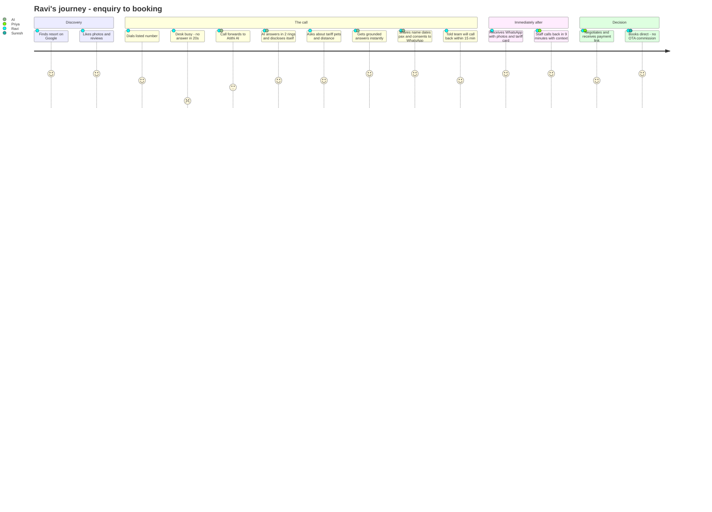
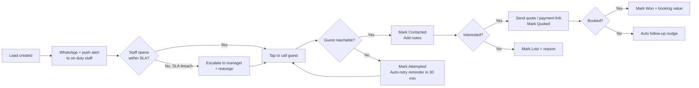
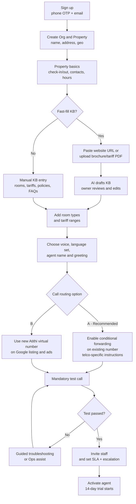
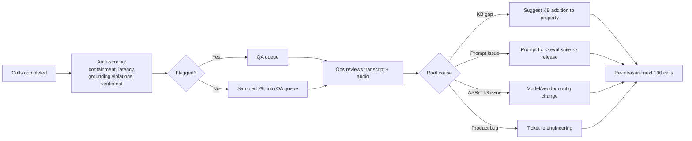

# 03 — Personas & User Journeys

**Version:** 0.1 · **Date:** 2026-09-13

---

## 1. Personas

### 1.1 Ravi — The Traveller (Guest / Caller) 🎯 *primary value recipient*

| | |
|---|---|
| **Age / profile** | 32, Bengaluru, IT professional, plans a 2-night Coorg trip for family |
| **Context** | Browsing Google/Instagram at 9:30 PM; shortlisted 3 resorts |
| **Goal** | Confirm price, availability, pet policy and driving distance — then decide tonight |
| **Behaviour** | Calls rather than emails; expects an answer in 2 rings; will call the next shortlisted property within minutes if unanswered |
| **Frustrations** | Ringing out, IVR menus, being told "call back tomorrow", staff who don't know the tariff |
| **Language** | English + Kannada/Hindi mix |
| **Success looks like** | Gets answers in < 3 minutes, receives a WhatsApp with photos and tariff, gets a callback from a human the same evening |
| **Will abandon if** | AI is slow, robotic, evasive, or loops without offering a human |

### 1.2 Priya — Front Office Executive (Staff) 🎯 *primary daily user*

| | |
|---|---|
| **Age / profile** | 24, front desk at a 28-room resort, 12-hour shifts |
| **Context** | Handles check-ins, walk-ins, housekeeping coordination and the phone — simultaneously |
| **Goal** | Don't lose bookings; don't get scolded by the manager; finish the shift |
| **Tools** | Android phone, WhatsApp, a legacy PMS on a desktop |
| **Frustrations** | Phone rings during check-in; callers ask the same 10 questions; no record of who called |
| **Success looks like** | A WhatsApp alert with the full context and a tap-to-call button; she calls back in a gap and sounds informed |
| **Will reject if** | It's another app to log into, or it creates extra data entry |

> **Design implication:** staff experience must be **WhatsApp/push-first**, dashboard-second. Zero mandatory data entry to work a lead — one tap to call, one tap to set outcome.

### 1.3 Mahesh — Property Manager

| | |
|---|---|
| **Profile** | 38, manages operations for a 40-room resort |
| **Goal** | Ensure every enquiry is followed up; keep occupancy up in lean season |
| **Frustrations** | No visibility into missed calls; can't prove staff followed up; peak-season chaos |
| **Success looks like** | Daily digest: X calls answered by AI, Y leads, Z contacted in SLA, ₹A recovered |
| **Buying role** | Champion / recommender |

### 1.4 Suresh — Owner / Group Admin 🎯 *economic buyer*

| | |
|---|---|
| **Profile** | 52, owns 2 resorts + 1 homestay; his personal mobile is on the Google listing |
| **Goal** | More direct bookings, less OTA commission; fewer staff headaches |
| **Mindset** | Sceptical of "AI"; convinced by rupees and a live demo of his own property |
| **Frustrations** | Paying 18% OTA commission while direct calls go unanswered; staff turnover |
| **Success looks like** | "Last month Atithi answered 94 calls you missed, captured 71 enquiries, 11 became bookings worth ₹1.04L. You paid ₹4,999." |
| **Will churn if** | He can't see attributable value, or a guest complains about the AI |

### 1.5 Anita — Atithi Onboarding/Success Ops (internal)

| | |
|---|---|
| **Goal** | Get properties live fast and keep call quality high |
| **Needs** | Tenant provisioning, KB bulk-edit, call QA queue, transcript search, prompt/KB tuning tools, telco forwarding playbooks |

### 1.6 Anti-persona (not our user, v1)
Large branded chains with an existing contact centre and 9-month procurement cycles; pure OTA-dependent properties with no direct phone traffic.

---

## 2. Journey A — Guest: missed call to booked stay

### Detailed step-by-step (happy path)

| # | Actor | Action | System behaviour | Time |
|---|---|---|---|---|
| 1 | Ravi | Dials property number | Telco rings the desk | T+0 |
| 2 | — | No answer for 20 s | Conditional forwarding triggers | T+20s |
| 3 | System | Inbound call at telephony provider → webhook to Atithi | Tenant resolved by called number; agent session created; KB pre-loaded | T+21s |
| 4 | AI | Greets: property name + "I'm the AI assistant" + recording notice | Media stream open; ASR listening | T+23s |
| 5 | Ravi | "Do you have rooms for 24–26 Dec, 2 adults 1 kid, and do you allow pets?" | ASR streams; intent = booking_enquiry; slots filled | T+30s |
| 6 | AI | Answers pet policy from KB; gives Dec tariff *range*; states team will confirm availability | RAG retrieval; grounding guard blocks firm quote | T+32s |
| 7 | Ravi | Asks distance from Bengaluru & whether there's a pool | Answered from KB | T+50s |
| 8 | AI | Asks for name, number readback, preferred callback time, WhatsApp consent | Slots + consent captured | T+80s |
| 9 | AI | Confirms: "Priya will call you within 15 minutes" and ends politely | Call ends | T+110s |
| 10 | System | Transcribe → summarise → score → create Lead | Lead in dashboard | T+115s |
| 11 | System | Push + WhatsApp to Priya; WhatsApp brochure to Ravi | Both delivered | T+140s |
| 12 | Priya | Taps call button, speaks with full context | Lead → Contacted | T+9min |
| 13 | Priya | Sends quote + payment link | Lead → Quoted | T+20min |
| 14 | Ravi | Pays advance | Lead → Won, value ₹14,500 | T+2h |
| 15 | Suresh | Sees attributed revenue in ROI report | Attribution recorded | Next day |

### Failure paths

| Path | Trigger | System response |
|---|---|---|
| **Caller hangs up early** | Hang-up < 15 s | Log as abandoned; if CLI available, send WhatsApp "Sorry we missed you" (consent rules apply) + create low-priority lead with number only |
| **Caller refuses AI** | "I don't want to talk to a machine" | Immediate transfer attempt; if unavailable, offer callback and take only name + number in ≤ 20 s |
| **Number capture fails** | Bad ASR / caller won't confirm | Fall back to CLI (caller ID) as callback number; flag "unverified number" |
| **AI can't answer** | Out-of-KB question | "Let me get our team to confirm that" → logged to unanswered-questions report |
| **Pipeline outage** | LLM/ASR down | Fallback IVR: "Please leave your number after the tone" → DTMF/voicemail → lead created |
| **Angry existing guest** | Complaint intent | No sales flow; immediate priority escalation + manager alert |

---

## 3. Journey B — Staff: working a lead

**Key design constraints for staff UX**
- Everything workable from WhatsApp + a mobile web page — no forced app install
- Lead card must show: name, number, dates, pax, room type, budget, sentiment, 60-word summary, "Play recording" and "Call now"
- Status update ≤ 2 taps
- Booking value entry is one field; prompt only at "Won"

---

## 4. Journey C — Owner onboarding (target: ≤ 30 minutes)

**Onboarding friction points to engineer around**
1. **Conditional call forwarding** is the #1 drop-off. Provide per-telco (Jio / Airtel / Vi / BSNL) USSD code cards, a short video, and a "WhatsApp our ops team" button. Offer option B as a zero-friction alternative.
2. **KB completeness** — block activation only on a minimum viable set (name, address, ≥1 room type with range, check-in/out, ≥3 policies, 1 human transfer number).
3. **Test call is mandatory** — owner must hear the agent answer their own property questions before go-live. This is the "aha" moment; instrument it.

---

## 5. Journey D — Internal Ops: call QA loop

---

## 6. Journey map — emotional arc (why speed wins)

| Stage | Guest emotion (today) | Guest emotion (with Atithi) |
|---|---|---|
| Dialling | Hopeful | Hopeful |
| Ringing 20 s | Impatient | — (answered) |
| No answer | Annoyed | — |
| 2nd/3rd attempt | Frustrated, doubts the property | — |
| Books competitor | Resigned; forms negative impression | Informed, reassured |
| Late callback | Irritated, feels disrespected | Delighted — called back within minutes |

**The product's real job:** compress the window between *intent* and *acknowledgement* to near zero.

---

**Next:** [04 — Workflows](04-workflows.md)
