# 04 — Workflows

**Version:** 0.1 · **Date:** 2026-09-13

This document defines the operational flows of the product. Diagrams are Mermaid; render in VS Code with a Mermaid preview extension or on GitHub.

---

## 1. Master flow — end to end

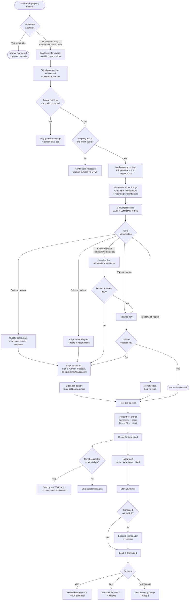

---

## 2. Call routing — how the call actually reaches us

Three supported routing modes. See [Doc 10](10-telephony-and-india-compliance.md) for telco specifics.

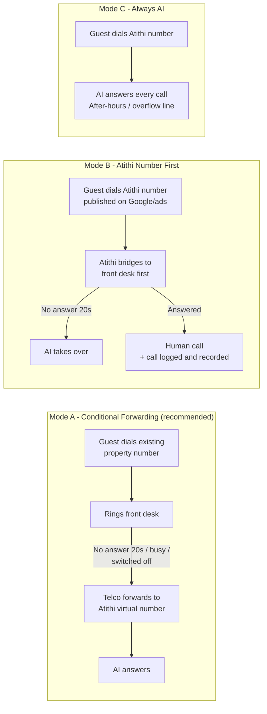

| Mode | Pros | Cons | Use when |
|---|---|---|---|
| **A — Conditional forwarding** | Keeps the number already on Google/OTAs/boards; zero marketing change | Requires owner to set forwarding; no visibility into calls the desk *did* answer; telco quirks | Default for most properties |
| **B — Atithi number first** | Full call analytics incl. human-answered calls; no forwarding setup | Owner must update the listed number; porting/CLI considerations | Properties wanting analytics; new listings; ad campaigns |
| **C — Always AI** | Simplest; guaranteed instant answer | No human-first experience | Dedicated after-hours or overflow line; homestays with no desk |

> **Product decision:** support A and B at MVP. C is a config toggle of B.

---

## 3. In-call conversation state machine

```mermaid
stateDiagram-v2
    [*] --> Greeting
    Greeting --> LanguageDetect : caller speaks
    LanguageDetect --> Discovery : language locked
    Discovery --> IntentClassified : intent confidence > threshold
    Discovery --> Clarify : low confidence
    Clarify --> Discovery

    IntentClassified --> Qualify : booking_enquiry
    IntentClassified --> ExistingBooking : existing_booking
    IntentClassified --> Escalate : complaint / emergency / in_house
    IntentClassified --> PoliteClose : vendor / job / spam
    IntentClassified --> Transfer : wants_human

    Qualify --> AnswerQuestions : caller asks something
    AnswerQuestions --> Qualify
    Qualify --> CaptureContact : slots sufficient OR caller ready
    ExistingBooking --> CaptureContact

    CaptureContact --> ConfirmNumber
    ConfirmNumber --> CaptureContact : readback mismatch
    ConfirmNumber --> ConsentCapture : confirmed
    ConsentCapture --> ClosingPromise
    ClosingPromise --> [*]

    Escalate --> Transfer
    Transfer --> HumanConnected : answered
    Transfer --> CaptureContact : no answer / busy
    HumanConnected --> [*]
    PoliteClose --> [*]

    Discovery --> Fallback : ASR failure x3 / silence x2
    Qualify --> Fallback : ASR failure x3
    Fallback --> DTMFCapture
    DTMFCapture --> [*]

    AnswerQuestions --> OutOfScope : question not in KB
    OutOfScope --> Qualify : defer to human, continue
```

### State rules

| State | Max duration | Exit rule | Notes |
|---|---|---|---|
| Greeting | 8 s | Caller speaks or 3 s silence | Must include AI disclosure + recording notice |
| LanguageDetect | 2 turns | Confidence ≥ 0.7 | Default to property's primary language on failure |
| Discovery | 60 s | Intent classified | |
| Qualify | 120 s | Required slots or caller signals done | Never interrogate — max 2 questions per turn |
| AnswerQuestions | — | Returns to Qualify | Grounding guard always active |
| CaptureContact | 60 s | Name + number captured | Fall back to CLI if refused |
| ConfirmNumber | 2 attempts | Readback matched | Then accept CLI |
| Transfer | 25 s ring | Answered or timeout | Announce to human: "AI transfer, booking enquiry" |
| Fallback | 30 s | DTMF number captured | Always reachable |
| **Total call** | **7 min hard cap** | Graceful wrap-up at 6 min | Cost + quality control |

---

## 4. Post-call pipeline

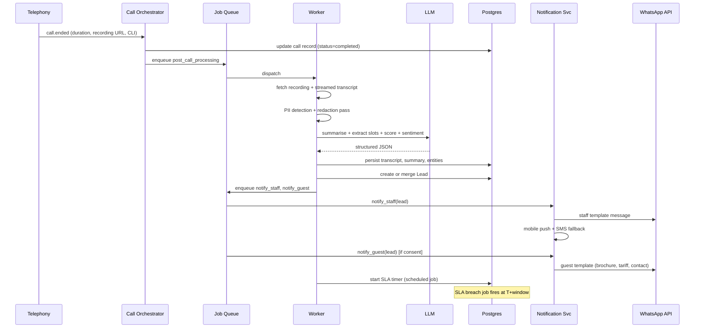

**Idempotency:** every job keyed by `call_id` + `job_type`; retries are safe. Notification sends deduped by `(lead_id, channel, template)` within 10 minutes.

---

## 5. Lead lifecycle

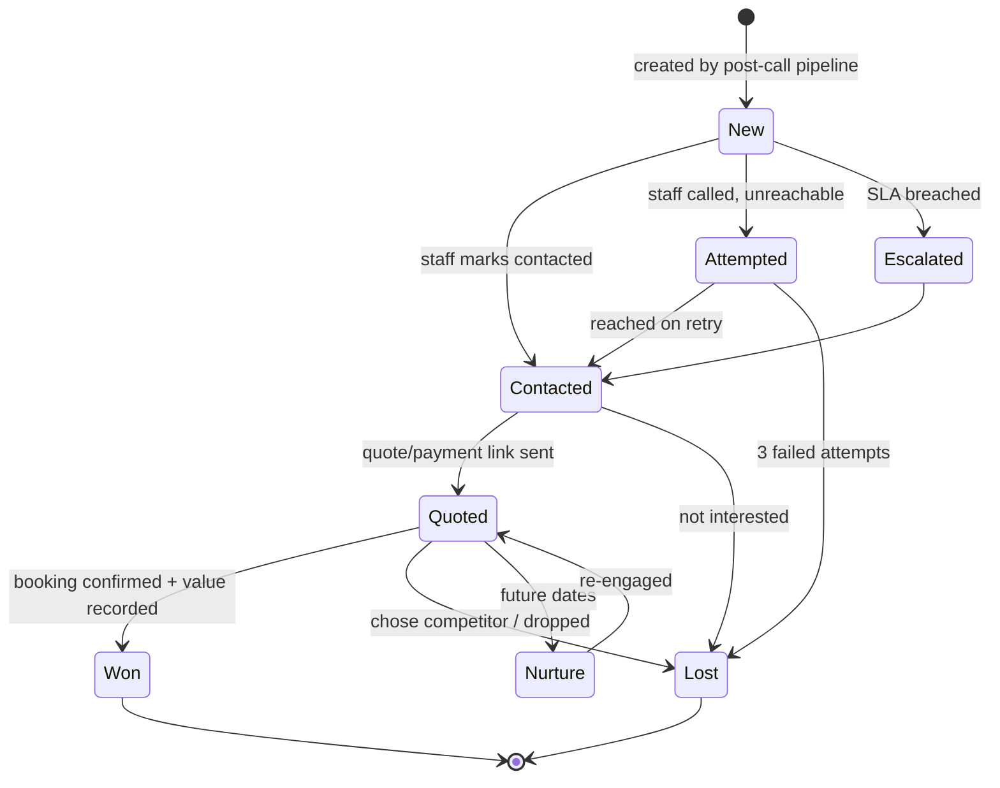

### SLA & escalation policy (configurable per property)

| Condition | Default SLA | Escalation |
|---|---|---|
| Business hours, hot lead | 15 min | Manager alerted at breach; lead reassigned |
| Business hours, warm/cold | 60 min | Manager alerted at breach |
| After hours | By next business-hour start + 30 min | Owner alerted at breach |
| Complaint / in-house guest | 5 min | Duty manager + owner alerted immediately |

---

## 6. Escalation & human transfer

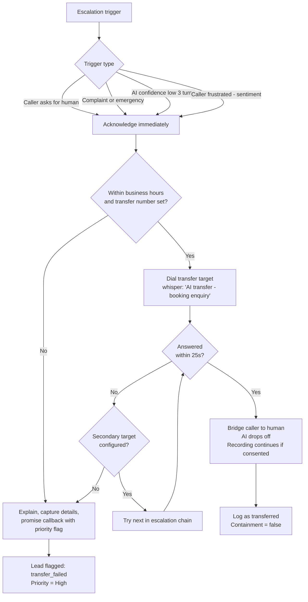

**Escalation chain example:** Front desk → Reservations mobile → Duty manager → Owner. Max 2 hops, 25 s each, hard cap 60 s total before falling back to capture.

---

## 7. Knowledge base authoring & update

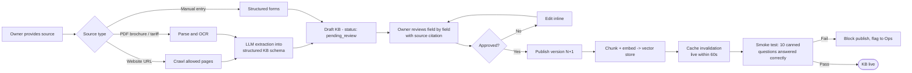

**Continuous improvement loop**

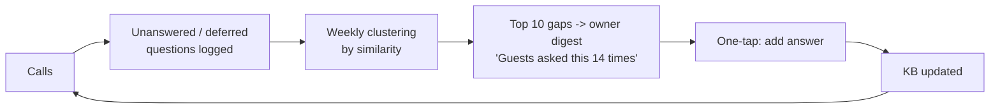

> This loop is a **retention feature**: the agent visibly gets smarter about *their* property every week.

---

## 8. Onboarding workflow (ops + product)

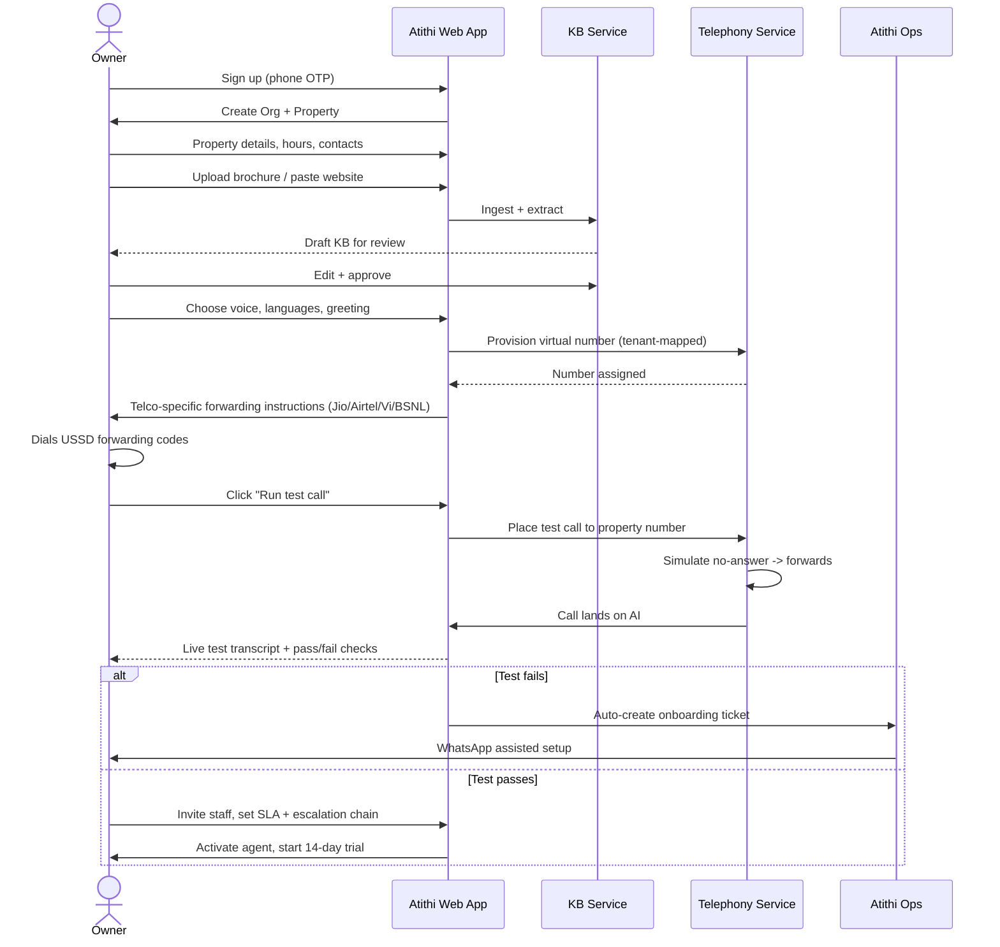

---

## 9. Billing & metering workflow

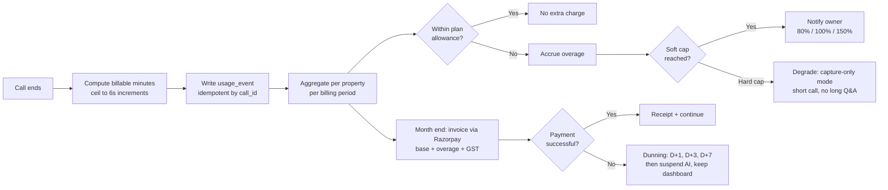

**Never hard-stop silently.** If a tenant hits a hard cap or fails payment, the AI still answers with a short "capture your number" flow — losing a guest's call must never be the failure mode.

---

## 10. Incident / degradation workflow

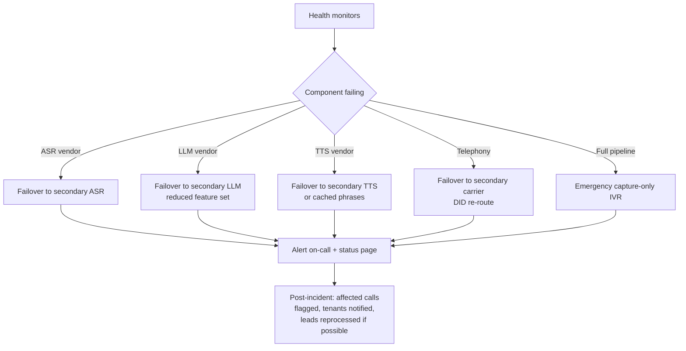

**Degradation ladder (worst case last):**
1. Full conversational AI
2. AI with reduced KB (cached answers only)
3. Scripted short capture: greeting → "please share your name and number" → confirm → end
4. DTMF capture: "press 1 to leave your number"
5. Voicemail + immediate staff alert with recording

---

## 11. Data lifecycle workflow

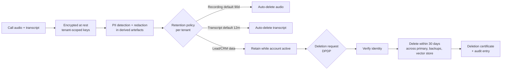

---

**Next:** [05 — System Architecture](05-system-architecture.md)
