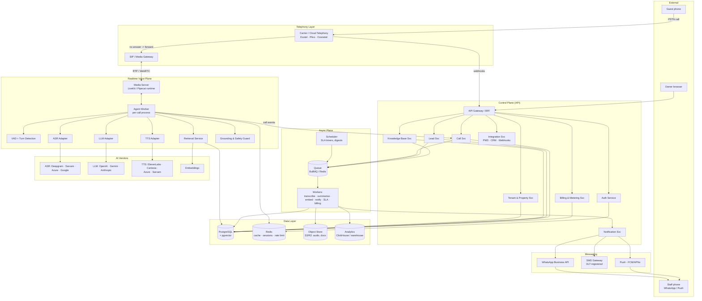
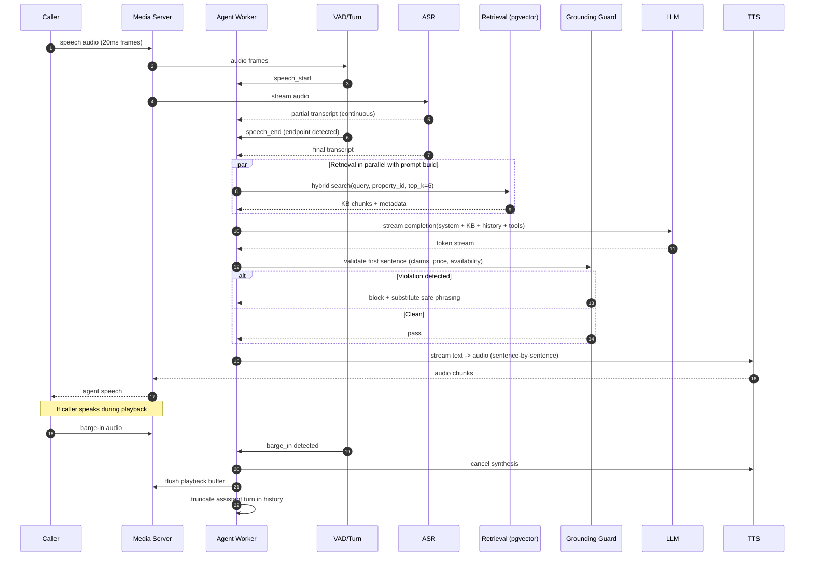
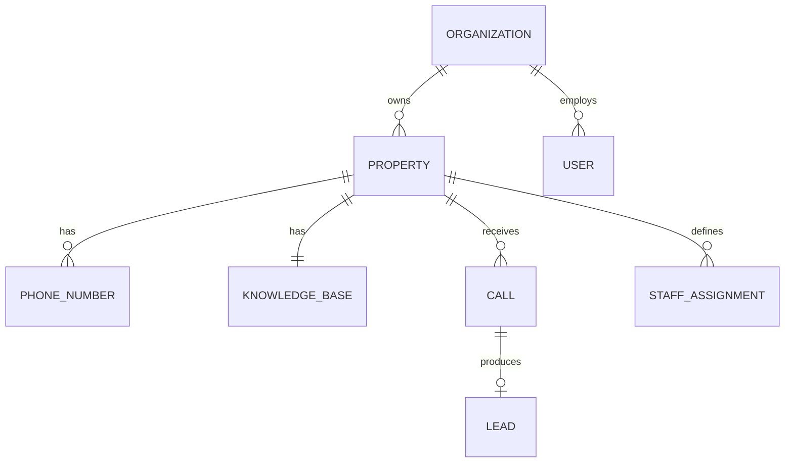
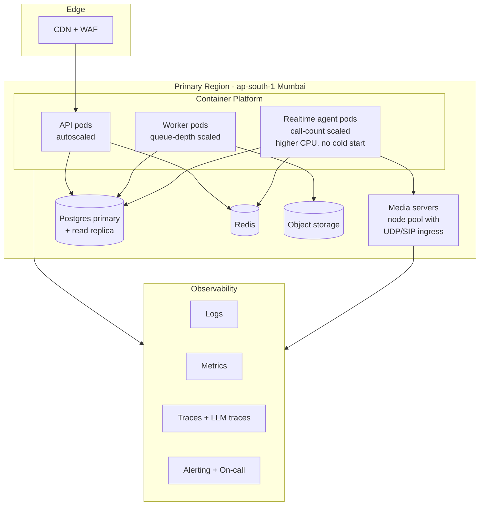
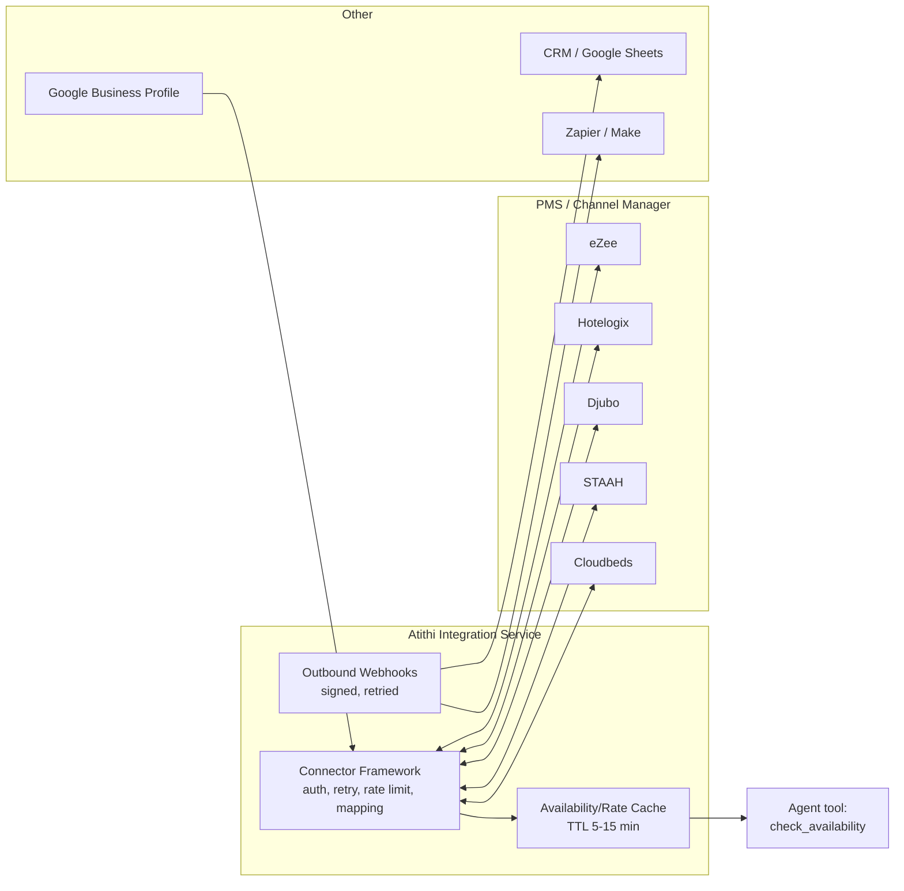
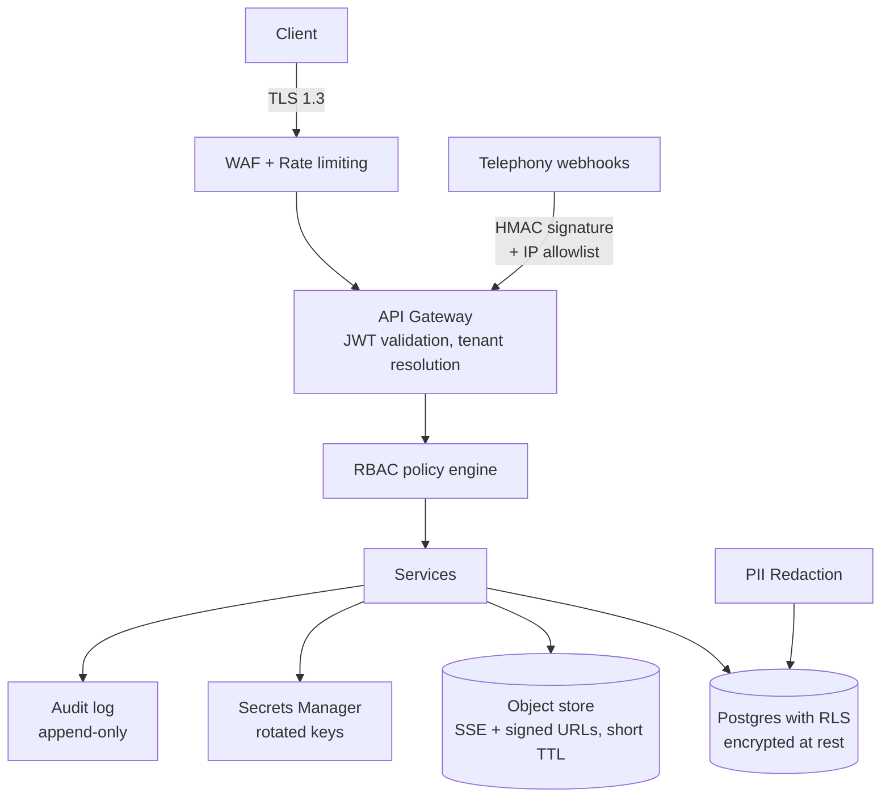

# 05 — System Architecture

**Version:** 0.1 · **Date:** 2026-09-13

---

## 1. Architectural principles

1. **Realtime path is sacred.** The media/voice path is isolated from CRUD workloads — separate service, separate scaling, separate deploy cadence. A dashboard deploy must never drop a live call.
2. **Vendor abstraction at every AI and telephony boundary.** Providers will change; swapping ASR/LLM/TTS/telephony must be config, not a rewrite.
3. **Multi-tenant by default.** Tenant ID is present in every row, every log line, every cache key, every metric label.
4. **Event-driven post-processing.** Anything not needed during the call happens asynchronously via a durable queue.
5. **Fail soft, never silent.** Every failure path still captures a callback number.
6. **India data residency.** Primary region `ap-south-1` (Mumbai); AI vendor endpoints chosen for latency and residency.
7. **Observability is a first-class feature.** Per-turn latency breakdown, per-call cost, grounding violations — all traced.

---

## 2. High-level architecture



---

## 3. Component responsibilities

### 3.1 Telephony layer

| Component | Responsibility |
|---|---|
| **Cloud telephony provider** | DID/virtual number provisioning, PSTN termination, call recording, DTMF, transfer/bridge, webhooks. Two providers behind one interface. |
| **Telephony Adapter** | Normalises provider differences into a common `CallEvent` model (`ringing`, `answered`, `dtmf`, `transfer_result`, `ended`), and a common command API (`answer`, `play`, `transfer`, `hangup`, `record`). |
| **SIP/Media gateway** | Bridges PSTN ↔ WebRTC/RTP into the media server. Provided by LiveKit SIP or provider's media streaming (WebSocket audio). |

**Interface contract (illustrative):**
```ts
interface TelephonyProvider {
  provisionNumber(req: { country: 'IN'; type: 'mobile'|'landline'|'tollfree' }): Promise<DID>;
  answer(callId: string): Promise<void>;
  streamMedia(callId: string): Promise<DuplexAudioStream>;
  transfer(callId: string, to: E164, opts: { whisper?: string; timeoutSec: number }): Promise<TransferResult>;
  playPrompt(callId: string, audioRef: string): Promise<void>;
  collectDtmf(callId: string, opts: { digits: number; timeoutSec: number }): Promise<string>;
  hangup(callId: string): Promise<void>;
  getRecording(callId: string): Promise<{ url: string; expiresAt: Date }>;
}
```

### 3.2 Realtime voice plane

| Component | Responsibility | Latency budget |
|---|---|---|
| **Media server** | Audio transport, jitter buffer, mixing, recording tap | ~50 ms |
| **VAD + turn detection** | Detect speech start/end, endpointing, barge-in | 50–150 ms |
| **ASR adapter** | Streaming partial + final transcripts, language ID | 150–300 ms |
| **Retrieval service** | Hybrid search (BM25 + vector) over property KB, ≤ 6 chunks | 30–80 ms |
| **LLM adapter** | Streaming completion / realtime speech model, function calling | 300–600 ms TTFT |
| **Grounding & safety guard** | Validates claims against retrieved context; blocks price/availability commitments; PII & profanity handling | 10–30 ms (inline rules) |
| **TTS adapter** | Streaming synthesis, first-byte fast | 120–250 ms TTFB |
| **Agent worker** | Per-call state machine, slot filling, tool calls, timers | orchestration only |

**Total target: p50 ≤ 900 ms, p95 ≤ 1.6 s** from end-of-user-speech to first audio byte. Budget details in [Doc 12](12-nfrs-and-slas.md).

**Two pipeline options (both supported behind one interface):**

| Option | Description | Trade-off |
|---|---|---|
| **Cascaded** (default) | ASR → LLM → TTS as discrete streaming stages | Best control, grounding guard can inspect text, per-stage vendor choice, best Indic language coverage |
| **Speech-to-speech** | Single realtime multimodal model | Lower latency, more natural prosody; weaker control/grounding, higher cost, limited Indic support today |

> **Decision:** build cascaded first (control + Indic coverage matter more), keep the interface ready for speech-to-speech per-tenant A/B.

### 3.3 Control plane services

| Service | Responsibility |
|---|---|
| **API Gateway / BFF** | AuthN/Z, rate limiting, request validation, tenant resolution, aggregation for the dashboard |
| **Auth** | Sessions, OTP, OAuth, RBAC policy evaluation, API keys for integrations |
| **Tenant & Property** | Orgs, properties, users, staff roster, business hours, escalation chains, feature flags |
| **Knowledge Base** | Structured property data, FAQs, ingestion jobs, versioning, chunking/embedding orchestration, publish + smoke test |
| **Call** | Call records, transcripts, recordings metadata, intents, quality scores |
| **Lead** | Lead CRUD, dedupe/merge, assignment, status machine, SLA timers, outcomes and attribution |
| **Notification** | Channel routing (push/WhatsApp/SMS), template management, delivery tracking, retry, quiet hours |
| **Billing & Metering** | Usage events, plan allowances, overage, Razorpay subscriptions, invoices, dunning, caps |
| **Integration** | PMS/channel-manager connectors, outbound webhooks, CRM sync, API for partners |

### 3.4 Async plane

- **Queue:** durable, retry with exponential backoff, DLQ, idempotency keys
- **Workers:** `post-call-processing`, `kb-ingest`, `kb-embed`, `notify`, `sla-timer`, `usage-rollup`, `digest`, `attribution`
- **Scheduler:** cron for digests/rollups; delayed jobs for SLA breach

---

## 4. Key sequence — live call, one conversational turn



**Critical implementation details**
- **Speculative start:** begin retrieval on the *partial* transcript once it stabilises, before endpointing — saves 100–200 ms
- **Sentence-level TTS streaming:** synthesise and play the first sentence while the LLM is still generating
- **Barge-in truncation:** when interrupted, the conversation history must record only what was actually *spoken*, not what was generated
- **Filler audio:** if TTFT > 700 ms, play a natural filler ("Sure, let me check that…") — pre-synthesised per language and voice

---

## 5. Multi-tenancy model



**Isolation strategy: shared database, row-level security.**

- Every tenant-scoped table has `organization_id` and (where applicable) `property_id`
- PostgreSQL **Row Level Security** policies enforce `organization_id = current_setting('app.current_org')::uuid`
- Application sets the tenant context per request/job; no query may bypass it
- Object storage paths are tenant-prefixed: `s3://atithi-media/{org_id}/{property_id}/calls/{call_id}.ogg`
- Vector search is always filtered by `property_id` **before** similarity ranking
- Redis keys namespaced `{org_id}:{property_id}:...`
- Automated test suite includes cross-tenant access attempts as a permanent regression guard

**Escalation path if scale demands it:** dedicated schema per large tenant, then dedicated database for enterprise. Design does not preclude it.

---

## 6. Deployment topology



**Scaling characteristics**

| Tier | Scaling signal | Notes |
|---|---|---|
| API pods | CPU + RPS | Stateless |
| Worker pods | Queue depth | Bursty after call peaks |
| Realtime agent pods | Active call count | **Pre-warmed pool** — cold starts are unacceptable; target ≥ 20% headroom during peak hours (10 AM–8 PM IST) |
| Media servers | Concurrent media sessions | UDP-heavy; not behind standard HTTP LB |
| Postgres | Connections + IOPS | PgBouncer; read replica for dashboard/analytics |

**Environments:** `dev` → `staging` (with telephony sandbox + synthetic callers) → `prod`. Realtime plane deploys are **drain-and-replace**: stop accepting new calls, finish in-flight calls, then recycle.

---

## 7. Integration architecture



**Design rules**
- PMS reads are **cached** — never block a live call on a slow third-party API (hard timeout 800 ms, fall back to tariff ranges)
- Every connector implements a common `AvailabilityProvider` interface: `getAvailability(propertyId, dateRange, occupancy)` → `{ roomTypes[], rates[], asOf }`
- Stale data > 15 min is treated as unavailable → agent falls back to "team will confirm"
- Write-back (creating a tentative booking) is **Phase 3** and requires explicit owner opt-in

---

## 8. Security architecture (summary)



Full detail in [Doc 11](11-security-privacy-dpdp.md).

---

## 9. Observability

| Signal | What we capture |
|---|---|
| **Call traces** | One trace per call; spans per turn: `vad`, `asr`, `retrieval`, `llm_ttft`, `llm_total`, `guard`, `tts_ttfb`, `playback`. Tagged with `org_id`, `property_id`, `language`, `intent` |
| **LLM observability** | Prompt version, retrieved chunk IDs, token counts, cost, grounding-guard verdicts, tool calls (Langfuse/Phoenix-style) |
| **Quality metrics** | Containment, transfer rate, hang-up < 15 s, ASR confidence distribution, unanswered-question count, sentiment |
| **Business metrics** | Leads created, SLA compliance, conversion, attributed revenue — per property |
| **Cost metrics** | ₹ per call broken down by ASR/LLM/TTS/telephony; per-tenant margin |
| **Alerts** | p95 latency > 2 s (5 min), answer failure rate > 1%, grounding violations > 0.5%, queue depth, vendor error rates, per-tenant cost anomaly |

**Every call must be replayable**: audio + transcript + retrieved context + prompt version + model version. Without this, debugging voice AI is guesswork.

---

## 10. Failure modes & resilience

| Failure | Detection | Response | Guest impact |
|---|---|---|---|
| ASR vendor degraded | Error rate / latency SLO | Failover to secondary ASR mid-call if possible, else next call | Minimal |
| LLM timeout on a turn | Per-turn timer 2.5 s | Play filler, retry once, then safe fallback line | Slight pause |
| TTS failure | TTFB timeout | Secondary TTS; else pre-recorded phrases | Voice changes |
| Retrieval failure | Query error/timeout | Answer from structured property fields only; defer the rest | Fewer answers |
| Telephony provider outage | Webhook/health failure | Re-route DIDs to secondary carrier | Some calls dropped during switch |
| Media server node loss | Heartbeat | In-flight calls lost; new calls to healthy nodes; auto-callback to affected CLIs | Call drop + apology SMS/WA |
| Database unavailable | Health check | Realtime plane serves from Redis-cached property context; writes buffered to queue | Call still works |
| Full AI outage | Composite alarm | Emergency capture-only IVR | Number captured, not conversation |

---

## 11. Build vs. buy

| Layer | Decision | Rationale |
|---|---|---|
| Telephony | **Buy** (Exotel/Plivo/Ozonetel) | Licensing, PSTN interconnect, KYC — not our differentiation |
| Media/WebRTC runtime | **Buy/OSS** (LiveKit or Pipecat) | Mature, battle-tested realtime primitives |
| ASR / TTS / LLM | **Buy** (multi-vendor) | Frontier quality; our value is orchestration + domain |
| Agent orchestration & state machine | **Build** | Core IP: conversation design, grounding, slot filling |
| Knowledge base & grounding | **Build** | Core IP: hospitality schema + hallucination control |
| Lead/CRM/SLA layer | **Build** | Core IP: the outcome the customer pays for |
| Dashboard/analytics | **Build** | Product surface |
| Billing | **Buy** (Razorpay) + build metering | Metering rules are product-specific |
| All-in-one voice agent platforms (Vapi/Retell) | **Evaluate for M0 prototype only** | Fastest to a demo; migrate off before scale for cost, control, latency and data ownership |

> **Pragmatic path:** build the M0 prototype on a managed voice-agent platform to validate the conversation and the telephony/forwarding assumption in weeks, while building the owned pipeline in parallel. Do not let the prototype become the production architecture.

---

**Next:** [06 — Tech Stack](06-tech-stack.md)
