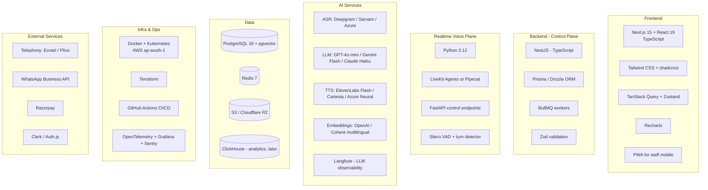

# 06 — Technology Stack

**Version:** 0.1 · **Date:** 2026-09-13

Selections are **recommendations with rationale and alternatives**. Anything marked 🔓 is an open decision — see [Doc 16](16-open-questions-and-decisions.md).

---

## 1. Stack at a glance



---

## 2. Frontend

| Concern | Choice | Rationale | Alternatives |
|---|---|---|---|
| Framework | **Next.js 15 (App Router) + React 19 + TypeScript** | SSR for dashboard speed, file routing, mature ecosystem, one language across FE/BE | Remix, SvelteKit, Vue/Nuxt |
| Styling | **Tailwind CSS v4 + shadcn/ui** | Fast, consistent, accessible primitives, easy theming for white-label later | MUI, Chakra, Mantine |
| Data fetching | **TanStack Query** | Caching, background refetch, optimistic updates for lead status | SWR, RTK Query |
| Client state | **Zustand** | Minimal; most state is server state | Redux Toolkit, Jotai |
| Forms | **React Hook Form + Zod** | Shared Zod schemas with backend | Formik |
| Charts | **Recharts** | Sufficient for ROI/analytics; light | Visx, ECharts |
| Realtime UI | **WebSocket / SSE** (live call feed, lead pop) | Owners love watching live calls — a demo-winning feature | Polling |
| Audio playback | **wavesurfer.js** | Waveform + transcript sync for call review | Native `<audio>` |
| Staff mobile | **PWA first**; React Native (Expo) later 🔓 | Staff resist app installs; PWA + WhatsApp covers MVP | Native app day one |
| i18n | **next-intl** | UI in English + Hindi at minimum | i18next |

**Key screens:** Dashboard (ROI-first), Call Log, Lead Board, Knowledge Base editor, Property & Agent settings, Team & SLA, Billing, Onboarding wizard, Live Calls.

---

## 3. Backend — control plane

| Concern | Choice | Rationale | Alternatives |
|---|---|---|---|
| Runtime/Framework | **Node.js 22 + NestJS (TypeScript)** | Opinionated modular structure, DI, guards/interceptors map cleanly to multi-tenant RBAC; shares types with frontend | Fastify + tRPC, Django/DRF, Go |
| ORM | **Prisma** (or Drizzle 🔓) | Type-safe, great DX, migrations; Drizzle if raw SQL/RLS control is preferred | TypeORM, Kysely |
| Validation | **Zod** | Single schema source shared FE↔BE | class-validator, Joi |
| API style | **REST + OpenAPI** for external; tRPC internally 🔓 | OpenAPI needed for partner/PMS integrations | GraphQL |
| Jobs/queue | **BullMQ on Redis** | Mature, delayed jobs (SLA timers), retries, DLQ, good observability | Temporal (if workflows get complex), SQS |
| Scheduling | **BullMQ repeatable jobs** | Digests, rollups | Cron in K8s |
| Auth | **Clerk** (fastest) or **Auth.js + custom OTP** 🔓 | Need phone OTP (staff), Google OAuth, magic link, org/multi-tenant support | Auth0, Supabase Auth, WorkOS |
| Feature flags | **Unleash** (self-host) or ConfigCat | Per-tenant rollout of languages/models | Homegrown table |

> **Why not Python for the whole backend?** The realtime voice plane is Python-first (best AI SDK ecosystem), but the CRUD/dashboard plane benefits from shared TypeScript types with the frontend. Two runtimes is an accepted, deliberate cost — the boundary is clean (queue + HTTP).

---

## 4. Realtime voice plane

| Concern | Choice | Rationale | Alternatives |
|---|---|---|---|
| Language | **Python 3.12** | All voice-AI SDKs are Python-first | Node.js |
| Agent framework | **LiveKit Agents** 🔓 | Production-grade WebRTC media, SIP ingress, built-in VAD/turn detection, vendor-agnostic ASR/LLM/TTS plugins, self-hostable | **Pipecat** (lighter, very flexible), Vocode, custom |
| Telephony bridge | **LiveKit SIP** + provider media streaming | Handles PSTN→WebRTC | Provider WebSocket audio + custom pipeline |
| VAD | **Silero VAD** | Fast, accurate, CPU-cheap | WebRTC VAD, provider-native |
| Turn detection | **Semantic turn detection model** + configurable endpointing | Indian speech patterns include long thinking pauses; naive silence endpointing cuts people off | Silence-threshold only |
| Interruption handling | Framework-native barge-in + history truncation | Non-negotiable for natural feel | — |
| Session state | **Redis** (call context, slots) | Fast, survives worker restart within a call window | In-memory only |

### Managed alternative for M0 prototype
**Vapi / Retell AI / Synthflow** — ship a working demo in days. Accept: higher per-minute cost, limited Indic language control, vendor lock-in, data leaves your boundary. **Prototype only.** 🔓

---

## 5. AI models

### 5.1 ASR (speech → text)

| Provider | Strength | Use for |
|---|---|---|
| **Deepgram Nova** | Very low latency, strong streaming, good Indian-English | Primary: English/Hinglish |
| **Sarvam AI** | Purpose-built for Indian languages, Indian data residency | Primary: Hindi + regional 🔓 |
| **Google Cloud STT (Chirp)** | Broadest Indic coverage | Fallback |
| **Azure Speech** | Good Indic coverage, enterprise compliance, India region | Fallback / enterprise tenants |
| **AssemblyAI / ElevenLabs Scribe** | Quality benchmarks | Evaluate |

**Requirements:** streaming with interim results, word-level timestamps, language ID, telephony-grade 8 kHz robustness, custom vocabulary boost (property names, room types, local place names — this materially improves accuracy).

### 5.2 LLM (reasoning)

| Model | Use |
|---|---|
| **GPT-4o-mini / Gemini 2.x Flash / Claude Haiku** | Primary in-call model — fast, cheap, sufficient for grounded Q&A + slot filling |
| **GPT-4o / Gemini Pro / Claude Sonnet** | Post-call summarisation, KB extraction, complex reasoning (latency-insensitive) |
| **Tiny classifier (fine-tuned small model or rules)** | Intent classification — cheaper and faster than a full LLM call |

**Requirements:** streaming, function/tool calling, strict JSON output, low TTFT, prompt caching (system prompt + KB is mostly static per property → big cost saver).

**Routing strategy:** cheap model by default → escalate to a stronger model only when confidence is low or the query is complex. Track cost per call per tenant.

### 5.3 TTS (text → speech)

| Provider | Strength |
|---|---|
| **ElevenLabs Flash v2.5** | ~75 ms latency, natural, multilingual incl. Hindi |
| **Cartesia Sonic** | Extremely low latency, good quality |
| **Azure Neural TTS** | Strong Indic voice catalogue, cost-effective, India region |
| **Sarvam / AI4Bharat TTS** | Native Indic prosody |
| **Google Cloud TTS** | Wide Indic coverage |

**Requirements:** streaming synthesis, < 200 ms TTFB, mid-utterance cancellation (for barge-in), SSML, natural Indian-accented voices, consistent voice per property persona.

### 5.4 Embeddings & retrieval

| Concern | Choice |
|---|---|
| Embeddings | **OpenAI text-embedding-3-small** (cheap, good) or **Cohere embed-multilingual-v3** (better for Indic) 🔓 |
| Vector store | **pgvector** in the main Postgres — KB per property is small (hundreds of chunks); avoid a separate system |
| Search | **Hybrid**: pgvector cosine + Postgres full-text (BM25-ish) with reciprocal rank fusion |
| Reranking | Optional cross-encoder for complex queries (latency permitting) |
| Chunking | Semantic, small chunks (150–300 tokens), heavy metadata (`category`, `room_type`, `season`, `language`) for pre-filtering |

> **Do not reach for Pinecone/Weaviate/Qdrant at MVP.** A property KB is tiny. pgvector keeps the stack simple and transactional with the KB records.

### 5.5 AI observability
**Langfuse** (self-hostable, open source) 🔓 — traces, prompt versioning, evaluations, cost tracking per tenant. Alternatives: Arize Phoenix, LangSmith, Helicone.

---

## 6. Data layer

| Store | Technology | Purpose | Notes |
|---|---|---|---|
| Primary DB | **PostgreSQL 16** (AWS RDS/Aurora, ap-south-1) | All transactional data | RLS for tenant isolation; PgBouncer pooling; read replica for analytics |
| Vector | **pgvector** extension | KB embeddings | HNSW index, filtered by `property_id` |
| Cache/queue | **Redis 7** (ElastiCache) | Sessions, rate limits, call context, BullMQ | Persistence enabled for queue |
| Object storage | **S3** or **Cloudflare R2** | Call recordings, brochures, exports | SSE-KMS, lifecycle rules for retention, short-TTL signed URLs |
| Analytics | **ClickHouse** (Phase 2) | Call/lead event analytics at scale | Start with Postgres + materialised views |
| Search (later) | Postgres FTS → OpenSearch if needed | Transcript search | Defer |

**Managed hosting options:** AWS RDS (recommended for residency + control), Neon/Supabase (fast start, verify India region + compliance) 🔓.

---

## 7. Telephony & messaging

| Concern | Choice | Notes |
|---|---|---|
| **Primary telephony (India)** | **Exotel** or **Ozonetel** 🔓 | Indian licensing, virtual numbers, programmable call flows, call recording, strong local support. Evaluate media-streaming/SIP capability for realtime AI — this is the decisive criterion |
| **Secondary telephony** | **Plivo** or **Twilio (India)** | Failover + international readiness; verify Indian regulatory constraints |
| **SIP trunking (scale)** | Direct SIP with an ILD/UL-licensed operator | Better unit economics at volume |
| **WhatsApp** | **Meta WhatsApp Business Cloud API**, direct or via BSP (Gupshup / AiSensy / Interakt / Wati) 🔓 | Templates must be pre-approved; BSP eases onboarding, direct is cheaper at scale |
| **SMS** | Any DLT-registered Indian provider (MSG91, Kaleyra, Gupshup) | **DLT registration of sender ID + templates is mandatory in India** |
| **Push** | Firebase Cloud Messaging | Web push + future mobile app |
| **Email** | Resend or AWS SES | Invoices, digests, exports |

⚠️ **Telephony choice is the single highest-risk technical decision.** Validate with a real POC before committing: can the provider stream bidirectional audio with low latency to your media server, preserve caller ID on forwarded calls, and support programmable transfer? See [Doc 10](10-telephony-and-india-compliance.md).

---

## 8. Payments & billing

| Concern | Choice | Notes |
|---|---|---|
| Payments (India) | **Razorpay** | UPI, cards, netbanking, subscriptions, e-mandate/auto-debit, GST invoicing |
| Alternative/global | Stripe (Phase 3) | For international expansion |
| Metering | **In-house usage events** → Postgres rollups | Per-call minutes, WhatsApp messages, overage |
| Invoicing | Razorpay Invoices + GST fields | Indian GST compliance (GSTIN, HSN/SAC, place of supply) |
| Tax | CA-advised GST handling | 🔓 Confirm SAC code and reverse-charge rules |

---

## 9. Infrastructure & DevOps

| Concern | Choice | Rationale |
|---|---|---|
| Cloud | **AWS ap-south-1 (Mumbai)** 🔓 | Data residency, lowest latency to Indian callers and telephony providers; GCP asia-south1 is an equally valid alternative |
| Orchestration | **Kubernetes (EKS)**; or ECS Fargate for simplicity at MVP 🔓 | Realtime pods need custom scaling + UDP ingress — K8s gives control |
| Realtime media hosting | Dedicated node pool (or LiveKit Cloud at MVP) | UDP/SIP ingress, no cold starts |
| Frontend hosting | **Vercel** (or same cluster) | DX, edge caching |
| IaC | **Terraform** | Reproducible environments |
| CI/CD | **GitHub Actions** → build, test, scan, deploy; Argo CD (later) | Separate pipelines for control plane vs realtime plane |
| Secrets | **AWS Secrets Manager** + External Secrets Operator | Rotation, no secrets in env files |
| Monitoring | **OpenTelemetry** → Grafana Cloud (or Prometheus+Grafana, Datadog) | Unified traces/metrics/logs |
| Errors | **Sentry** (FE + BE) | |
| Uptime/status | Better Stack or similar + public status page | Trust signal for customers |
| Logging | Structured JSON with `org_id`/`property_id`/`call_id` on every line | Non-negotiable for multi-tenant debugging |

---

## 10. Development tooling

| Concern | Choice |
|---|---|
| Monorepo | **Turborepo** + pnpm workspaces (TS apps); Python service as a sibling package with `uv` |
| Lint/format | ESLint + Prettier (TS); Ruff + Black (Python) |
| Type checking | TypeScript strict; mypy/pyright strict for Python |
| Testing | Vitest (unit), Playwright (E2E), pytest (Python), k6 (load) |
| Voice testing | Recorded-audio replay harness + synthetic caller bot (see [Doc 15](15-testing-and-qa.md)) |
| API contracts | OpenAPI generated from NestJS decorators; typed client generated for FE |
| DB migrations | Prisma Migrate, reviewed in PR |
| Local dev | Docker Compose (Postgres, Redis, LiveKit, mock telephony) |
| Docs | Markdown in repo (this folder) + ADRs in `docs/adr/` |

### Suggested repository layout

```
atithi/
├─ apps/
│  ├─ web/                 # Next.js dashboard + onboarding
│  ├─ api/                 # NestJS control plane
│  ├─ workers/             # BullMQ workers (TS)
│  └─ voice-agent/         # Python realtime agent (LiveKit/Pipecat)
├─ packages/
│  ├─ shared-types/        # Zod schemas + generated types
│  ├─ telephony-adapter/   # Provider abstraction
│  ├─ ai-adapters/         # ASR/LLM/TTS interfaces
│  ├─ prompts/             # Versioned prompt templates
│  └─ ui/                  # Shared React components
├─ infra/
│  ├─ terraform/
│  └─ k8s/
├─ evals/                  # Conversation eval sets + scripts
└─ docs/                   # This documentation set
```

---

## 11. Third-party service checklist (pre-build)

| Service | Needed for | Blocker? | Lead time |
|---|---|---|---|
| Cloud telephony account + KYC | Everything | 🔴 Yes | 3–10 days (Indian KYC) |
| Virtual numbers (DIDs) | Call intake | 🔴 Yes | With account |
| WhatsApp Business API + verified business + approved templates | Follow-up | 🟠 Phase 1 | 1–3 weeks (Meta verification) |
| DLT registration (sender ID + SMS templates) | SMS alerts | 🟠 Phase 1 | 1–2 weeks |
| LLM/ASR/TTS accounts with production rate limits | Conversation | 🔴 Yes | Days |
| Razorpay merchant + GST | Billing | 🟡 Phase 2 | 1–2 weeks |
| Cloud account with ap-south-1 | Hosting | 🔴 Yes | Immediate |
| Company incorporation + GST + bank | Contracts/payments | 🔴 Yes for revenue | 2–4 weeks |

> **Start telephony KYC and WhatsApp verification on day one.** They are the long poles and they gate the demo.

---

## 12. Estimated running costs (order of magnitude, to validate)

Per **4-minute AI call**, indicative:

| Component | Approx cost |
|---|---|
| Telephony (inbound + forwarding) | ₹1.20 – ₹3.00 |
| ASR streaming | ₹1.50 – ₹3.00 |
| LLM (with prompt caching) | ₹0.80 – ₹2.50 |
| TTS | ₹1.50 – ₹4.00 |
| Infra amortised | ₹0.50 – ₹1.00 |
| **Total** | **≈ ₹5.50 – ₹13.50 per call** |

At 150 AI calls/month per property ≈ **₹825 – ₹2,025 COGS**, against a ₹4,999 plan → **~60–83% gross margin**. Optimisation levers: prompt caching, cheaper TTS for non-primary languages, shorter calls via tighter conversation design, volume-committed telephony rates. Track actuals from day one — see [Doc 12](12-nfrs-and-slas.md#cost-budget).

---

## 13. Technology decisions to close before coding 🔓

1. LiveKit Agents vs Pipecat vs managed platform for M0
2. Exotel vs Ozonetel vs Plivo (decide by realtime media-streaming POC)
3. Sarvam vs Deepgram vs Azure for Hindi/regional ASR (decide by WER benchmark on real call audio)
4. Clerk vs self-managed auth (phone OTP is the deciding requirement)
5. Prisma vs Drizzle (RLS ergonomics)
6. EKS vs ECS Fargate for MVP
7. WhatsApp direct Cloud API vs BSP

Each should be a short, time-boxed spike with a written ADR in `docs/adr/`.

---

**Next:** [07 — Data Model](07-data-model.md)
