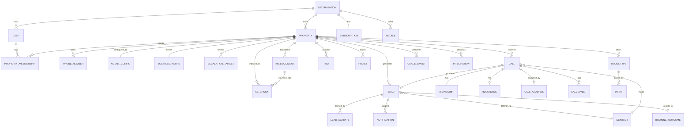

# 07 — Data Model

**Version:** 0.1 · **Date:** 2026-09-13

---

## 1. Entity relationship overview



---

## 2. Core tables

### 2.1 Tenancy & identity

#### `organizations`
| Column | Type | Notes |
|---|---|---|
| `id` | uuid PK | |
| `name` | text | |
| `slug` | text unique | |
| `type` | enum | `single_property`, `chain`, `agency` |
| `gstin` | text null | For invoicing |
| `billing_email` | text | |
| `country` | char(2) | `IN` default |
| `status` | enum | `trial`, `active`, `past_due`, `suspended`, `churned` |
| `created_at` / `updated_at` | timestamptz | |

#### `users`
| Column | Type | Notes |
|---|---|---|
| `id` | uuid PK | |
| `organization_id` | uuid FK | |
| `full_name` | text | |
| `email` | citext null | |
| `phone_e164` | text | Primary login for staff |
| `phone_verified_at` | timestamptz null | |
| `role` | enum | `owner`, `manager`, `staff`, `readonly` |
| `locale` | text | `en-IN`, `hi-IN`, … |
| `notification_prefs` | jsonb | Channels, quiet hours |
| `last_active_at` | timestamptz | |
| `status` | enum | `invited`, `active`, `disabled` |

> Internal Atithi staff live in a separate `platform_users` table with its own roles (`ops`, `support`, `admin`) — never mixed with tenant users.

#### `property_memberships`
Join table: `user_id`, `property_id`, `role_override`, `is_on_duty`, `duty_schedule jsonb`.

#### `properties`
| Column | Type | Notes |
|---|---|---|
| `id` | uuid PK | |
| `organization_id` | uuid FK | |
| `name` | text | |
| `type` | enum | `resort`, `hotel`, `homestay`, `villa`, `banquet`, `other` |
| `address` | jsonb | line1, city, state, pincode |
| `geo` | point | lat/lng for distance answers |
| `timezone` | text | `Asia/Kolkata` |
| `primary_language` | text | `en-IN` |
| `supported_languages` | text[] | |
| `check_in_time` / `check_out_time` | time | |
| `total_rooms` | int | |
| `website_url` | text null | |
| `google_place_id` | text null | |
| `status` | enum | `draft`, `onboarding`, `active`, `paused`, `archived` |
| `activated_at` | timestamptz null | |

### 2.2 Telephony & agent configuration

#### `phone_numbers`
| Column | Type | Notes |
|---|---|---|
| `id` | uuid PK | |
| `property_id` | uuid FK | |
| `e164` | text unique | The DID |
| `provider` | enum | `exotel`, `plivo`, `ozonetel`, … |
| `provider_ref` | text | Provider-side ID |
| `purpose` | enum | `ai_forward_target`, `published_tracking`, `transfer_source` |
| `routing_mode` | enum | `conditional_forward`, `atithi_first`, `always_ai` |
| `is_active` | bool | |
| **Index** | unique on `e164` | Tenant resolution on inbound webhook |

#### `agent_configs`
| Column | Type | Notes |
|---|---|---|
| `property_id` | uuid PK/FK | 1:1 |
| `agent_name` | text | e.g. "Meera" |
| `voice_id` | text | TTS voice |
| `tts_provider` | text | |
| `asr_provider` | text | |
| `llm_model` | text | |
| `greeting_template` | text | Variables: `{property_name}`, `{agent_name}` |
| `disclosure_text` | text | **Immutable core sentence + optional suffix** |
| `tone` | enum | `formal`, `warm`, `concise` |
| `max_call_seconds` | int | default 420 |
| `recording_enabled` | bool | |
| `transfer_enabled` | bool | |
| `allow_price_ranges` | bool | default true |
| `allow_firm_quotes` | bool | default **false** |
| `prompt_version` | text | For traceability |
| `feature_flags` | jsonb | |

#### `business_hours` / `holidays`
Per-property weekly schedule (`day_of_week`, `open_time`, `close_time`) plus date-specific overrides and closures.

#### `escalation_targets`
| Column | Type | Notes |
|---|---|---|
| `id` | uuid PK | |
| `property_id` | uuid FK | |
| `priority` | int | 1 = first hop |
| `phone_e164` | text | |
| `label` | text | "Front desk", "Duty manager" |
| `active_hours` | jsonb | |
| `applies_to_intents` | text[] | e.g. `{complaint, in_house_request}` |

### 2.3 Knowledge base

#### `kb_documents`
Source artefacts: `source_type` (`manual`, `url`, `pdf`, `pms_sync`), `source_ref`, `raw_text`, `status` (`pending_review`, `approved`, `rejected`), `version`, `approved_by`, `approved_at`.

#### `kb_chunks`
| Column | Type | Notes |
|---|---|---|
| `id` | uuid PK | |
| `property_id` | uuid FK | **Always filter on this first** |
| `document_id` | uuid FK null | |
| `category` | enum | `rooms`, `tariff`, `policy`, `amenity`, `location`, `food`, `activity`, `faq`, `other` |
| `content` | text | 150–300 tokens |
| `language` | text | |
| `metadata` | jsonb | `room_type_id`, `season`, `valid_from/to` |
| `embedding` | vector(1536) | pgvector |
| `fts` | tsvector generated | Hybrid search |
| `version` | int | |
| `is_active` | bool | |
| **Indexes** | HNSW on `embedding`; GIN on `fts`; btree on `(property_id, is_active, category)` | |

#### `room_types`
`name`, `description`, `max_occupancy`, `bed_config`, `amenities text[]`, `count`, `images jsonb`, `is_active`.

#### `tariffs`
| Column | Type | Notes |
|---|---|---|
| `room_type_id` | uuid FK | |
| `season_label` | text | `peak`, `shoulder`, `off`, `festival` |
| `valid_from` / `valid_to` | date | |
| `min_price` / `max_price` | numeric(10,2) | **Ranges, not firm quotes** |
| `currency` | char(3) | `INR` |
| `includes` | text[] | breakfast, taxes |
| `notes` | text | |

#### `policies`
`policy_key` (`cancellation`, `pets`, `alcohol`, `smoking`, `unmarried_couples`, `id_proof`, `extra_bed`, `children`, `check_in_early`, `late_checkout`), `value_text`, `is_ask_team` (bool — explicitly defer to human).

#### `faqs`
`question`, `answer`, `language`, `category`, `usage_count`, `is_active`.

#### `unanswered_questions`
`property_id`, `call_id`, `question_text`, `normalized_text`, `cluster_id`, `occurrences`, `suggested_answer`, `status` (`new`, `answered`, `ignored`). Feeds the weekly KB-gap digest.

### 2.4 Calls

#### `calls`
| Column | Type | Notes |
|---|---|---|
| `id` | uuid PK | |
| `organization_id` / `property_id` | uuid FK | |
| `provider` / `provider_call_id` | text | |
| `direction` | enum | `inbound`, `outbound` |
| `from_e164` | text | Caller CLI (PII) |
| `to_e164` | text | Which DID was dialled |
| `routing_mode` | enum | How it reached us |
| `started_at` / `answered_at` / `ended_at` | timestamptz | |
| `ring_to_answer_ms` | int | SLO metric |
| `duration_seconds` | int | |
| `billable_seconds` | int | |
| `status` | enum | `ringing`, `in_progress`, `completed`, `failed`, `abandoned`, `transferred` |
| `end_reason` | enum | `caller_hangup`, `agent_ended`, `transferred`, `timeout`, `error`, `max_duration` |
| `language_detected` | text | |
| `was_transferred` | bool | |
| `transfer_target` | text null | |
| `contained` | bool | Handled without transfer |
| `agent_prompt_version` | text | |
| `models_used` | jsonb | asr/llm/tts + versions |
| `cost_breakdown` | jsonb | ₹ per component |
| `contact_id` | uuid FK null | |
| **Indexes** | `(property_id, started_at desc)`, `(from_e164)`, `(status)` | |

#### `call_events`
Append-only timeline: `call_id`, `seq`, `event_type` (`ringing`, `answered`, `greeting_played`, `speech_start`, `turn_completed`, `intent_classified`, `slot_filled`, `guard_violation`, `transfer_attempted`, `dtmf`, `ended`), `payload jsonb`, `occurred_at`, `latency_ms`.

#### `transcripts`
`call_id`, `turns jsonb[]` (`{speaker, text, text_en, start_ms, end_ms, confidence}`), `full_text`, `full_text_en`, `redacted_text`, `language`.

#### `recordings`
`call_id`, `storage_key`, `duration_seconds`, `format`, `size_bytes`, `consent_captured` (bool), `expires_at`, `deleted_at`.

#### `call_analysis`
| Column | Type |
|---|---|
| `call_id` | uuid PK/FK |
| `intent_primary` | enum: `booking_enquiry`, `existing_booking`, `in_house_request`, `complaint`, `vendor`, `job_enquiry`, `spam`, `other` |
| `intent_confidence` | numeric |
| `summary` | text |
| `summary_language` | text |
| `sentiment` | enum: `positive`, `neutral`, `negative` |
| `frustration_detected` | bool |
| `extracted_slots` | jsonb |
| `quality_score` | numeric |
| `grounding_violations` | int |
| `topics` | text[] |
| `qa_flagged` | bool |

### 2.5 Contacts & leads

#### `contacts`
`organization_id`, `phone_e164` (unique per org), `full_name`, `email`, `whatsapp_consent`, `whatsapp_consent_at`, `preferred_language`, `city`, `first_seen_at`, `last_seen_at`, `total_calls`, `tags text[]`, `do_not_contact`.

#### `leads`
| Column | Type | Notes |
|---|---|---|
| `id` | uuid PK | |
| `organization_id` / `property_id` | uuid FK | |
| `contact_id` | uuid FK | |
| `source_call_id` | uuid FK | |
| `source` | enum | `ai_call`, `manual`, `web`, `whatsapp` |
| `status` | enum | `new`, `contacted`, `attempted`, `quoted`, `nurture`, `won`, `lost`, `escalated` |
| `priority` | enum | `hot`, `warm`, `cold` |
| `score` | int 0–100 | |
| `check_in_date` / `check_out_date` | date null | |
| `nights` | int null | |
| `adults` / `children` | int null | |
| `room_type_id` | uuid FK null | |
| `rooms_required` | int null | |
| `occasion` | text null | honeymoon, family, corporate |
| `budget_min` / `budget_max` | numeric null | |
| `special_requests` | text | |
| `preferred_callback_at` | timestamptz null | |
| `assigned_to_user_id` | uuid FK null | |
| `sla_due_at` | timestamptz | |
| `first_contacted_at` | timestamptz null | |
| `sla_met` | bool null | |
| `lost_reason` | enum null | `price`, `unavailable`, `chose_competitor`, `unreachable`, `plan_cancelled`, `other` |
| **Indexes** | `(property_id, status, created_at desc)`, `(assigned_to_user_id, sla_due_at)`, `(contact_id)` | |

#### `lead_activities`
Audit trail: `lead_id`, `actor_type` (`system`, `user`, `ai`), `actor_id`, `activity_type` (`created`, `notified`, `viewed`, `called`, `status_changed`, `note_added`, `escalated`, `whatsapp_sent`), `payload jsonb`, `occurred_at`.

#### `booking_outcomes`
`lead_id`, `booked` (bool), `booking_reference`, `booking_value` numeric, `currency`, `nights`, `rooms`, `confirmed_at`, `recorded_by`, `verification_source` (`manual`, `pms`). **This table drives ROI attribution — its quality determines whether the customer renews.**

### 2.6 Notifications

#### `notifications`
`id`, `organization_id`, `property_id`, `lead_id` null, `recipient_user_id` null, `recipient_phone`, `channel` (`whatsapp`, `sms`, `push`, `email`), `template_key`, `payload jsonb`, `status` (`queued`, `sent`, `delivered`, `read`, `failed`), `provider_ref`, `error`, `sent_at`, `delivered_at`, `dedupe_key` (unique).

### 2.7 Billing & usage

#### `subscriptions`
`organization_id`, `plan_code`, `status`, `current_period_start/end`, `included_minutes`, `included_properties`, `price_inr`, `billing_cycle` (`monthly`, `annual`), `razorpay_subscription_id`, `trial_ends_at`, `cancel_at_period_end`.

#### `usage_events`
| Column | Type | Notes |
|---|---|---|
| `id` | uuid PK | |
| `organization_id` / `property_id` | uuid FK | |
| `event_type` | enum | `ai_call_minutes`, `whatsapp_message`, `sms_message`, `transfer_minutes` |
| `quantity` | numeric | |
| `unit` | text | |
| `reference_id` | uuid | `call_id` / `notification_id` |
| `idempotency_key` | text unique | **Prevents double billing on retries** |
| `cost_inr` | numeric | Our COGS, for margin tracking |
| `occurred_at` | timestamptz | |

#### `usage_rollups`
Pre-aggregated per `(property_id, period, event_type)` for fast dashboards and invoicing.

#### `invoices`
`organization_id`, `period_start/end`, `base_amount`, `overage_amount`, `tax_amount`, `total_amount`, `gst_breakup jsonb`, `status`, `razorpay_invoice_id`, `paid_at`, `pdf_key`.

### 2.8 Integrations & platform

#### `integrations`
`property_id`, `kind` (`pms`, `channel_manager`, `crm`, `webhook`), `provider`, `credentials` (**encrypted, envelope encryption via KMS**), `config jsonb`, `status`, `last_sync_at`, `last_error`.

#### `audit_logs`
Append-only: `organization_id`, `actor_type`, `actor_id`, `action`, `resource_type`, `resource_id`, `before jsonb`, `after jsonb`, `ip`, `user_agent`, `occurred_at`. Covers config changes, KB publishes, PII access, exports, deletions, impersonation.

#### `data_subject_requests`
DPDP compliance: `organization_id`, `subject_phone`, `request_type` (`access`, `correction`, `erasure`), `status`, `received_at`, `completed_at`, `evidence jsonb`.

---

## 3. Tenant isolation implementation

```sql
-- Every tenant table
ALTER TABLE leads ENABLE ROW LEVEL SECURITY;
ALTER TABLE leads FORCE ROW LEVEL SECURITY;

CREATE POLICY tenant_isolation ON leads
  USING (organization_id = current_setting('app.current_org_id', true)::uuid);

-- Application sets context per request / per job
-- SET LOCAL app.current_org_id = '...';
```

**Rules**
- The application DB role is **not** a superuser and does **not** have `BYPASSRLS`
- Background jobs set the tenant context explicitly from the job payload
- A dedicated `analytics` role with cross-tenant read exists only for internal aggregate reporting, and its access is audited
- Automated tests assert that a query without tenant context returns zero rows

---

## 4. Data retention & PII

| Data | Classification | Default retention | Configurable | Deletion |
|---|---|---|---|---|
| Call recordings | Sensitive (voice = personal data) | 90 days | 30–365 days | Hard delete + storage lifecycle rule |
| Transcripts (raw) | Sensitive | 12 months | 3–24 months | Hard delete |
| Transcripts (redacted) | Internal | 24 months | — | Hard delete |
| Caller phone numbers | PII | Life of account | — | Deleted on erasure request |
| Lead & booking data | Business + PII | Life of account + 12 months | — | Anonymised then deleted |
| Call metadata (no PII) | Internal analytics | 36 months | — | Aggregated |
| Audit logs | Compliance | 24 months | — | Immutable until expiry |
| KB content | Tenant IP | Life of account | — | Deleted with account |

**PII handling**
- Phone numbers stored in E.164; **hashed index** (`sha256(phone + pepper)`) for lookup without exposing plaintext in logs
- Application-level encryption for high-sensitivity fields (integration credentials, ID numbers if ever captured)
- Automatic redaction of card numbers, Aadhaar-like patterns, and emails from transcripts before they reach analytics or LLM fine-tuning corpora
- **Never** send raw recordings or transcripts to any vendor for training; opt out of vendor training on all AI accounts

---

## 5. Key queries & access patterns

| Pattern | Frequency | Optimisation |
|---|---|---|
| Resolve tenant from dialled number (inbound webhook) | Every call, latency-critical | Redis cache keyed by `e164`, 5-min TTL, warmed on config change |
| Load property agent context (KB summary, config, hours) | Every call start | Redis cached composite object, invalidated on KB publish |
| Hybrid KB retrieval | Multiple per call, < 80 ms | HNSW index + `property_id` pre-filter + small chunk count |
| Lead board for a property | High | Composite index `(property_id, status, created_at desc)` |
| SLA breach scan | Every minute | Delayed BullMQ jobs (not table scans) |
| ROI report (12 months) | Low | Materialised view refreshed hourly |
| Transcript keyword search | Medium | Postgres FTS; OpenSearch later if needed |
| Usage rollup for billing | Daily + month-end | Incremental aggregation from `usage_events` |

---

## 6. Event schema (internal message bus)

All async work is driven by typed events:

```ts
type DomainEvent =
  | { type: 'call.started';    callId: string; propertyId: string; from: string; at: string }
  | { type: 'call.answered';   callId: string; ringToAnswerMs: number }
  | { type: 'call.ended';      callId: string; durationSec: number; endReason: string }
  | { type: 'call.analysed';   callId: string; intent: string; slots: Record<string, unknown> }
  | { type: 'lead.created';    leadId: string; callId: string; priority: 'hot'|'warm'|'cold' }
  | { type: 'lead.sla_breached'; leadId: string; assignedTo?: string }
  | { type: 'lead.status_changed'; leadId: string; from: string; to: string; actorId: string }
  | { type: 'booking.won';     leadId: string; valueInr: number }
  | { type: 'kb.published';    propertyId: string; version: number }
  | { type: 'usage.recorded';  propertyId: string; eventType: string; quantity: number };
```

Every event carries `organizationId`, `propertyId`, `eventId` (uuid, for idempotency) and `occurredAt`. Consumers must be idempotent.

---

## 7. Migration & seeding notes

- Seed data: default policy keys, intent taxonomy, notification templates, plan catalogue, Indian state/city reference for distance answers
- Every migration must be backward compatible (expand → migrate → contract) because the realtime plane and control plane deploy independently
- Never drop a column in the same release that stops writing to it

---

**Next:** [08 — API Specification](08-api-spec.md)
