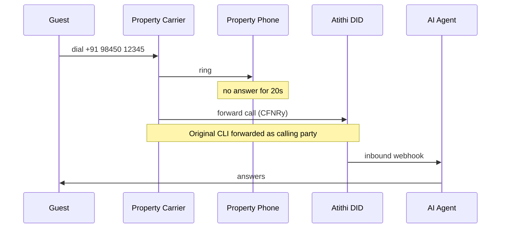
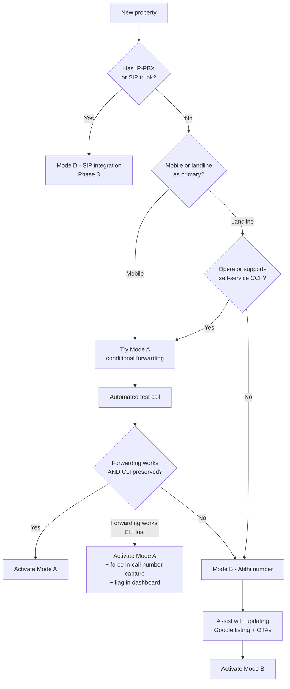
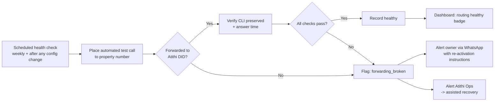

# 10 — Telephony & India Compliance

**Version:** 0.1 · **Date:** 2026-09-13

> ⚠️ **This document contains the highest-risk assumptions in the entire project.** Telephony routing and Indian telecom regulation determine whether the product is even possible at the intended price and experience. **Validate everything here with providers and a telecom lawyer before building.** Nothing in this document is legal advice.

---

## 1. Why this is the critical path

You cannot answer a call placed to someone else's phone number unless one of these is true:

1. The property **forwards** the call to a number you control, **or**
2. The property **publishes a number you control**, **or**
3. The property **ports** its number to your provider, **or**
4. You integrate at the **PBX/SIP trunk** level

Everything else in the product depends on solving this. **Validate it in week 1 of the project**, before writing application code.

---

## 2. Routing modes in detail

### 2.1 Mode A — Conditional Call Forwarding (CCF) 🎯 primary

The property keeps its existing number. The carrier forwards unanswered/busy/unreachable calls to an Atithi virtual number.



**Forwarding conditions**

| Condition | Code family | Triggers when |
|---|---|---|
| CFNRy (No Reply) | `**61*` | Rings for N seconds unanswered |
| CFB (Busy) | `**67*` | Line engaged |
| CFNRc (Not Reachable) | `**62*` | Switched off / no network |
| CFU (Unconditional) | `**21*` | Always — used for Mode C |

**Generic GSM syntax (verify per carrier/circle):**
```
Activate no-reply forwarding with 20s timer:  **61*<target>*11*20#
Activate busy forwarding:                      **67*<target>#
Activate unreachable forwarding:               **62*<target>#
Check status:                                  *#61#
Deactivate:                                    ##61#  ##67#  ##62#
```

⚠️ **Must be verified per operator (Jio, Airtel, Vi, BSNL) and per circle.** Behaviour differs:
- Some operators cap or ignore the ring-timer parameter (only 5/10/15/20/25/30 s permitted)
- Some require the feature to be enabled on the plan first
- VoLTE and 4G/5G handling differs from legacy circuit-switched
- Landline forwarding is operator-configured, often not self-service — usually requires a support request
- **Jio landline/fixed-line and enterprise plans behave differently from Jio mobile**

**Advantages**
- ✅ No change to the number on Google, OTAs, signboards, visiting cards
- ✅ Human-first: staff still get first chance to answer
- ✅ Instant to set up (if it works on their plan)

**Risks and limitations**
- ❌ **Caller ID (CLI) presentation on forwarded calls is not guaranteed.** Some operators present the *forwarding* number, not the original caller. **If we lose the original CLI, we lose the callback number and the product breaks.** → **Must be tested per operator before onboarding a property.** Mitigation: always ask the caller for their number in-call rather than relying on CLI.
- ❌ Forwarding charges may apply to the property (outgoing call charges) — set expectations
- ❌ Owner can accidentally disable it; we cannot detect this without periodic test calls → implement **automated weekly forwarding health checks**
- ❌ Only one forwarding target per condition — conflicts if they already forward somewhere
- ❌ Multiple property numbers = multiple setups

### 2.2 Mode B — Atithi Number First 🎯 secondary

The property publishes an Atithi virtual number. We bridge to the front desk first; if unanswered, the AI takes over.

**Advantages**
- ✅ Guaranteed CLI (we receive the original call directly)
- ✅ Full analytics on *all* calls, including human-answered ones
- ✅ No dependency on carrier forwarding features
- ✅ Enables call recording of human calls (with consent) and coaching
- ✅ Ideal for new Google Business listings and ad campaigns

**Disadvantages**
- ❌ Owner must update the number on Google/OTAs/signage — real friction and perceived risk ("what if I stop using you?")
- ❌ Outbound leg cost (we pay to bridge to the front desk)
- ❌ Trust barrier: "my phone number now belongs to a startup"

**Mitigation for the trust barrier:** contractual commitment to forward all calls to the property's number for 90 days after any cancellation, documented in the MSA.

### 2.3 Mode C — Always AI
Same as Mode B without the human-first bridge. For after-hours-only lines, overflow lines, or unstaffed homestays.

### 2.4 Mode D — SIP/PBX integration (Phase 3)
For larger properties with an IP-PBX or PRI. We register as a SIP endpoint in their overflow/hunt group. Best quality and control; requires IT involvement. Not for the SMB beachhead.

### 2.5 Recommended onboarding logic



---

## 3. Indian telephony provider evaluation

### 3.1 Must-have capabilities

| Capability | Why it matters | Deal-breaker? |
|---|---|---|
| **Bidirectional realtime media streaming** (WebSocket/SIP to our media server, < 150 ms added latency) | Without this, no realtime AI conversation is possible | 🔴 **Yes** |
| Virtual numbers (DID) in required circles | Local numbers build trust | 🔴 Yes |
| Original CLI on forwarded calls | Callback capability | 🟠 High |
| Programmable call transfer (attended/blind) | Human escalation | 🔴 Yes |
| Call recording with API retrieval | QA, compliance, dispute resolution | 🟠 High |
| DTMF capture | Fallback capture path | 🟠 High |
| Webhooks with signature verification | Security | 🟠 High |
| High concurrency per account | Peak-season spikes | 🟠 High |
| Sub-second call setup | Answer-time SLO | 🟠 High |
| India data residency for recordings | DPDP | 🟠 High |
| Transparent per-minute pricing + volume commits | Unit economics | 🟠 High |

### 3.2 Candidate providers

| Provider | Notes | Verify |
|---|---|---|
| **Exotel** | Large Indian CPaaS, strong enterprise presence, good support, voice-bot/streaming offerings | Realtime media streaming latency; concurrency limits; forwarded-CLI behaviour |
| **Ozonetel (KooKoo)** | Indian, contact-centre heritage, AI-agent friendly | Streaming API maturity; pricing at low volume |
| **Plivo** | Good developer experience, India presence, WebSocket audio streaming | Indian regulatory constraints; number availability by circle |
| **Twilio** | Best-in-class APIs and Media Streams | **Indian regulatory restrictions on local numbers and use cases — verify carefully**; higher cost |
| **Kaleyra / Tata Communications** | Enterprise-grade, carrier relationships | SMB onboarding friction; minimums |
| **Servetel / Acefone** | SMB-friendly Indian pricing | Programmability depth; streaming support |
| **Knowlarity** | Established Indian cloud telephony | API modernity |
| **LiveKit SIP + Indian SIP trunk** | Best latency and control at scale | Requires a licensed trunk partner; more ops burden |

### 3.3 Provider POC checklist (do this first — 1–2 weeks)

- [ ] Provision a DID in a target circle (e.g. Bengaluru, Goa)
- [ ] Establish bidirectional audio streaming to a test media server; **measure round-trip added latency**
- [ ] Place a call from Jio / Airtel / Vi / BSNL mobiles → **verify CLI arrives intact**
- [ ] Enable CCF on a real Jio, Airtel, Vi and BSNL number → **verify forwarding works and CLI is preserved on each**
- [ ] Test programmable transfer to a mobile; measure setup time
- [ ] Test 20 concurrent calls
- [ ] Retrieve a recording via API; confirm storage region
- [ ] Test webhook signature verification and retry behaviour
- [ ] Measure end-to-end "ring → AI first word" time
- [ ] Get written pricing at 10k, 100k, 1M minutes/month
- [ ] Confirm KYC requirements and timelines
- [ ] Confirm contractual position on AI-answered calls and recording

> **Decision gate:** do not pick a provider on brand or price. Pick on **measured latency + CLI preservation + transfer reliability.** Document the result as an ADR.

### 3.4 Multi-provider abstraction
Implement the `TelephonyProvider` interface from [Doc 05](05-system-architecture.md#31-telephony-layer) from day one. Carry at least one live secondary provider. Carrier outages in India are real and DID re-routing takes time.

---

## 4. Indian regulatory landscape

> **Not legal advice.** Engage a telecom/technology lawyer before launch. Regulations change; re-verify at each phase.

### 4.1 Bodies and instruments

| Body / instrument | Relevance |
|---|---|
| **DoT (Department of Telecommunications)** | Licensing (UL, VNO), interconnection rules, restrictions on mixing internet telephony with PSTN |
| **TRAI** | Consumer protection, UCC (unsolicited commercial communication) regulations, tariff transparency |
| **TCCCPR 2018** (Telecom Commercial Communications Customer Preference Regulations) | Governs commercial communications, DND, DLT registration, consent, headers and templates |
| **Telecommunications Act, 2023** | Modernised telecom framework; includes provisions around consent for commercial messages |
| **DPDP Act, 2023** (Digital Personal Data Protection) | Personal data processing, consent, notice, data principal rights, breach reporting |
| **IT Act 2000 + SPDI Rules 2011** | Reasonable security practices for sensitive personal data |
| **CCPA / Consumer Protection Act 2019** | Misleading representations to consumers |

### 4.2 What applies to us

#### Inbound AI answering (our core product)
Answering an inbound call that a customer voluntarily placed is **fundamentally lower risk** than outbound calling. Key obligations:

| Obligation | Our implementation |
|---|---|
| **Disclosure** — caller should know they're speaking to an AI | Mandatory, non-removable disclosure in the greeting |
| **Recording consent** — notice before recording | Announcement in greeting: "This call may be recorded"; per-tenant toggle; recording only after notice |
| **Data protection** — voice and phone number are personal data | DPDP-compliant notice, consent, retention, deletion ([Doc 11](11-security-privacy-dpdp.md)) |
| **No misrepresentation** | Agent never claims to be human; never makes binding commitments |
| **Accurate information** | Grounding rules prevent misleading price/availability claims |

#### Outbound calling (Phase 3 — much higher risk) ⚠️
If we ever auto-call leads back:
- Falls under **TCCCPR/UCC rules** if commercial in nature
- Requires **DLT registration** of the entity, headers and content templates
- Must respect **DND / customer preference registries**
- Restricted calling hours apply for promotional communication
- Consent must be **recorded, auditable and revocable**
- **Recommendation:** treat outbound as a separate compliance workstream with legal sign-off before any build. Calling back a person who *just called you and asked for a callback* is a defensible service call, but must be documented and consent-logged.

#### WhatsApp and SMS follow-up
| Channel | Requirement |
|---|---|
| **WhatsApp** | Meta Business verification; message templates pre-approved; **opt-in consent required and must be recorded**; 24-hour customer service window rules apply; respect Meta's business messaging policy |
| **SMS** | **DLT registration mandatory**: register entity, sender ID (header), and every content template on a DLT platform (Jio/Airtel/Vi/BSNL portals). Transactional vs promotional classification matters. Unregistered templates are blocked by operators. |

> **Practical impact:** the guest-facing WhatsApp brochure message must be a **pre-approved template**, and consent must be explicitly captured in-call and stored with a timestamp. Build the consent record into the data model (already done — `contacts.whatsapp_consent_at`).

### 4.3 Call recording in India

- No blanket prohibition on recording a call you are a party to, but **notice is the safe and expected practice**, and DPDP makes voice data personal data requiring lawful processing
- Our policy: **always announce**, store encrypted, restrict access, audit every access, honour deletion requests
- Do **not** record when the tenant disables recording
- Never use recordings for model training without explicit, separate consent
- Retention default 90 days, tenant-configurable

### 4.4 Data residency

- **Store all personal data (recordings, transcripts, contacts) in India** (`ap-south-1`) by default
- Cross-border transfer is permitted under DPDP except to restricted countries notified by the Government — but **customer perception and enterprise sales favour India-only**
- ⚠️ **AI vendor processing is the hard part:** if ASR/LLM/TTS providers process audio outside India, that is a cross-border transfer. Options:
  1. Use vendors with India regions (Azure India, Google India, Sarvam AI)
  2. Disclose transfers clearly in the privacy notice and DPA
  3. Self-host models for sensitive tenants (Phase 3)
- Document the full data-flow map per vendor and keep it current

### 4.5 Licensing considerations ⚠️

- Providing telecom services in India requires licensing (UL/VNO). **We do not intend to be a telecom operator** — we consume a licensed provider's services. This is the standard CPaaS-consumer model.
- However: **DoT rules historically restrict interconnecting internet telephony with the PSTN** in certain configurations. Bridging a PSTN call into a WebRTC media server sits close to this boundary.
- ✅ **Mitigation:** the licensed telephony provider performs the PSTN interconnection; we receive media via their supported streaming API within their licensed service. **Get written confirmation from the provider that our architecture is within their licensed offering**, and have counsel review.
- 🔴 **Action item:** legal opinion before commercial launch.

---

## 5. Number strategy

| Number type | Cost | Trust | Use case |
|---|---|---|---|
| **Local landline-style DID** (e.g. 080-xxxx) | Low | High — looks like a local business | Recommended default |
| **Virtual mobile (10-digit)** | Medium | High — familiar to Indian callers | Good for homestays |
| **Toll-free (1800)** | High | Very high, but signals "call centre" | Larger chains |
| **Existing number ported** | Setup effort | Highest | Enterprise, Phase 3 |

**Rules**
- Prefer a DID in the **property's own circle/city** — callers trust local numbers
- Never reuse a released number across tenants without a cooling-off period (stray calls leak across tenants — a privacy incident)
- Maintain a small buffer of pre-provisioned numbers per circle to keep onboarding instant

---

## 6. Forwarding health monitoring

Forwarding silently breaking is a **churn event we must detect before the customer does**.



Also monitor: **zero AI calls in 72 hours for an active property** → likely broken forwarding, not low demand. Investigate proactively.

---

## 7. Operational playbooks

### 7.1 Carrier-specific onboarding cards
Build in-product, per carrier (Jio / Airtel / Vi / BSNL) and per device type (Android / iPhone / landline):
- Exact USSD codes **verified by our ops team**, with screenshots
- A 45-second video
- "Test it now" button
- "Get help on WhatsApp" escape hatch with a human

### 7.2 Peak-season readiness
Indian leisure peaks: Dec 20–Jan 5, long weekends, Diwali, Holi, summer (Apr–Jun) for hill stations, Puja (Oct).
- Pre-scale realtime capacity ahead of known peaks
- Pre-purchase telephony concurrency
- Proactive owner comms: "Your peak week starts Friday — your routing is healthy ✅"

### 7.3 Emergency human takeover
Ops must be able to instantly:
- Disable AI for a property (route all calls straight to the front desk)
- Change the transfer target
- Blocklist a number
- Pull any call's audio + transcript for a dispute

---

## 8. Compliance checklist before launch

| Item | Owner | Status |
|---|---|---|
| Telephony provider contract reviewed; AI use case explicitly permitted | Legal | ☐ |
| Written confirmation that our media-streaming architecture is within provider licence | Legal + Provider | ☐ |
| Legal opinion on inbound AI answering + recording | External counsel | ☐ |
| DPDP compliance review (notice, consent, rights, retention, breach process) | Legal | ☐ |
| Privacy policy + terms of service + DPA published | Legal | ☐ |
| Recording consent script approved | Legal | ☐ |
| AI disclosure script approved | Legal | ☐ |
| WhatsApp Business verification + templates approved | Ops | ☐ |
| DLT registration (entity, header, templates) for SMS | Ops | ☐ |
| Data-flow map incl. all AI sub-processors | Eng + Legal | ☐ |
| Sub-processor list published | Legal | ☐ |
| Data residency verified for every vendor | Eng | ☐ |
| Vendor training opt-out confirmed in writing for all AI vendors | Eng | ☐ |
| Customer MSA includes: number-return commitment, recording consent responsibility, AI limitations disclaimer | Legal | ☐ |
| Grievance officer appointed and published (DPDP/IT rules) | Legal | ☐ |
| Incident/breach response plan documented | Eng + Legal | ☐ |

---

## 9. Key risks

| Risk | Impact | Likelihood | Mitigation |
|---|---|---|---|
| **CLI lost on forwarded calls for a major carrier** | 🔴 Critical — breaks callback | Medium | Test per carrier; always capture number in-call; show routing quality per property |
| **No provider offers low-latency media streaming at acceptable cost** | 🔴 Critical — product not viable as designed | Low-Med | POC multiple providers in week 1; SIP trunk + own media server as fallback |
| **Regulatory ruling against AI answering or PSTN-WebRTC bridging** | 🔴 Critical | Low | Legal opinion upfront; provider-licensed architecture; maintain relationships with providers |
| **Owners fail to set up forwarding** | 🟠 High — kills activation | High | Mode B alternative; assisted setup; ops-verified carrier cards |
| **Forwarding silently breaks** | 🟠 High — silent churn | High | Automated weekly health checks + zero-call alerts |
| **Telephony cost higher than modelled** | 🟠 High — margin | Medium | Volume commits; monitor cost per call from day one |
| **Provider outage during peak season** | 🟠 High | Medium | Secondary provider; pre-tested DID re-routing runbook |
| **Number recycling leaks calls across tenants** | 🟠 High — privacy incident | Low | Cooling-off period; never reuse within 90 days |

---

**Next:** [11 — Security, Privacy & DPDP](11-security-privacy-dpdp.md)
