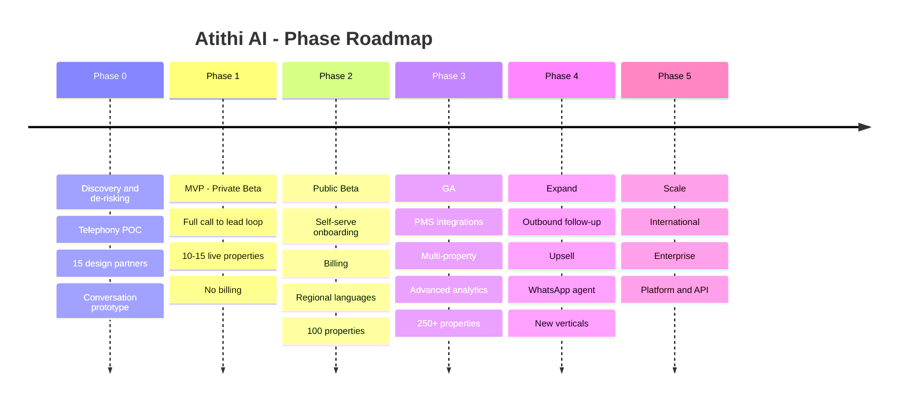
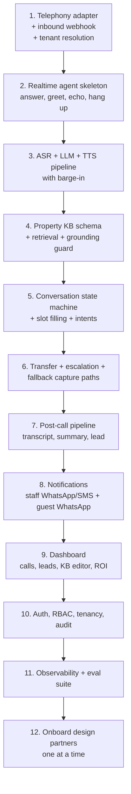

# 13 — Roadmap & MVP Scope

**Version:** 0.1 · **Date:** 2026-09-13

> Phases are sequenced by dependency and risk, not by calendar dates. Attach dates once the team size and the telephony POC outcome are known.

---

## 1. Guiding sequencing principle

**Retire the biggest risk first.**

The riskiest assumptions, in order:
1. Can we reliably receive a property's unanswered calls with caller ID intact? *(telephony)*
2. Will callers talk to an AI instead of hanging up? *(behaviour)*
3. Can the AI answer property questions accurately without inventing things? *(grounding)*
4. Will staff actually call the leads back? *(workflow adoption)*
5. Will owners pay for it? *(willingness to pay)*

**Everything in Phase 0 and 1 exists to answer these five questions.** Do not build billing, multi-property rollups, or PMS integrations before question 1 is answered.

---

## 2. Phase overview

---

## 3. Phase 0 — Discovery & De-risking

**Goal:** prove the product is technically possible and commercially wanted, before building a SaaS.

### Workstream A — Telephony POC 🔴 *highest priority, do this first*

- [ ] Shortlist 3 providers (Exotel, Ozonetel, Plivo)
- [ ] Provision test DIDs
- [ ] Build a bare-bones media-streaming echo test; **measure added latency**
- [ ] Test conditional forwarding on real **Jio, Airtel, Vi and BSNL** numbers
- [ ] **Verify original CLI is preserved on forwarded calls for each carrier** ← make-or-break
- [ ] Test programmable transfer to a mobile
- [ ] Get written pricing at 10k / 100k / 1M minutes
- [ ] Write ADR: chosen provider + fallback

**Exit criteria:** one provider demonstrably supports sub-150 ms media streaming, forwarding works on ≥ 3 of 4 major carriers, transfer succeeds ≥ 98%.

### Workstream B — Customer discovery

- [ ] Interview 30 property owners/managers (Coorg, Goa, Wayanad, Manali, Jaipur)
- [ ] Collect actual missed-call data from 15 of them (carrier logs, Google Business insights)
- [ ] Validate hypotheses H1–H5 from [Doc 01](01-product-vision-and-problem.md#13-quantifying-the-pain-hypotheses-to-validate)
- [ ] Test price sensitivity (₹2,999 / ₹4,999 / ₹9,999)
- [ ] Recruit **10–15 design partners** with signed LOIs (free during beta, committed to feedback + a testimonial)

**Exit criteria:** ≥ 10 design partners committed; missed-call rate validated at ≥ 15%; willingness to pay ≥ ₹3,000/month confirmed by ≥ 60%.

### Workstream C — Conversation prototype

- [ ] Build a single-property demo (a managed platform like Vapi/Retell is acceptable here — speed over architecture)
- [ ] Hard-coded KB for one real design-partner property
- [ ] English + Hindi
- [ ] Run 100 test calls with real people (friends, family, recruited testers)
- [ ] Measure: hang-up rate, perceived naturalness, information accuracy
- [ ] **Demo it to design partners using their own property's data** — this is the sales weapon

**Exit criteria:** ≤ 20% hang-up rate on test calls; owners say "this sounds like it could work" after hearing their own property demo.

### Workstream D — Legal & compliance groundwork

- [ ] Engage telecom/tech counsel
- [ ] Confirm the architecture is within the provider's licensed service (in writing)
- [ ] Draft privacy policy, ToS, DPA outlines
- [ ] Start WhatsApp Business verification (long lead time)
- [ ] Start DLT registration (long lead time)
- [ ] Company/GST setup if not done

**Phase 0 exit gate:** all four workstreams green. **If the telephony POC fails, stop and redesign** — do not proceed to build.

---

## 4. Phase 1 — MVP (Private Beta)

**Goal:** the complete call → lead → callback → outcome loop, running live at 10–15 properties, free of charge, with us watching every call.

### In scope

| Area | Included |
|---|---|
| **Telephony** | Mode A (conditional forwarding) + Mode B (Atithi number); one provider; transfer; recording; DTMF fallback |
| **Voice AI** | English, Hindi, Hinglish; barge-in; RAG-grounded answers; intent classification; slot filling; escalation |
| **Guardrails** | Full grounding firewall; no firm prices; no availability confirmation; AI disclosure; recording notice |
| **Knowledge base** | Manual structured entry (property, room types, tariff ranges, policies, FAQs); publish + test-query |
| **Leads** | Auto-creation, summary, transcript, recording, status pipeline, assignment, SLA timer, escalation |
| **Notifications** | Staff WhatsApp + SMS; guest WhatsApp with brochure (template-approved) |
| **Dashboard** | Call log, lead board, basic analytics, ROI report, KB editor, agent settings |
| **Platform** | Org/property/user model, RBAC, phone OTP auth, audit log |
| **Ops tooling** | Call replay, QA queue, tenant provisioning, prompt/KB tuning |

### Explicitly out of scope for MVP

❌ Billing and payments (manual invoicing if needed) · ❌ Self-serve onboarding (we onboard each property manually) · ❌ Regional languages beyond Hindi · ❌ KB auto-ingestion from URL/PDF · ❌ PMS integrations · ❌ Lead scoring · ❌ Multi-property rollups · ❌ Outbound calling · ❌ Public API · ❌ Mobile app (PWA only)

> **Manual onboarding is a feature at this stage**, not a shortcut. Doing it by hand 15 times teaches you exactly what to automate.

### MVP build sequence

### Success criteria to exit Phase 1

| Metric | Threshold |
|---|---|
| Properties live | ≥ 10 |
| AI-handled calls | ≥ 1,500 total |
| Call answer rate | ≥ 98% |
| Latency p95 | ≤ 1.8 s |
| Hang-up within 15 s | ≤ 15% |
| Lead capture rate | ≥ 60% |
| Grounding violations | 0 |
| Leads contacted by staff | ≥ 70% |
| Design partners who say "don't turn it off" | ≥ 8 of 10 |
| Verbal commitment to pay | ≥ 6 of 10 |

---

## 5. Phase 2 — Public Beta

**Goal:** remove humans from onboarding, start charging, and prove the model repeats without us in the room.

| Area | Additions |
|---|---|
| **Onboarding** | Full self-serve wizard; carrier-specific forwarding instructions; automated test call; readiness checklist |
| **KB** | URL/PDF ingestion with AI draft + owner review; versioning + rollback; unanswered-question digest |
| **Languages** | Telugu, Tamil, Kannada, Marathi, Malayalam (each behind an eval gate) |
| **Billing** | Razorpay subscriptions; metering; overage; GST invoices; dunning; trial → paid conversion |
| **Leads** | Lead scoring; duplicate detection/merge; auto-reassignment |
| **Analytics** | Call quality insights; peak-hour heatmap; scheduled owner digests |
| **Reliability** | Second telephony provider; vendor failover; forwarding health monitoring |
| **Trust** | Public status page; security page; published sub-processor list |

**Exit criteria:** 100 paying properties · ≥ 70% self-serve onboarding completion · monthly churn < 5% · gross margin ≥ 60% · NPS ≥ 40.

---

## 6. Phase 3 — General Availability

**Goal:** become the system of record for enquiries, and deepen the moat with integrations.

| Area | Additions |
|---|---|
| **PMS / Channel Manager** | eZee, Hotelogix, Djubo, STAAH, Cloudbeds — read availability & rates; **enables firm quoting (with legal review)** |
| **Multi-property** | Group dashboards, shared KB inheritance, cross-property routing, consolidated billing |
| **Advanced agent** | Upsell prompts, package suggestions, event/wedding enquiry flow |
| **Integrations** | Public API, outbound webhooks, Zapier, CRM sync, Google Business Profile insights |
| **Compliance** | SOC 2 Type I, external pen test, enterprise DPA |
| **Support** | In-app support, help centre, SLA-backed support tiers |
| **Languages** | Bengali, Gujarati, Punjabi |

**Exit criteria:** 250+ paying properties · NRR ≥ 110% · ≥ 30% of accounts with a PMS integration connected · gross margin ≥ 70%.

---

## 7. Phase 4 — Expand the surface

**Goal:** grow revenue per account and open adjacent markets.

| Initiative | Description | Notes |
|---|---|---|
| **Outbound AI callback** | AI calls back unconverted leads and no-shows | ⚠️ Separate compliance workstream — DLT, consent, DND. Legal sign-off required |
| **WhatsApp AI agent** | Same knowledge base answering text enquiries | Natural extension; high demand |
| **Post-stay feedback calls** | Automated feedback + review solicitation | Reputation product |
| **Upsell engine** | Activities, spa, late checkout, room upgrades during enquiry | Revenue share potential |
| **Payment links in-flow** | Token/advance collection via the follow-up message | Razorpay integration |
| **Vertical expansion** | Clinics, diagnostic labs, salons/spas, real-estate sales offices, wedding venues, tour operators | Same engine, new knowledge packs + new sales motion |
| **Partner channel** | PMS vendors, hotel associations, travel-tech resellers | Distribution leverage |

---

## 8. Phase 5 — Scale

- International markets (UAE, Southeast Asia, Sri Lanka, Nepal — similar call-first behaviour)
- Enterprise/chain features: SSO, customer-managed keys, private deployment, advanced audit
- Platform play: white-label agent for PMS vendors; developer API
- Self-hosted/fine-tuned models for cost and residency control
- SOC 2 Type II + ISO 27001

---

## 9. MVP cut-line decision framework

When scope pressure hits, use this test:

> **"If we remove this, does the loop 'missed call → answered → lead → callback → booking' still close?"**

| Feature | Loop still closes? | Verdict |
|---|---|---|
| Grounded Q&A from KB | ❌ No — the caller gets nothing useful | **Keep** |
| Contact capture | ❌ No | **Keep** |
| Staff notification | ❌ No — nobody calls back | **Keep** |
| Human transfer | ⚠️ Closes, but trust breaks | **Keep** |
| Guest WhatsApp follow-up | ✅ Yes | Keep — high perceived value, low cost |
| SLA timer + escalation | ✅ Yes | **Keep** — it's what makes staff actually act |
| Lead scoring | ✅ Yes | Cut to Phase 2 |
| KB auto-ingestion | ✅ Yes | Cut to Phase 2 |
| Billing | ✅ Yes | Cut to Phase 2 |
| Regional languages | ✅ Yes (for pilot properties) | Cut to Phase 2 |
| Multi-property rollup | ✅ Yes | Cut to Phase 3 |
| PMS integration | ✅ Yes | Cut to Phase 3 |
| Analytics beyond basic ROI | ✅ Yes | Cut to Phase 2 |

---

## 10. Team shape by phase

| Phase | Suggested team |
|---|---|
| **Phase 0** | Founder (product/sales) + 1 full-stack/AI engineer + fractional legal |
| **Phase 1** | + 1 voice-AI engineer, + 1 full-stack engineer, + 1 ops/onboarding person |
| **Phase 2** | + 1 frontend engineer, + 1 designer, + 1 customer success, + 1 sales |
| **Phase 3** | + backend engineers (integrations), + QA, + more sales/CS, + data analyst |

**Critical early hire:** someone who has shipped **realtime voice** in production. Latency and interruption handling are where naive implementations fail, and it is very hard to learn under deadline pressure.

---

## 11. Milestone checklist

### M0 — Feasibility proven
- [ ] Telephony POC passed with written ADR
- [ ] 100 prototype calls completed and analysed
- [ ] 10 design partners signed
- [ ] Legal opinion received
- [ ] WhatsApp + DLT registrations initiated

### M1 — MVP live
- [ ] First real guest call answered end-to-end in production
- [ ] First lead captured and called back by staff
- [ ] First booking attributed to a recovered call ← **the moment the company is real**
- [ ] 10 properties live
- [ ] Eval suite running in CI with zero grounding violations

### M2 — Commercially viable
- [ ] First self-serve property live with no human help
- [ ] First payment collected
- [ ] Unit economics positive at the account level
- [ ] 100 paying properties

### M3 — Scalable
- [ ] First PMS integration live
- [ ] Multi-property customer onboarded
- [ ] 250 paying properties, NRR ≥ 110%

---

## 12. Things that will go wrong (plan for them)

| Likely problem | Preparation |
|---|---|
| Forwarding doesn't work on one major carrier | Mode B ready from day one |
| Latency is worse than expected in production | Budget instrumented per stage from the first line of code |
| Regional language quality disappoints | Hard eval gates; do not ship a language that fails |
| Staff ignore lead alerts | SLA escalation + owner-visible accountability reporting |
| Owners can't articulate ROI | Attribution built into MVP, not deferred |
| A guest complains publicly about "AI answering" | Disclosure from day one; fast human transfer; prepared comms |
| AI costs spike with usage | Per-tenant caps and cost telemetry from day one |
| A design partner churns in beta | Over-recruit — sign 15 to keep 10 |

---

**Next:** [14 — Pricing & GTM](14-pricing-and-gtm.md)
