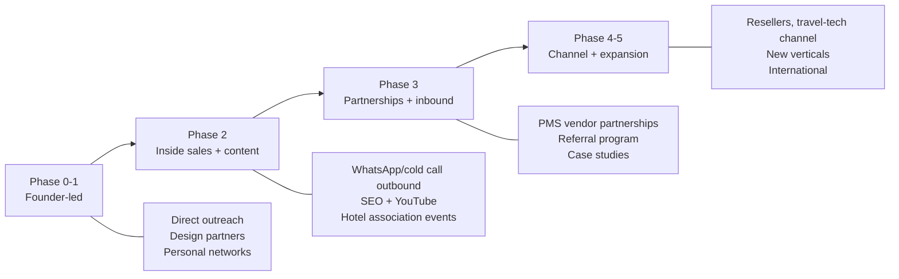

# 14 — Pricing & Go-To-Market

**Version:** 0.1 · **Date:** 2026-09-13

> All numbers are **starting hypotheses to validate in Phase 0**, not conclusions.

---

## 1. Pricing philosophy

1. **Price against the value recovered, not the cost of AI minutes.** One recovered ₹12,000 booking pays for months of subscription.
2. **Per property, not per user.** Staff count changes; properties don't. Never charge per seat — it discourages adoption by the very people who work the leads.
3. **Include enough minutes that customers never fear using it.** Metered anxiety kills usage, and usage is what proves ROI.
4. **Simple enough to explain on a phone call** to a 55-year-old resort owner in 60 seconds.
5. **Annual prepay is the goal** — improves cash flow and cuts churn.

---

## 2. Packaging

| | **Starter** | **Growth** ⭐ | **Scale** | **Enterprise** |
|---|---|---|---|---|
| **Monthly (INR)** | ₹2,999 | ₹5,999 | ₹11,999 | Custom |
| **Annual (per month, 20% off)** | ₹2,399 | ₹4,799 | ₹9,599 | Custom |
| **Target** | Homestays, villas, ≤ 15 rooms | Independent resorts/hotels 15–60 rooms | Large properties, 60+ rooms, high call volume | Chains, 5+ properties |
| Properties included | 1 | 1 | 1 | Multiple |
| AI call minutes/month | 300 | 800 | 2,000 | Custom |
| Overage per minute | ₹9 | ₹7 | ₹5 | Negotiated |
| Languages | English + Hindi | All Tier 1 + 2 | All | All |
| Staff users | 3 | 10 | Unlimited | Unlimited |
| WhatsApp follow-ups | 300 | 1,000 | 3,000 | Custom |
| Call recording retention | 30 days | 90 days | 180 days | Configurable |
| Lead management + SLA | ✅ | ✅ | ✅ | ✅ |
| ROI reporting | Basic | Full | Full + custom | Full + custom |
| KB auto-ingestion | ❌ | ✅ | ✅ | ✅ |
| Lead scoring | ❌ | ✅ | ✅ | ✅ |
| PMS integration | ❌ | ✅ (1) | ✅ (unlimited) | ✅ |
| API + webhooks | ❌ | ❌ | ✅ | ✅ |
| Multi-property dashboard | ❌ | ❌ | ❌ | ✅ |
| Custom voice/persona | ❌ | ✅ | ✅ | ✅ |
| Support | Email, 24 h | WhatsApp + email, 8 h | Priority, 4 h | Dedicated CSM, SLA |
| Uptime SLA | 99.5% | 99.9% | 99.9% | 99.9% + credits |
| Onboarding | Self-serve | Guided (1 session) | White-glove | White-glove + training |

**Add-ons**
| Add-on | Price |
|---|---|
| Extra property (Growth tier) | ₹4,499/month |
| Extra 500 AI minutes | ₹2,500 |
| Additional virtual number | ₹499/month |
| Extended recording retention (1 year) | ₹999/month |
| Outbound AI callback (Phase 4) | ₹1,999/month + ₹8/min |
| WhatsApp AI agent (Phase 4) | ₹1,999/month |

**Free trial:** 14 days, full Growth features, 150 AI minutes, no card required. Card required only to continue.

---

## 3. Unit economics

### 3.1 Growth tier illustration (₹5,999/month)

| Line | Value |
|---|---|
| Revenue | ₹5,999 |
| AI calls/month (assumed) | 160 calls × 4 min = 640 min |
| COGS @ ₹1.50/min | ₹960 |
| WhatsApp messages (~250) | ₹200 |
| Infrastructure (amortised) | ₹180 |
| Support (amortised) | ₹350 |
| **Total COGS** | **₹1,690** |
| **Gross profit** | **₹4,309** |
| **Gross margin** | **~72%** |

### 3.2 SaaS metrics targets

| Metric | Target |
|---|---|
| ARPA (blended) | ₹5,500/month |
| CAC (self-serve) | ≤ ₹6,000 |
| CAC (sales-assisted) | ≤ ₹15,000 |
| CAC payback | ≤ 4 months |
| Gross margin | ≥ 70% (steady state) |
| Monthly logo churn | < 3% |
| Net revenue retention | ≥ 110% |
| LTV (30-month avg life) | ≈ ₹1,15,000 |
| LTV:CAC | ≥ 8:1 (self-serve), ≥ 5:1 (assisted) |

### 3.3 Customer-side ROI (the sales argument)

$$\text{ROI multiple} = \frac{N_{\text{missed}} \times r_{\text{capture}} \times c_{\text{conv}} \times V_{\text{booking}}}{P_{\text{subscription}}}$$

| Scenario | Missed calls/mo | Capture | Conversion | Avg booking | Recovered | Plan | ROI |
|---|---|---|---|---|---|---|---|
| Conservative | 40 | 70% | 10% | ₹7,000 | ₹19,600 | ₹5,999 | **3.3×** |
| Typical | 80 | 80% | 15% | ₹9,000 | ₹86,400 | ₹5,999 | **14.4×** |
| High-season | 200 | 85% | 15% | ₹12,000 | ₹3,06,000 | ₹5,999 | **51×** |

> Even the **conservative** case is positive. Lead with the conservative number in sales — credibility converts better than hype, and the in-product ROI report will do the rest.

### 3.4 Alternative models considered

| Model | Verdict |
|---|---|
| Pure per-minute | ❌ Unpredictable bills terrify SMB owners; discourages usage |
| Per-lead captured | 🟡 Attractive alignment, but disputes over lead quality; consider as an add-on |
| Revenue share on bookings | 🟡 Best alignment, hardest to verify without PMS; **offer to large properties in Phase 3** |
| Per-room pricing | 🟡 Familiar to hoteliers (PMS vendors price this way); consider for chains |
| Freemium | ❌ Voice AI COGS is real; free tier burns cash. Use a trial instead |

---

## 4. Positioning

### 4.1 Positioning statement

> For **independent resorts, hotels and homestays in India** that lose bookings when the front desk can't answer the phone, **Atithi AI** is an **AI receptionist** that answers every missed call in the guest's own language, captures the enquiry, and hands your team a hot lead within seconds — unlike voicemail, IVR or call-alert services, which tell you a call was missed but don't save the booking.

### 4.2 Messaging by audience

| Audience | Headline | Proof point |
|---|---|---|
| **Owner** | "Every missed call is a booking going to your competitor. We answer them all." | ROI report: "₹1.04L recovered last month" |
| **Manager** | "Know every enquiry, and know your team followed up." | SLA compliance dashboard |
| **Front desk** | "Stop juggling the phone during check-in. We catch what you can't." | WhatsApp alert with full context |

### 4.3 Objection handling

| Objection | Response |
|---|---|
| *"Guests will hate talking to a robot."* | We disclose it's an AI and offer a human instantly. In beta, X% stayed on the line and Y% left their details. Also — the alternative today is *nobody* answering. |
| *"My staff answer all calls."* | Let's find out. Free 14-day trial — if we answer zero calls, you owe nothing and you've learned your desk is perfect. *(This is a powerful close: the data does the selling.)* |
| *"It's expensive."* | It costs less than one lost booking. Here's the conservative ROI at your booking value. |
| *"I don't want to change my phone number."* | You don't. Conditional forwarding keeps your existing number. |
| *"What if it gives wrong information?"* | It only answers from the information you enter and approve, and it never quotes firm prices or confirms availability. You can test every answer before going live. |
| *"What if I want to stop?"* | Cancel any time. If you used our number, we forward all calls to you for 90 days — it's in the contract. |
| *"AI doesn't understand my guests' language."* | It handles English, Hindi and Hinglish today, plus regional languages. Let me call your property right now and you listen. |

### 4.4 The demo that closes deals
**Build the agent for their property before the meeting.** Enter their real tariffs and policies from their website, then call it on speakerphone during the pitch and let them ask their own questions. Nothing else converts like hearing their own resort answered correctly by an AI.

---

## 5. Go-to-market motion

### 5.1 Phase-wise channels

### 5.2 Beachhead plan

**Geography-first, not category-first.** Dominate one tourist circuit at a time — word of mouth among property owners in a circuit is extremely strong.

| Wave | Circuits |
|---|---|
| 1 | Coorg, Wayanad, Chikmagalur (Bengaluru weekend belt) |
| 2 | Goa, Gokarna |
| 3 | Manali, Kasol, Rishikesh, Mussoorie |
| 4 | Udaipur, Jaipur, Jaisalmer |
| 5 | Munnar, Alleppey, Ooty, Kodaikanal |

**Why:** localised references ("the resort down the road uses it"), efficient field visits, concentrated case studies, and a local DID pool per circuit.

### 5.3 Acquisition tactics

| Tactic | Notes |
|---|---|
| **The "missed call audit"** 🎯 | Call 20 properties in a circuit at random hours, log who doesn't answer, then show the owner: "We called you 4 times on Saturday. Nobody picked up." **This is the single most effective opener** — it's their own data, it's undeniable, and it creates urgency. |
| Design-partner referrals | Incentivise: 1 free month per referral that converts |
| Hotel & homestay associations | FHRAI, state associations, district homestay bodies — sponsor meetups, offer member pricing |
| PMS/channel-manager partnerships | eZee, Djubo, Hotelogix marketplaces; revenue share |
| Travel-tech events | Hotel Investment Conference, FHRAI conventions, state tourism expos |
| Content/SEO | "How much revenue do hotels lose to missed calls", "AI receptionist for hotels India" |
| YouTube/Instagram | Real recorded AI calls (with consent) — the product demos itself |
| WhatsApp outbound | Compliant, template-based outreach to property owners |
| OTA-adjacent | Properties unhappy with OTA commission are primed for a direct-booking pitch |

### 5.4 Sales process

```mermaid
flowchart LR
    A[Lead: audit, referral,<br/>inbound, event] --> B[Qualify: rooms, call volume,<br/>who answers the phone]
    B --> C[Demo: pre-built agent<br/>with THEIR property data]
    C --> D[14-day free trial<br/>forwarding set up on the call]
    D --> E[Day 7 check-in:<br/>'Here's what we caught']
    E --> F[Day 12 ROI review<br/>Recovered revenue vs price]
    F --> G[Close: annual prepay preferred]
    G --> H[Onboard staff + SLA setup]
    H --> I[Day 30 success review<br/>-> testimonial + referral ask]
```

**Trial is the sales engine.** The product generates its own proof — by day 12 the owner is looking at a list of real guests the AI saved. Instrument the trial heavily and make the day-12 ROI review automatic.

---

## 6. Onboarding & retention

### 6.1 Time-to-value targets

| Milestone | Target |
|---|---|
| Signup → property configured | 20 min |
| → forwarding active + test call passed | 30 min |
| → **first real call answered by AI** | < 24 h |
| → first lead delivered to staff | < 48 h |
| → first attributed booking | < 14 days |

### 6.2 Retention drivers

| Driver | Implementation |
|---|---|
| **Visible ROI** | Monthly WhatsApp digest: "We answered 94 calls you missed. 11 became bookings worth ₹1.04L." |
| **Improving agent** | Weekly KB-gap digest — the agent visibly learns their property |
| **Staff habit** | Lead workflow becomes the team's daily routine |
| **Switching cost** | Call history, KB, lead data, PMS integration |
| **Health monitoring** | Detect broken forwarding before they notice |
| **Seasonal check-ins** | "Peak season starts Friday — your setup is healthy ✅" |

### 6.3 Churn early-warning signals

| Signal | Action |
|---|---|
| Zero AI calls in 7 days | Forwarding likely broken → ops outreach same day |
| Leads not being worked (< 30% contacted) | CSM call — the product is working but the team isn't; this is the #1 silent churn cause |
| No login in 21 days | Re-engagement + value digest |
| Recording/AI paused | Immediate call — something went wrong |
| Support ticket about a guest complaint | Founder-level response |
| Downgrade request | ROI review before accepting |

---

## 7. Financial projection sketch (illustrative)

| | Year 1 | Year 2 | Year 3 |
|---|---|---|---|
| Paying properties (end of year) | 250 | 1,200 | 4,000 |
| Blended ARPA/month | ₹5,000 | ₹5,800 | ₹6,500 |
| ARR (end of year) | ₹1.5 Cr | ₹8.4 Cr | ₹31.2 Cr |
| Gross margin | 65% | 72% | 76% |
| Monthly churn | 4% | 3% | 2.5% |
| NRR | 100% | 110% | 118% |

**Key sensitivities:** COGS per minute, churn rate, and sales efficiency in the first two circuits. Model these as ranges, not points.

---

## 8. Competitive pricing context

| Alternative the customer is comparing against | Monthly cost | Our advantage |
|---|---|---|
| Extra front-desk staff member | ₹15,000–₹25,000 | 3–5× cheaper, works 24×7, never sick |
| Outsourced call centre seat | ₹20,000–₹40,000 | 5–8× cheaper, no minimum commitment |
| OTA commission on one ₹10,000 booking | ₹1,500–₹2,500 | 3 recovered direct bookings pay for a year |
| Missed-call alert service | ₹500–₹1,500 | They report the problem; we solve it |
| Doing nothing | ₹0 upfront, large hidden loss | The audit makes the hidden cost visible |

---

## 9. GTM metrics to track from day one

| Stage | Metric |
|---|---|
| Awareness | Website visits, demo requests, audit calls made |
| Acquisition | Trial starts, cost per trial |
| Activation | % reaching successful test call, time-to-first-AI-call |
| Value | % with ≥ 1 lead in week 1, % with attributed booking in 30 days |
| Revenue | Trial→paid conversion, ARPA, annual prepay share |
| Retention | Logo churn, NRR, lead-contact rate (leading indicator) |
| Referral | Referrals per customer, NPS |

**The single most predictive metric:** *lead-contact rate*. If staff work the leads, the customer sees ROI and renews. If they don't, nothing else saves the account.

---

**Next:** [15 — Testing & QA](15-testing-and-qa.md)
