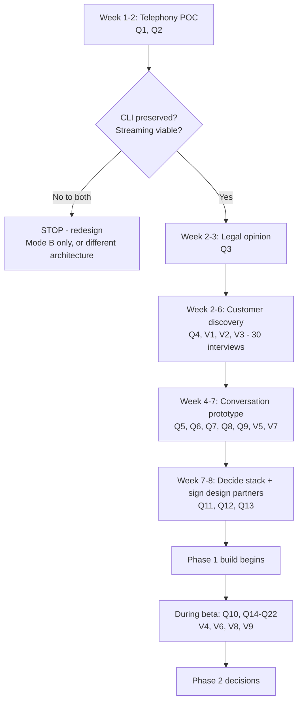

# 16 — Open Questions & Decision Log

**Version:** 0.1 · **Date:** 2026-09-13

---

## 1. How to use this document

- **Section 2** — decisions already taken (with rationale), so they don't get re-litigated
- **Section 3** — open questions blocking progress, each with an owner and a decision method
- **Section 4** — validation backlog: assumptions that must be tested with real customers
- **Section 5** — a proposed sequence for closing everything

When a question is answered, move it to Section 2 and write an ADR in `docs/adr/`.

---

## 2. Decisions taken (v0.1)

| # | Decision | Rationale | Revisit when |
|---|---|---|---|
| D1 | **India-first, hospitality-first** | Founder insight, clear pain, underserved by global players | Post-GA |
| D2 | **Inbound only in v1; no outbound calling** | Outbound carries heavy TCCCPR/DLT/DND regulatory load; inbound is defensible | Phase 4 |
| D3 | **AI always discloses itself** | Trust is the product; deception is a regulatory and reputational risk | Never |
| D4 | **No firm price quotes, no availability confirmation in v1** | Hallucinated commitments create legal and CX liability; ranges are sufficient to qualify | When PMS integration is live + legal review |
| D5 | **No payment collection by the AI** | Fraud and PCI risk; staff handle payment via secure links | Phase 4, links only |
| D6 | **Cascaded pipeline (ASR→LLM→TTS), not speech-to-speech** | Better control, guardrails can inspect text, better Indic coverage today | When Indic speech-to-speech matures |
| D7 | **Multi-tenant shared DB with PostgreSQL RLS** | Right complexity for SMB scale; isolation enforced at the DB layer | At enterprise deals requiring dedicated infra |
| D8 | **pgvector, not a dedicated vector DB** | Property KBs are small; avoids a whole extra system | > 5M chunks or latency issues |
| D9 | **Per-property subscription pricing, not per-seat** | Per-seat discourages the staff adoption we need | If usage variance becomes extreme |
| D10 | **Two runtimes: TypeScript control plane + Python voice plane** | Best ecosystem for each; clean boundary via queue/HTTP | If team size makes it painful |
| D11 | **Realtime plane isolated from CRUD plane** | A dashboard deploy must never drop a live call | Never |
| D12 | **India data residency by default (ap-south-1)** | DPDP posture, latency, enterprise sales | International expansion |
| D13 | **Support both conditional forwarding (Mode A) and Atithi-number-first (Mode B) at MVP** | Forwarding is the highest-risk assumption; need a fallback | — |
| D14 | **Manual onboarding during private beta** | Learn what to automate by doing it 15 times | Phase 2 |
| D15 | **Every production failure becomes a permanent eval case** | Only way to prevent quality regression in a non-deterministic system | Never |

---

## 3. Open questions 🔓

### 3.1 Critical — blocking the build

| # | Question | Why it matters | How to decide | Owner |
|---|---|---|---|---|
| **Q1** | **Does conditional call forwarding preserve the original caller ID on Jio, Airtel, Vi and BSNL?** | If CLI is lost, callbacks depend entirely on in-call capture. Changes the whole product risk profile | Physical test with SIMs on all 4 carriers, multiple circles | Eng + Founder |
| **Q2** | **Which telephony provider offers sub-150 ms bidirectional media streaming at acceptable cost?** | Determines whether the latency target is achievable at all | POC with 3 providers, measured | Eng |
| **Q3** | **Is our PSTN↔WebRTC media architecture within the provider's licensed service under DoT rules?** | Legal viability of the entire product | Written confirmation from provider + counsel opinion | Legal |
| **Q4** | **What is the actual missed-call rate at target properties?** | The entire value proposition. If it's 3%, there's no business | Carrier logs + Google Business insights from 15 properties + our own audit calls | Founder |
| **Q5** | **Will Indian callers stay on the line with a disclosed AI?** | If hang-up rate is 50%, the product fails regardless of engineering quality | 100 prototype calls with real testers; measure hang-up within 15 s | Founder + Eng |

> **These five must be answered in Phase 0. Q1–Q3 can individually kill or reshape the product.**

### 3.2 High — needed before MVP

| # | Question | Decision method |
|---|---|---|
| Q6 | LiveKit Agents vs Pipecat vs a managed platform (Vapi/Retell) for production | 1-week spike building the same flow in two; compare latency, control, cost |
| Q7 | Which ASR for Hindi and Hinglish — Sarvam, Deepgram, Azure, Google? | WER benchmark on 200 real Indian call recordings |
| Q8 | Which TTS voice profile do Indian callers rate as most trustworthy? | A/B test 4 voices across 100 calls; measure hang-up + survey |
| Q9 | Should the greeting say "AI assistant", "virtual assistant", or "automated assistant"? | A/B test; measure hang-up rate. Wording matters more than expected |
| Q10 | How much qualification before it feels like an interrogation? | A/B test 3 slot-capture depths; measure capture rate vs hang-up rate |
| Q11 | WhatsApp direct Cloud API vs BSP (Gupshup/AiSensy/Wati)? | Compare onboarding time, template approval support, cost at 50k msgs/month |
| Q12 | Clerk vs self-built auth (phone OTP is the key requirement)? | 2-day spike; check Clerk's India SMS/OTP cost and reliability |
| Q13 | Product name and domain | Trademark search + domain availability + owner reaction testing |

### 3.3 Medium — needed before public beta

| # | Question |
|---|---|
| Q14 | Pricing: is ₹5,999 the right Growth price, or is ₹3,999 the adoption unlock? |
| Q15 | Should included minutes be generous (low anxiety) or tight (upsell driver)? |
| Q16 | Which PMS to integrate first — by installed base among our customers, not market size |
| Q17 | Should we offer a per-lead or revenue-share pricing option for large properties? |
| Q18 | How do we verify booking outcomes without a PMS? (Self-reported data will be optimistic) |
| Q19 | Do we need a native mobile app for staff, or is PWA + WhatsApp enough? |
| Q20 | Regional language rollout order — by tourist circuit demand or by model quality? |
| Q21 | Should tenants be able to disable the AI disclosure? **(Recommended answer: no)** |
| Q22 | Recording retention default — 30, 60 or 90 days? Trade-off: storage cost vs dispute resolution value |

### 3.4 Lower — Phase 3+

| # | Question |
|---|---|
| Q23 | Once PMS availability is live, should the agent ever state a firm price? |
| Q24 | Vertical expansion order: clinics, salons, real estate, or wedding venues? |
| Q25 | International market entry: UAE, Southeast Asia, or Sri Lanka/Nepal first? |
| Q26 | Build vs partner for the WhatsApp AI agent? |
| Q27 | Self-hosted models for cost/residency — at what scale does it pay off? |
| Q28 | White-label offering for PMS vendors — does it cannibalise direct sales? |

---

## 4. Validation backlog (test with real customers)

| # | Assumption | Test | Kill criterion |
|---|---|---|---|
| V1 | 20–40% of enquiry calls go unanswered | Audit calls + carrier logs at 15 properties | < 10% → no market |
| V2 | 30–50% of unanswered callers never call back | Survey recovered leads | < 15% → weak value |
| V3 | Owners will pay ₹5,000+/month | Pricing interviews + trial-to-paid conversion | < 30% willing → repackage |
| V4 | Owners will set up call forwarding | Track onboarding completion | < 50% complete → lead with Mode B |
| V5 | Callers accept a disclosed AI | Hang-up rate in prototype | > 40% hang-up → rethink greeting/approach |
| V6 | Staff will work AI-generated leads | Lead contact rate in beta | < 50% → the product doesn't convert; fix workflow before scaling |
| V7 | AI can answer property questions accurately enough | KB accuracy audit | < 90% → more KB structure needed |
| V8 | Properties can articulate their tariffs/policies well enough to build a KB | Onboarding time + KB completeness | Too hard → build ingestion earlier |
| V9 | Recovered bookings are attributable and believable to owners | Day-30 ROI review reaction | Owners dispute attribution → change measurement approach |
| V10 | Word of mouth spreads within a tourist circuit | Referral rate in wave 1 | Low → GTM must be paid/outbound-led |

---

## 5. Proposed sequence to close everything



---

## 6. Decision-making rules for this project

1. **Reversible decisions: decide fast, in a day.** Irreversible ones (telephony provider, data model, disclosure policy): take a week and write an ADR.
2. **No decision without a measurement plan.** If you can't state how you'd know it was wrong, you're guessing.
3. **Prefer the option that keeps optionality** — abstraction layers over direct vendor coupling, especially for telephony and AI vendors.
4. **When quality and speed conflict on the conversation itself, choose quality.** A bad call costs a customer's guest, their trust, and our reputation simultaneously.
5. **Any decision that weakens AI disclosure, grounding, or tenant isolation requires founder sign-off.** These are the three things that can end the company.

---

## 7. ADR template

Create `docs/adr/NNNN-short-title.md` for each significant decision:

```markdown
# ADR-0001: <Title>

**Status:** Proposed | Accepted | Superseded by ADR-XXXX
**Date:** YYYY-MM-DD
**Deciders:** <names>

## Context
What is the issue? What forces are at play? What constraints apply?

## Options considered
1. Option A — pros / cons / cost / risk
2. Option B — pros / cons / cost / risk
3. Option C — pros / cons / cost / risk

## Decision
What we chose and why.

## Consequences
Positive, negative, and what becomes harder or easier as a result.

## Validation
How we will know this was right or wrong, and by when.
```

---

**Next:** [17 — Glossary](17-glossary.md)
