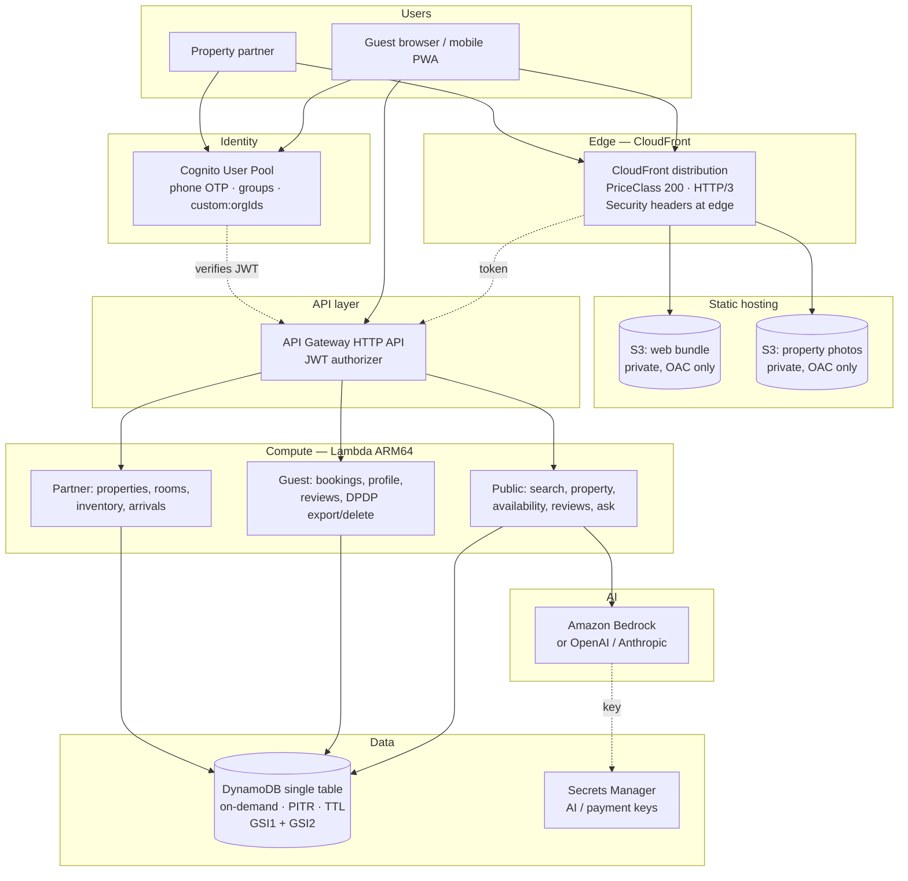

# 18 — AWS Serverless Architecture, Cost & Deployment

**Version:** 0.1 · **Date:** 2026-09-13

This describes the **application** built in `frontend/`, `backend/`, `infrastructure/` and `packages/shared/`.

---

## 1. Architecture



### Deliberate omissions

| Not used | Why |
|---|---|
| **VPC / NAT Gateway** | A NAT Gateway alone is roughly ₹3,000–4,000/month before a single request. Lambdas talk only to AWS APIs, which need no VPC. |
| **OpenSearch / Elasticsearch** | Smallest usable cluster is ~₹6,000/month. City-partitioned DynamoDB GSI queries serve search at this scale for near zero. |
| **RDS / Aurora** | Always-on cost. DynamoDB on-demand costs nothing when idle. |
| **REST API Gateway** | HTTP API is ~70% cheaper for the same job. |
| **ECS / Fargate / EC2** | Idle compute cost; Lambda scales from zero. |
| **ElastiCache** | Lambda container-level caching covers the hot paths (city list, tenant config). |

---

## 2. Cost model

### 2.1 At launch (~1,000 bookings/month, ~50,000 searches)

| Service | Usage | Monthly (₹) |
|---|---|---|
| Lambda | ~400k invocations, ARM64, mostly <200 ms | **0** (free tier: 1M req + 400k GB-s) |
| API Gateway HTTP API | ~400k requests | ~**35** (first 300M @ $1.00/M) |
| DynamoDB on-demand | ~2M reads, 200k writes, <1 GB | ~**120** |
| S3 | ~5 GB photos + web bundle | ~**15** |
| CloudFront | ~50 GB transfer | **0** (free tier: 1 TB/month) |
| Cognito | <50,000 MAU | **0** (free tier) |
| Secrets Manager | 2 secrets | ~**85** |
| CloudWatch Logs | ~2 GB, 7-day retention | ~**100** |
| Bedrock (Claude Haiku) | ~20k AI calls | ~**900** |
| **Total** | | **≈ ₹1,250/month** |

### 2.2 At scale (~50,000 bookings/month, ~2M searches)

| Service | Monthly (₹) |
|---|---|
| Lambda | ~2,500 |
| API Gateway | ~1,400 |
| DynamoDB | ~6,000 |
| S3 + CloudFront | ~4,500 |
| Cognito (above 50k MAU) | ~9,000 |
| Bedrock | ~18,000 |
| CloudWatch | ~2,000 |
| **Total** | **≈ ₹43,000/month** |

At 50,000 bookings that is well under ₹1 per booking in infrastructure.

### 2.3 Cost controls already in the code

| Control | Where |
|---|---|
| Public search cached 120 s at CloudFront | [backend/src/handlers/search.ts](../backend/src/handlers/search.ts) |
| Property page cached 300 s | [backend/src/handlers/properties.ts](../backend/src/handlers/properties.ts) |
| City list cached per Lambda container | [backend/src/handlers/search.ts](../backend/src/handlers/search.ts) |
| AI output token ceiling | [backend/src/lib/env.ts](../backend/src/lib/env.ts) |
| AI temperature 0 (deterministic, cacheable) | [backend/src/ai/provider.ts](../backend/src/ai/provider.ts) |
| Secret cached for container lifetime | [backend/src/ai/provider.ts](../backend/src/ai/provider.ts) |
| Short log retention | [infrastructure/lib/platform-stack.ts](../infrastructure/lib/platform-stack.ts) |
| ARM64 Lambdas | [infrastructure/lib/platform-stack.ts](../infrastructure/lib/platform-stack.ts) |
| S3 Intelligent-Tiering after 90 days | [infrastructure/lib/platform-stack.ts](../infrastructure/lib/platform-stack.ts) |

### 2.4 Budget alarms to set on day one

```bash
aws budgets create-budget --account-id <ACCOUNT_ID> --budget '{
  "BudgetName": "atithi-monthly",
  "BudgetLimit": { "Amount": "5000", "Unit": "INR" },
  "TimeUnit": "MONTHLY",
  "BudgetType": "COST"
}'
```

An unbounded AI or telephony bill is the most likely way this project loses money unexpectedly. Set the alarm before the first deploy.

---

## 3. DynamoDB single-table design

| Entity | PK | SK | GSI1PK / GSI1SK | GSI2PK / GSI2SK |
|---|---|---|---|---|
| User profile | `USER#<id>` | `PROFILE` | — | — |
| Organisation | `ORG#<id>` | `PROFILE` | — | — |
| Property | `ORG#<orgId>` | `PROPERTY#<id>` | `PROP#<id>` / `META` | `CITY#<slug>` / `RANK#<score>#<id>` |
| Room type | `PROP#<id>` | `ROOM#<id>` | — | — |
| Inventory day | `PROP#<id>` | `INV#<roomId>#<date>` | — | — |
| Booking | `BOOKING#<id>` | `META` | `USER#<id>` / `BOOKING#<ts>#<id>` | `ORG#<id>` / `BOOKING#<checkIn>#<id>` |
| Review | `PROP#<id>` | `REVIEW#<id>` | — | — |
| Review lock | `REVIEWLOCK#<bookingId>` | `LOCK` | — | — |
| Lead | `ORG#<id>` | `LEAD#<id>` | — | — |

**Why this shape enforces isolation:** a guest's bookings live under `GSI1PK = USER#<their id>`, and a partner's under `GSI2PK = ORG#<their org>`. The partition key *is* the tenant boundary — there is no query that spans two tenants, even accidentally.

---

## 4. Deployment

### 4.0 Install the AWS CLI (Windows, no admin rights required)

The AWS CLI MSI normally installs machine-wide and triggers a UAC prompt. These flags perform a
**per-user** install instead, which needs no administrator access:

```powershell
# Download
Invoke-WebRequest -Uri "https://awscli.amazonaws.com/AWSCLIV2.msi" -OutFile "$env:TEMP\AWSCLIV2.msi" -UseBasicParsing

# Install per-user (ALLUSERS=2 + MSIINSTALLPERUSER=1 avoids elevation)
Start-Process msiexec.exe -Wait -NoNewWindow -ArgumentList `
  "/i `"$env:TEMP\AWSCLIV2.msi`" /qn /norestart ALLUSERS=2 MSIINSTALLPERUSER=1"

# Add to PATH for this session and permanently for the user
$awsDir = "$env:LOCALAPPDATA\Programs\Amazon\AWSCLIV2"
$env:Path = "$awsDir;$env:Path"
[Environment]::SetEnvironmentVariable('Path', "$awsDir;" + [Environment]::GetEnvironmentVariable('Path','User'), 'User')

aws --version   # expect: aws-cli/2.x  Python/3.x  Windows/11  exe/AMD64
```

### 4.1 Configure credentials

Non-secret defaults can be set directly:

```powershell
aws configure set region ap-south-1
aws configure set output json
aws configure set cli_pager ""
```

Then supply credentials using **one** of the following. Pick SSO if your organisation offers it —
it issues short-lived credentials and writes no long-lived secret to disk.

```powershell
# Option A — IAM Identity Center (recommended)
aws configure sso
#   SSO start URL  : https://<your-org>.awsapps.com/start
#   SSO region     : ap-south-1
#   Account + role : choose from the list
# Sign in again later with:  aws sso login

# Option B — IAM access keys
aws configure
#   AWS Access Key ID     : AKIA...
#   AWS Secret Access Key : <typed directly into the terminal>
#   Default region        : ap-south-1
#   Default output        : json
```

> ⚠️ Type the secret access key **into the terminal only**. Never paste it into a chat, a commit,
> a ticket, or `.env`. If a key is ever exposed, deactivate it in the IAM console immediately.

Verify the identity the CLI is using before deploying anything:

```powershell
aws sts get-caller-identity
# -> { "UserId": "...", "Account": "123456789012", "Arn": "arn:aws:iam::..." }
```

A `NoCredentials` error here means the step above has not been completed yet.

### 4.2 One-time project setup

```bash
# 1. Install dependencies
npm install

# 2. Bootstrap CDK (once per account/region)
npm run bootstrap -w infrastructure

# 3. Store the AI key (skip if using Bedrock — Bedrock uses IAM, no key needed)
aws secretsmanager create-secret \
  --name atithi/dev/ai-api-key \
  --secret-string '{"apiKey":"sk-..."}' \
  --region ap-south-1

# 4. Request Bedrock model access in the AWS console
#    Bedrock → Model access → enable Claude 3.5 Haiku
```

### 4.3 Deploy

```bash
# Backend + data + auth + API
npm run build -w packages/shared
npm run build -w backend
npm run deploy -w infrastructure

# Copy the CDK outputs (ApiUrl, UserPoolId, UserPoolClientId) into frontend/.env
# Then build and deploy the web app
npm run build -w frontend
npm run deploy:web -w infrastructure
```

### 4.4 Verify before announcing

```bash
# Tenant isolation and grounding guards must pass
npm test -w backend
```

Both suites are release gates. If either fails, do not deploy — one protects customer data, the other protects against fabricated prices.

---

## 5. Environments

| Stage | Command | Notes |
|---|---|---|
| `dev` | `cdk deploy -c stage=dev` | Destroyable; table and buckets removed on teardown |
| `staging` | `cdk deploy -c stage=staging` | Mirror of prod, synthetic data only |
| `prod` | `cdk deploy -c stage=prod` | RETAIN removal policy, deletion protection, PITR, longer log retention |

Never copy production booking data into a lower environment — see [Doc 15](15-testing-and-qa.md#10-test-data--environments).

---

## 6. Current deployed environment (dev)

Deployed to account `325355907299`, region `ap-south-1`.

| Resource | Value | Status |
|---|---|---|
| API base URL | `https://838loo47jh.execute-api.ap-south-1.amazonaws.com` | ✅ Live |
| Cognito user pool | `ap-south-1_J1HbiyZYd` | ✅ Live |
| Cognito web client | `u44sigcus4frr6vnv7v9d8br1` | ✅ Live |
| DynamoDB table | `atithi-main-dev` — PAY_PER_REQUEST, GSI1 + GSI2 ACTIVE, PITR ENABLED | ✅ Live |
| Lambda functions | 25, all `nodejs22.x` on `arm64` | ✅ Live |
| API routes | 25 — 6 public, 19 JWT-protected | ✅ Live |
| Media bucket | `atithi-media-dev-325355907299` | ✅ Live |
| CloudFront + web hosting | — | ⛔ Blocked |

### 6.1 Account-level blockers ⛔

Two AWS services are restricted on this account. Neither is a code or IAM problem — both need AWS Support to lift.

**CloudFront**
```
Your account must be verified before you can add new CloudFront resources.
To verify your account, please contact AWS Support.
```
New AWS accounts are commonly gated on CloudFront. Until it is lifted, `AtithiWeb-dev`
cannot deploy and there is no distribution to invalidate.

**Bedrock**
```
ValidationException: Operation not allowed
```
Returned for *every* model and *every* provider tested in ap-south-1 — `anthropic.claude-3-haiku`,
the `apac.*` inference profiles, and `amazon.nova-lite`. Since it is not model-specific it is an
account-level restriction, not a missing model-access grant.

Verified with:
```powershell
aws bedrock list-foundation-models --region ap-south-1          # models ARE listed
aws bedrock-runtime invoke-model --model-id <any> --region ap-south-1   # Operation not allowed
```

**To resolve:** open a case at <https://console.aws.amazon.com/support/home#/> quoting both
messages, and separately enable model access under **Bedrock → Model access** in the console.

**Impact while blocked:** AI natural-language search degrades gracefully — it returns HTTP 200 with
`degraded: true` and a plain filter set, and the UI shows "Smart search is unavailable right now".
No crash, no fabricated results. Everything else works normally.

### 6.2 Resuming the web deploy once CloudFront is unblocked

```powershell
npm run build -w frontend
cd infrastructure
npx cdk deploy AtithiWeb-dev --require-approval never

# Then invalidate the edge cache:
$dist = aws cloudformation describe-stacks --stack-name AtithiWeb-dev --region ap-south-1 `
  --query "Stacks[0].Outputs[?OutputKey=='DistributionId'].OutputValue" --output text
aws cloudfront create-invalidation --distribution-id $dist --paths "/*"
```

`BucketDeployment` already invalidates `/*` automatically on every deploy; the manual command is
only needed for out-of-band cache clears.

---

## 7. What still needs building

| Gap | Priority | Notes |
|---|---|---|
| Razorpay payment integration | 🔴 High | `pay_now` currently creates a `pending_payment` booking; the payment leg and webhook are not wired |
| Photo upload + ops verification console | 🔴 High | Media bucket exists; the upload flow and verification queue do not |
| WhatsApp booking confirmations | 🟠 Medium | Requires Meta Business verification and approved templates |
| Partner onboarding wizard | 🟠 Medium | API exists; the guided UI does not |
| AI receptionist call handling | 🟠 Medium | The `Lead` model and repository exist; telephony wiring is Phase 2 (see [Doc 10](10-telephony-and-india-compliance.md)) |
| Price-drop alerts | 🟡 Low | Data model supports it |
| Map view | 🟡 Low | Geo is stored on every property |

---

**Related:** [05 — System Architecture](05-system-architecture.md) · [11 — Security & DPDP](11-security-privacy-dpdp.md) · [19 — What We Do Differently](19-what-we-do-differently.md)
