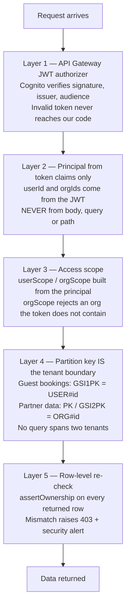

# 19 — What We Do Differently

**Version:** 0.1 · **Date:** 2026-09-13

You asked: *"think as a real customer — what are MakeMyTrip, Agoda, Goibibo, Cleartrip, OYO, Booking.com and the cheap-hotel sites NOT giving?"*

This document answers that, and maps each gap to where it is implemented in the code. These are not marketing lines — each one is a constraint enforced somewhere in the repository.

---

## 1. The eleven gaps

### Gap 1 — The price changes between search and payment 🔴

**What happens today:** A room shows at ₹2,199. At checkout it becomes ₹2,199 + taxes + "convenience fee" + "service fee" = ₹2,847. The guest feels cheated even when the final price is competitive.

**What we do:**
- One pricing function, shared by frontend and backend, so the two can never disagree — [packages/shared/src/pricing.ts](../packages/shared/src/pricing.ts)
- Convenience fee is a constant fixed at **zero**, kept as an explicit line item so the promise is visible in code — `PLATFORM_CONVENIENCE_FEE_PAISE`
- The full itemised breakdown is one tap away on the search card and open by default at checkout — [frontend/src/components/PriceBreakdown.tsx](../frontend/src/components/PriceBreakdown.tsx)
- The client sends back the total it displayed; the server recomputes and **rejects the booking** if they differ, rather than silently charging more — `PriceChangedError` in [backend/src/services/bookingService.ts](../backend/src/services/bookingService.ts)

---

### Gap 2 — "Confirmed" online, no room on arrival 🔴

**What happens today:** Listings are cached or estimated. The guest arrives at 11 PM after a six-hour drive to be told the booking "did not come through".

**What we do:**
- Availability is read **only** from real per-date inventory rows a partner published. A missing date is reported as unpriced, never assumed available — [backend/src/repositories/inventoryRepository.ts](../backend/src/repositories/inventoryRepository.ts)
- A room type is offered only when **every** night has inventory, is open, and has enough unsold rooms — [backend/src/services/availabilityService.ts](../backend/src/services/availabilityService.ts)
- Booking and inventory decrement happen in **one DynamoDB transaction** with a conditional check, so two guests cannot be sold the same last room — [backend/src/services/bookingService.ts](../backend/src/services/bookingService.ts)

---

### Gap 3 — Denied at check-in over "couples not allowed" or "local IDs not allowed" 🔴

**What happens today:** This is one of the most common and most humiliating failures in Indian hospitality, and almost no OTA lets you filter for it reliably. The policy is discovered at the reception desk.

**What we do:**
- `unmarried_couples` and `local_id_accepted` are **mandatory policy fields** — a listing cannot go live without an explicit answer — `MANDATORY_POLICY_KEYS` in [packages/shared/src/constants.ts](../packages/shared/src/constants.ts)
- Both are first-class search filters — [frontend/src/pages/SearchPage.tsx](../frontend/src/pages/SearchPage.tsx)
- The filter passes **only** on an explicit `allowed`. Silence never counts as a yes — [backend/src/services/searchService.ts](../backend/src/services/searchService.ts)
- Policies are shown high on the property page with colour-coded stances, not buried in a collapsed footer — [frontend/src/pages/PropertyPage.tsx](../frontend/src/pages/PropertyPage.tsx)

---

### Gap 4 — Fake and incentivised reviews 🔴

**What happens today:** Reviews can be posted by people who never stayed. Ratings are padded at launch.

**What we do:**
- A review requires a booking that **exists, belongs to the reviewer, and is completed**. There is no other code path — [backend/src/repositories/reviewRepository.ts](../backend/src/repositories/reviewRepository.ts)
- One review per booking, enforced by a lock row written in the same transaction — not by application logic that could be bypassed
- `verifiedStay: true` is a type-level literal, because there is no way to create an unverified one
- Aggregate ratings are computed from real reviews only and return `undefined` when there are none — we show "no reviews yet" instead of a flattering default

---

### Gap 5 — Photos that do not match the property 🟠

**What happens today:** Wide-angle shots from five years ago, or stock images entirely.

**What we do:**
- Every photo carries a `verified` boolean set by our ops team during onboarding — [packages/shared/src/types.ts](../packages/shared/src/types.ts)
- A minimum verified-photo count is required before a listing can be published — `LIMITS.minPhotosForVerification`
- Verified photo count feeds the ranking score, so honest listings rank higher — [backend/src/repositories/propertyRepository.ts](../backend/src/repositories/propertyRepository.ts)

---

### Gap 6 — You cannot reach the property 🟠

**What happens today:** OTAs deliberately hide the property's phone number to protect their commission. The guest cannot ask a simple question.

**What we do:**
- The property's real phone number is shown prominently with a tap-to-call button — [frontend/src/pages/PropertyPage.tsx](../frontend/src/pages/PropertyPage.tsx)
- **This is where the original AI receptionist idea plugs in:** if nobody answers, our AI agent takes the enquiry and the property calls back. The `Lead` model, repository and SLA fields already exist — [packages/shared/src/types.ts](../packages/shared/src/types.ts), [docs/09](09-ai-agent-design.md)
- Properties with the AI receptionist enabled get an "always answers" badge in search results

---

### Gap 7 — English-only, or token Hindi 🟠

**What happens today:** A traveller from Coimbatore or Guwahati books in a language they do not read comfortably, and misreads the cancellation policy.

**What we do:**
- Ten Indian languages across the whole UI, switchable from every screen, with each option shown in its own script — [frontend/src/i18n/translations.ts](../frontend/src/i18n/translations.ts), [frontend/src/components/LanguageSwitcher.tsx](../frontend/src/components/LanguageSwitcher.tsx)
- Natural-language search accepts any of them: *"Coorg mein next weekend pet friendly resort 6000 tak"* — [backend/src/ai/searchParser.ts](../backend/src/ai/searchParser.ts)
- Property Q&A answers in the guest's language — [backend/src/ai/groundedAssistant.ts](../backend/src/ai/groundedAssistant.ts)
- Machine-translated content is **labelled as such**; we never present generated text as the owner's own words
- Missing translations fall back to English rather than rendering a raw key

---

### Gap 8 — Opaque, pay-to-win ranking 🟠

**What happens today:** "Recommended" means "paid for placement". The guest cannot tell why a result is first.

**What we do:**
- The ranking score is a small, readable function: rating, review count, verified photos, amenity completeness. **No paid-placement term exists** — [backend/src/repositories/propertyRepository.ts](../backend/src/repositories/propertyRepository.ts)
- Every result card shows plain-language `matchReasons` explaining why it matched — [backend/src/services/searchService.ts](../backend/src/services/searchService.ts)

---

### Gap 9 — Guest details collected too late 🟡

**What happens today:** Only the booker's name is captured. At check-in the property demands details for every guest and the family stands at reception for twenty minutes.

**What we do:**
- Every member is captured at checkout — name, age, child flag — with the reason stated plainly — [frontend/src/pages/CheckoutPage.tsx](../frontend/src/pages/CheckoutPage.tsx)
- Also captured: origin city, expected arrival time, purpose of stay, special requests
- The partner dashboard shows the named member count per arrival — [frontend/src/pages/PartnerDashboardPage.tsx](../frontend/src/pages/PartnerDashboardPage.tsx)
- **We deliberately do NOT store ID numbers** — only the ID *type*. Storing Aadhaar numbers is an unnecessary liability — [packages/shared/src/types.ts](../packages/shared/src/types.ts)

---

### Gap 10 — Prepayment forced, refunds vague 🟡

**What happens today:** Card charged upfront, refund "in 7–10 business days" with no number attached.

**What we do:**
- `pay_at_property` is a first-class, filterable payment mode — many Indian guests strongly prefer it
- The free-cancellation deadline is computed and stored **on the booking**, in IST, at the moment of booking — [packages/shared/src/pricing.ts](../packages/shared/src/pricing.ts)
- The exact refund amount is computed and shown at cancellation, with the expected number of days — [backend/src/handlers/bookings.ts](../backend/src/handlers/bookings.ts)
- Cancelled inventory is released in the same transaction, so the room is immediately resellable

---

### Gap 11 — Your data is the product 🟠

**What happens today:** Phone numbers get resold, spam calls follow, and there is no way to leave.

**What we do:**
- Consent is explicit, per-purpose, timestamped and append-only — [backend/src/repositories/userRepository.ts](../backend/src/repositories/userRepository.ts)
- DPDP export and erasure endpoints are built in, not a support-ticket process — [backend/src/handlers/profile.ts](../backend/src/handlers/profile.ts)
- Phone numbers and emails are masked in every log line by default — [backend/src/lib/logger.ts](../backend/src/lib/logger.ts)
- All data stays in `ap-south-1` — [infrastructure/bin/app.ts](../infrastructure/bin/app.ts)

---

## 2. Data separation — your explicit requirement

> *"when I share this app with others, don't show one customer's data to others — it should be separate for everyone."*

This is enforced at **four independent layers**, so a bug in any one of them is not sufficient to leak data.

| Layer | Implementation |
|---|---|
| 1. Token verification | [infrastructure/lib/platform-stack.ts](../infrastructure/lib/platform-stack.ts) — `HttpJwtAuthorizer` |
| 2. Identity from claims | [backend/src/lib/auth.ts](../backend/src/lib/auth.ts) — `getPrincipal` |
| 3. Scope construction | [backend/src/lib/auth.ts](../backend/src/lib/auth.ts) — `userScope`, `orgScope` |
| 4. Physical partitioning | [backend/src/lib/dynamo.ts](../backend/src/lib/dynamo.ts) — `keys` |
| 5. Row-level assertion | [backend/src/lib/auth.ts](../backend/src/lib/auth.ts) — `assertOwnership` |
| Regression proof | [backend/src/\_\_tests\_\_/tenantIsolation.test.ts](../backend/src/__tests__/tenantIsolation.test.ts) — 20 tests |

**Additional protections**
- Cross-tenant attempts return **403, not 404**, and are logged with `securityEvent: 'cross_tenant_access_denied'` so they can be alerted on
- `rejectImpersonation` blocks a request body that names a different user
- A guest's bookings query carries no user id at all — the server derives it from the token, so there is nothing for a client to tamper with

---

## 3. No fake or hallucinated data — your explicit requirement

> *"I don't want any fake hallucinated data."*

Four mechanisms, each independent of the model's cooperation.

### 3.1 There is no seed data
The repository ships with **zero fictional hotels**. Every property enters through partner onboarding and only becomes publicly searchable after ops verification — `publishVerified()` is the sole path that writes a city search-index entry.

### 3.2 Only verified listings are searchable
`getPublicById` returns `null` for any property that is not `verified`. Draft, pending, rejected and suspended listings are invisible to guests, by construction.

### 3.3 The AI is given a closed world
The grounded assistant receives a fact sheet built **only** from stored, partner-declared, ops-verified fields. It is instructed that this is its entire source of truth, that it may not reason from general knowledge, and that it may never quote a firm price or claim availability — [backend/src/ai/groundedAssistant.ts](../backend/src/ai/groundedAssistant.ts)

### 3.4 A deterministic scanner checks every answer
This is the part that matters. `detectViolation()` is plain code, not model judgement, so it holds even if the prompt is defeated by injection:

| Blocked | Example |
|---|---|
| Availability claims | "Rooms are available on the 24th" |
| Sold-out claims | "We are fully booked" |
| Booking confirmations | "Your booking is confirmed" |
| Discount promises | "I can give you 10% off" |
| Guarantees | "I guarantee..." |
| Payment solicitation | "Share your card number" |
| **Any rupee figure not present verbatim in the fact sheet** | "The rate is ₹6,500" |

On a violation the answer is discarded and replaced with a deferral in the guest's language, and `grounded: false` is returned so the UI shows "the property will confirm this" instead of the text.

Proven by 15 tests in [backend/src/\_\_tests\_\_/grounding.test.ts](../backend/src/__tests__/grounding.test.ts).

### 3.5 The search parser cannot invent a destination
The natural-language parser resolves a city only against the allow-list of cities that actually exist in our verified inventory. An unrecognised place is returned in `unresolvedTerms` and **shown to the guest**, never silently guessed — [backend/src/ai/searchParser.ts](../backend/src/ai/searchParser.ts)

---

## 4. What we deliberately chose NOT to copy

| Common OTA practice | Our decision |
|---|---|
| "Only 1 room left!" on every listing | Shown only when real inventory is ≤ 3 |
| "17 people viewing this now" | Not implemented. It is almost always fabricated |
| Countdown timers on prices | Not implemented |
| Pre-ticked insurance / donation add-ons | Not implemented |
| Sponsored results disguised as recommendations | No paid-placement term exists in the ranking function |
| Hiding the property's phone number | We show it prominently |
| Making cancellation hard to find | One button on the booking card |
| Fake "member discount" that everyone gets | Not implemented |
| Padding new listings with a default rating | Rating is `undefined` until real reviews exist |

Each of these is a short-term conversion trick that costs long-term trust. Since the founding insight of this project was a customer lost to a broken experience, optimising for trust is the entire point.

---

## 5. Honest limitations

Stated plainly, because overstating readiness would repeat the exact problem this platform is built to solve:

| Limitation | Status |
|---|---|
| Payments not integrated | `pay_now` creates a `pending_payment` booking; Razorpay is not wired |
| No photo upload UI | Media bucket and verification flags exist; the upload and ops review screens do not |
| AI receptionist not connected to telephony | Data model ready; requires the Phase 0 telephony POC in [Doc 10](10-telephony-and-india-compliance.md) |
| No WhatsApp notifications | Requires Meta Business verification |
| Search is city-partitioned | No map view, no radius search, no fuzzy destination matching yet |
| No partner onboarding wizard | API complete; guided UI not built |
| Not load-tested | Architecture scales, but this has not been proven under load |

---

**Related:** [01 — Problem & Vision](01-product-vision-and-problem.md) · [18 — AWS Architecture & Cost](18-aws-serverless-architecture-and-cost.md)
